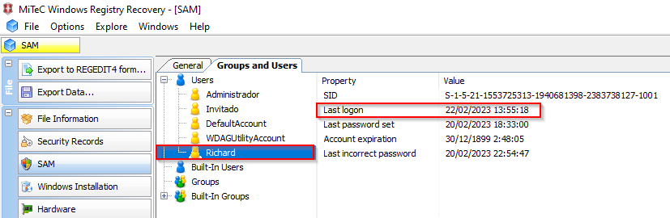
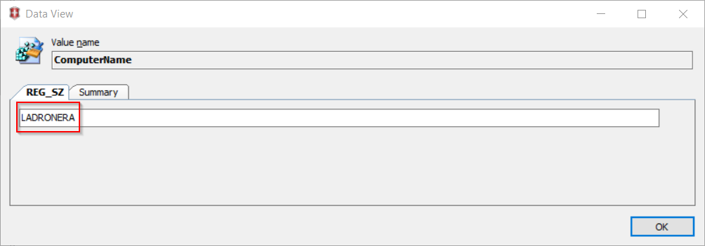
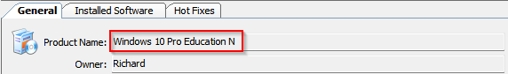
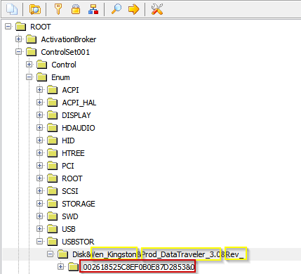
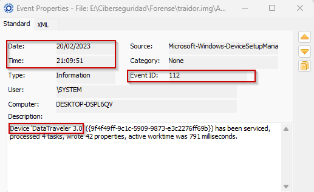

1. **Verificar la integridad de la imagen del disco a través de CMD o PowerShell, comparando los hashes proporcionados. ¿Coinciden los tres hashes?**

Cómo podemos ver, el hash MD5 y el hash SHA-256 no son iguales a los proporcionados en la práctica.

| Algoritmo | Hashes proporcionados | Hashes comprobados |
|-----------|-----------------------|---------------------|
| MD5       | DFDFBA2231E3FA409676B1B737474208 | DFDFBA2231E3FA409676B1B737474288 |
| SHA-1     | F476A81089A10F9D5393AA8C2F8BBCCDB87F7D3C | F476A81089A10F9D5393AA8C2F8BBCCDB87F7D3C |
| SHA-256   | 66D6EE7A61EA7A986E8F6BB54B9986F79D95B5A0278BEF86678ED42ACE320D96 | 66D6EE7A61EA7A986E8F6BB54B9986F79D95B5A0278BEF86678ED42ACE320D9B |

2. **Confirmar la existencia de un usuario correspondiente a Richard en el equipo y determinar cuándo fue su último inicio de sesión.**

Se ha encontrado a través del registro SAM un usuario llamado Richard con un Last logon el 22/02/2023 a las 13:55:18.

3. **Identificar el nombre del equipo y la versión del Sistema Operativo utilizado.**

A través del registro System se ha encontrado el nombre del equipo que es Ladronera.

Además con el registro Software podemos encontrar la versión del Sistema Operativo.

4. **Investigar si se introdujo algún dispositivo USB en el equipo, a pesar de las políticas de la empresa contra su uso por parte de Richard. En caso afirmativo, especificar los detalles del dispositivo USB y el momento de su conexión.**

Investigando en el registro System encontramos en \ControlSet001\Enum\USBSTOR que se ha conectado un USB con un número de serie.

Los tres primeros recuadros amarillos indican el Device Class ID y el segundo el número de serie del dispositivo.

[Falta nombre del dispositivo]

Investigando en los eventos de windows, en los eventos de Microsoft-Windows-DeviceSetupManager%4Admin.evtx he encontrado un evento que indica que un USB de nombre DataTraveler 3.0 fue conectado a las 21:09:51 del 20 de Febrero de 2023. Además indica que estuvo conectado por 791 millisegundos.

6. **Determinar si, tras su salida de la empresa, Richard tenía planes de visitar otro lugar y, de ser así, cómo planeaba llegar allí.**

Efectivamente existen vestigios que al menos indican la actividad relacionada con lo que parecen planes para visitar a otro lugar. Estos vestigios refieren a una serie de búsquedas en el navegador "Opera" de vuelos y hoteles hacia Las Palmas de Gran Canaria:

Estos vestigios fueron hallados utilizando la herramienta DB Browser en el artefacto de sistema "History" perteneciente al navegador Opera, el cual consiste en el historial de URLs visitadas por el usuario. Se encuentra en la ubicación siguiente:

`C:\Users\Richard\AppData\Roaming\Opera\Software\Opera Stable\History`

7. **Comprobar si existe algún navegador web, aparte de los proporcionados por Microsoft, configurado para ejecutarse al iniciar sesión Richard.**

Efectivamente existen vestigios de que el usuario "Richard" tenía en su sus programas de inicio un navegador, concretamente "Opera". 

El vestigio de este hecho puede encontrarse en el siguiente artefacto del sistema ubicado en `C:\Users\Richard\NTUSER.DAT\Software\Microsoft\Windows\CurrentVersionRun`

