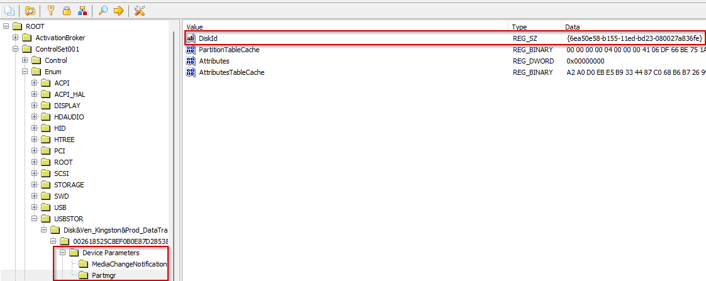
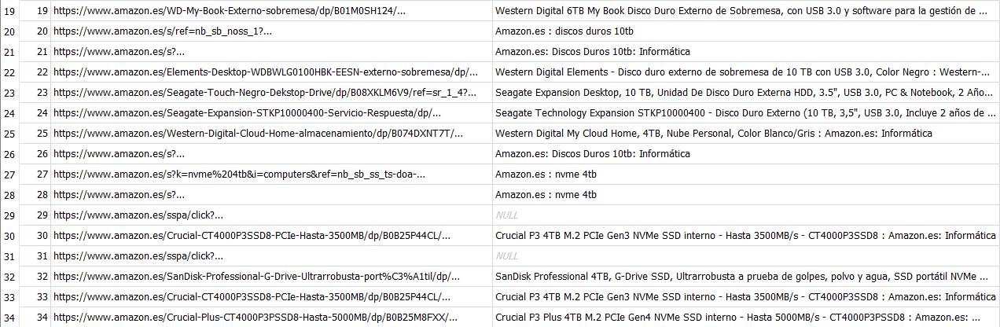

1. **Verificar la integridad de la imagen del disco a través de CMD o PowerShell, comparando los hashes proporcionados. ¿Coinciden los tres hashes?**

Cómo podemos ver, el hash MD5 y el hash SHA-256 no son iguales a los proporcionados en la práctica.

| Algoritmo | Hashes proporcionados | Hashes comprobados |
|-----------|-----------------------|---------------------|
| MD5       | DFDFBA2231E3FA409676B1B737474208 | DFDFBA2231E3FA409676B1B737474288 |
| SHA-1     | F476A81089A10F9D5393AA8C2F8BBCCDB87F7D3C | F476A81089A10F9D5393AA8C2F8BBCCDB87F7D3C |
| SHA-256   | 66D6EE7A61EA7A986E8F6BB54B9986F79D95B5A0278BEF86678ED42ACE320D96 | 66D6EE7A61EA7A986E8F6BB54B9986F79D95B5A0278BEF86678ED42ACE320D9B |

2. **Confirmar la existencia de un usuario correspondiente a Richard en el equipo y determinar cuándo fue su último inicio de sesión.**

Se ha encontrado a través del registro SAM un usuario llamado Richard con un Last logon el 22/02/2023 a las 13:55:18.

3. **Identificar el nombre del equipo y la versión del Sistema Operativo utilizado.**

A través del registro System se ha encontrado el nombre del equipo que es Ladronera. Este dato se encuentra en el registro `SYSTEM\ControlSet001\ComputerName`.

Además con el registro SOFTWARE podemos encontrar la versión del Sistema Operativo.

4. **Investigar si se introdujo algún dispositivo USB en el equipo, a pesar de las políticas de la empresa contra su uso por parte de Richard. En caso afirmativo, especificar los detalles del dispositivo USB y el momento de su conexión.**

Investigando en el registro `System\ControlSet001\Enum\USBSTOR` encontramos que se ha conectado un USB con número de serie 002618525C8EF0B0E87D2853&0.

Los tres primeros recuadros amarillos indican el Device Class ID y el recuadro rojo el número de serie del dispositivo.

Analizando los parámetros del dispositivo USB he encontrado el id disk del mismo que nos ha servido para compararlo con el id disk del registro `SYSTEM\MountedDevices` para saber que letra ha tenido al conectarlo.

En el registro de `SYSTEM\MountedDevices` vemos que el id disk marcado con un cuadro en rojo es igual al encontrado en los parametros del dispositivo USB y que la letra que obtuvo del Sistema Operativo al momento de conectarse fue la letra E:

Una vez encontrada la letra que el dispositivo USB usó como punto de montaje, hemos comprobado el nombre del dispositivo en `SOFTWARE\Microsoft\Windows Search\VolumeInfoCache\`. En el punto de montaje E: se conectó un dispositivo de nombre Mantenimiento.

Investigando en los eventos de windows, en los eventos de Microsoft-Windows-DeviceSetupManager%4Admin.evtx a través de la herramienta Event Log Explorer he encontrado un evento que indica que un USB de nombre DataTraveler 3.0 fue conectado a las 21:09:51 del 20 de Febrero de 2023. Además indica que estuvo conectado por 791 millisegundos. 

5. **Dado el interés conocido de Richard por el fútbol y la música rock y heavy, investigar su actividad en línea relacionada con estos intereses. Además, verificar si ha visualizado contenido en línea que pueda justificar un despido procedente, como la visualización de una película online. Documentar cualquier hallazgo relevante.**

Haciendo uso del software *FTK Imager v4.7.1.2* montamos la imagen forense del disco duro de Richard. Luego navegamos por los directorios hasta llegar a C:\\Users\\Richard\\AppData\\Roaming\\Mozilla\\Firefox\\Profiles\\mt13hmmn.default-release, siendo este su perfil del navegador Mozilla Firefox. Si entramos en esa carpeta y bajamos, veremos una base de datos llamada **places.sqlite**, que es la que almacena el historial del navegador, así que la descargamos también.

Luego abriremos dicha base de datos con el programa *DB Browser for SQLite Versión 3.12.2*, y mostraremos los datos de la tabla **moz_places**. En esta vemos las urls que el usuario ha visitado, junto con otros datos como el título de la página o la búsqueda realizada en Google, el número de visitas realizadas a cada página o la última hora de visita de cada una, en formato Epoch Time.

Una vez que entramos en dicha tabla, vemos que el usuario Richard ha buscado en Google "trabajo basura español download", que resulta ser una película del año 1999. Revisa las páginas rebeldemule.org, cine24h.net y new.c.mi.

La hora Epoch de la búsqueda 14 es **1677076184188000**, que corresponde a la búsqueda de la película en cuestión en la página new.c.mi o CUEVANA.HD.

Si convertimos este dato en horario GMT, este resulta ser las 14:29:44 del 22 de febrero de 2023.

Más tarde busca en Google discos duros Western Digital y Crucial de 4TB, un disco duro Western Digital de 10TB y un disco duro Seagate de 10TB.

Y finalmente, realiza unas búsquedas de páginas de trading como eToro, busca ropa de mujer y finalmente descarga el software PulseAudio 1.1.

6. **Determinar si, tras su salida de la empresa, Richard tenía planes de visitar otro lugar y, de ser así, cómo planeaba llegar allí.**

Efectivamente existen vestigios que al menos indican la actividad relacionada con lo que parecen planes para visitar a otro lugar. Estos vestigios refieren a una serie de búsquedas en el navegador "Opera" de vuelos y hoteles hacia Las Palmas de Gran Canaria:

Estos vestigios fueron hallados utilizando la herramienta DB Browser en el artefacto de sistema "History" perteneciente al navegador Opera, el cual consiste en el historial de URLs visitadas por el usuario. Se encuentra en la ubicación siguiente:

`C:\Users\Richard\AppData\Roaming\Opera\Software\Opera Stable\History`

7. **Comprobar si existe algún navegador web, aparte de los proporcionados por Microsoft, configurado para ejecutarse al iniciar sesión Richard.**

Efectivamente existen vestigios de que el usuario "Richard" tenía en su sus programas de inicio un navegador, concretamente "Opera". 

El vestigio de este hecho puede encontrarse en el siguiente artefacto del sistema ubicado en `C:\Users\Richard\NTUSER.DAT\Software\Microsoft\Windows\CurrentVersionRun`

8. **Buscar evidencia de que Richard haya asistido a competidores o terceros mediante la exfiltración de datos por correo electrónico.**

Con el software *FTK Imager v4.7.1.2* montamos la imagen forense del disco duro de Richard. Luego navegamos por los directorios hasta llegar a C:\\Users\\Richard\\AppData\\Roaming\\Thunderbird, donde vemos que tenía instalado el cliente de correo electrónico Mozilla Thunderbird. 

Sabiendo esto, ahondamos más y encontramos un perfil de correo electrónico en la carpeta \\Thunderbird\\Profiles\\tvtlv94f.default-release, así que extraemos el perfil entero, a fin de poder procesarlo con el software *SysTools MBOX Viewer v4.0*.

Gracias a este programa, accedemos a los correos electrónicos de Richard, por lo que comenzamos a leer. Después de unos momentos, nos percatamos que el usuario Richard se encontraba entablando una conversación con otro usuario, cuyo correo es **proba2.seguridade@gmail.com**. En esta conversación, Richard acuerda una subida de sueldo, de 38000€ a 45000€.

Notamos que el 20/02/2023 a las 21:05, el usuario **proba2** le responde a esta petición de subida salarial.

En un correo más tarde, a las 0:58:55, Richard vuelve a contactar a proba2, acordando firmar el contrato laboral, el pago del dinero acordado y la salida de su empresa a cambio de algo que Richard califica de "unas pruebas".

Luego, unos 8 minutos más tarde, a las 1:06:44, vemos que Richard envía 4 archivos **pom.xml** a proba2, como respuesta a la contestación afirmativa de este usuario, recibida a las 1:01. Estos archivos consisten en archivos de configuración de Maven.

36 minutos más tarde, a las 1:40:17 Richard envía un correo a otro usuario con email **phy.reg@gmail.com**, en el que le avisa que planea abandonar la empresa.

Horas más tarde, a las 15:06:09, el usuario Richard envía un enlace de Google Drive a proba2, y le advierte que está protegido con contraseña, la cual sólo proporcionará cuando proba2 le pague.

Finalmente, 4 minutos más tarde, a las 15:10:23, el usuario proba2 afirma haber realizado el pago Richard, solicitándole la contraseña. También vemos un último correo de Richard a las 15:25:27, de nuevo a phy.reg@gmail.com, en el que le termina de avisar de su inminente salida de la empresa.

