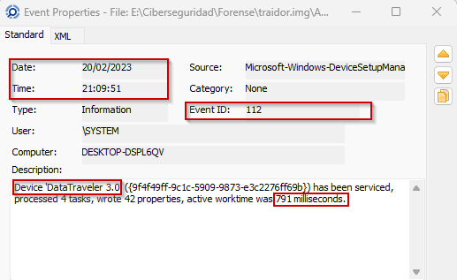
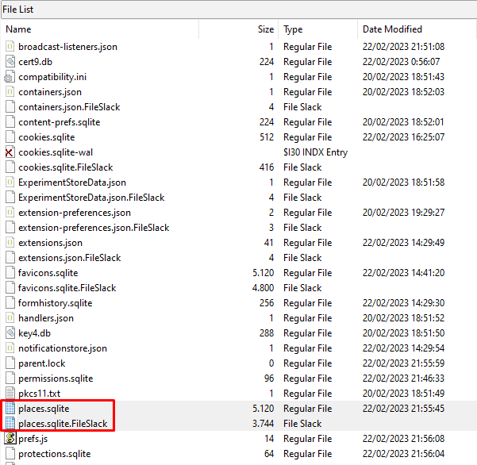
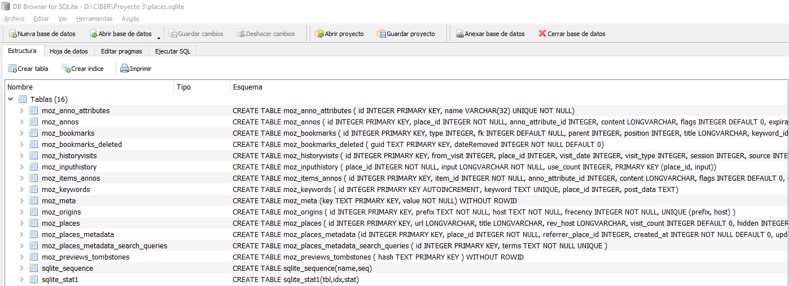
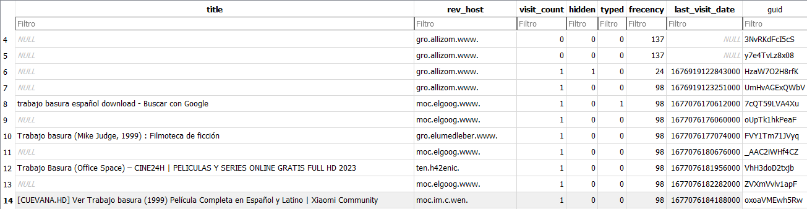
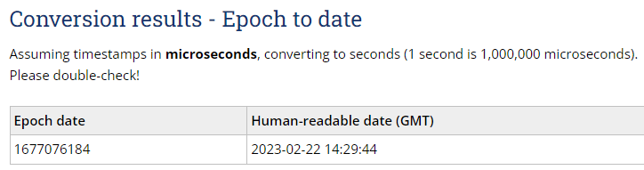
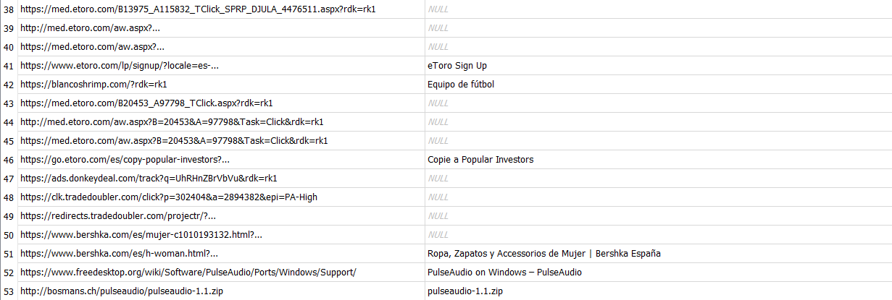
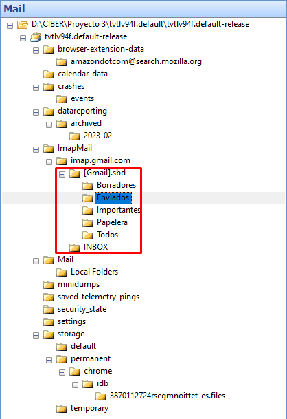
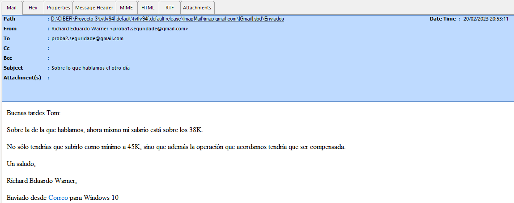
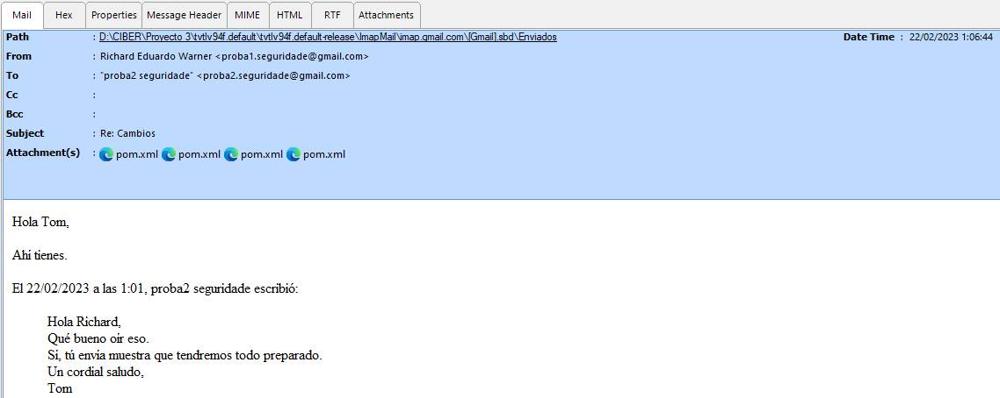
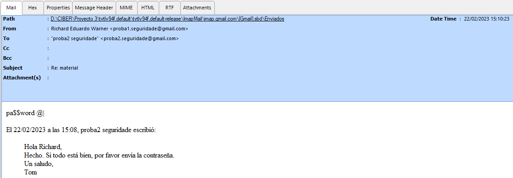

# Índice

1. [Resumen ejecutivo](#resumen-ejecutivo)
2. [Introducción](#introducción)
3. [Objetivos](#objetivos)
4. [Alcance](#alcance)
5. [Objetivos](#objetivos)
6. [Metodología](#metodología)
7. [Investigación](#investigación)

   7.1 [Timeline](#timeline)
8. [Conclusiones](#conclusiones)
9. [Anexos](#anexos)

## Resumen ejecutivo

En el presente informe se detallan los hechos acontecidos entre el **20 y el 22 de Febrero de 2023**, en los cuáles se investiga la actividad del empleado **_Richard Eduardo Wagner_** en las semanas previas a su despido a partir de una imagen de disco suministrada por InnovaTech Solutions. 

A partir de la imagen suministrada, se ha encontrado una serie de vestigios que indican que _**Richard Eduardo Wagner**_ mantuvo conversaciones con lo que parecen dos personas externas a InnovaTech Solutions, una a la que se refiere como "_Tom_" y otra la que se refiere como "_Phy_", con las cuáles expresaba descontento con su situación actual como empleado,hay vestigios que indican que comparte archivos de metadatos que parecen pertenecer al proyecto "_Social Query_" de InnovaTech Solutions.

Se encuentran vestigios de que Richard lleva acabo una serie de acciones planeadas y comunicaciones con estos agentes, y que a cambio estas personas ofrecen una serie de compensaciones, entre ellas una supuesta transacción de Bitcoin, que se ha intentado ratificar, y de la que no hay registro de que se haya producido en la fecha indicada.

Según una serie de correos electrónicos encontrados y su historial de búsquedas online, Richard planeaba su salida de la empresa, un intercambio de información que se ha comprobado perteneciente a la empresa a cambio de dinero (_a través de bitcoin, previamente mencionada_) y la toma de unas vacaciones a Las Palmas de Gran Canaria. El usuario Richard también comparte un enlace con un archivo subido a Google Drive el cual no se ha podido determinar su contenido. 

Además se encuentran indicios de actividad no relacionada con su trabajo en su historial de búsqueda, como visitas a webs de periódicos deportivo o sitios de streaming de películas online con el ordenador del que se suministra la imagen de disco, que podría justificar un despido procedente.

Estos acontecimientos se relacionan y ordenan en una línea de tiempo incluida en este mismo documento.

## Introducción

En este documento se presentan los hallazgos encontrados en la investigación y análisis de la imagen proporiconada. Incluimos anexos que hacen referencia a los hallazgos mencionados, a la cadena de custodia realizada y un documento generado sobre la integridad de la imagen proporcionada con sus valores hashes comprobados. También mencionamos la metodología y las herramientas utilizadas en el proceso de investigación.

## Objetivos

Aclarar las acciones del empleado llamado Richard en las semanas previas a su salida de la empresa.

## Alcance

Loss datos del disco duro a partir del cual se creó la imagen, el usuario de Richard, recuperación y análisis de archivos que se encuentran en la imagen, correos electrónicos del usuario Richard y el historial del navegador utilizado por el propio usuario teniendo en cuenta sus búsquedas en internet y marcadores.

## Metodología y herramientas

A continuación indicamos la metodología utilizada para el proceso:

1. Identificación de hallazgos o vestigios.

En primer lugar comenzamos por identificar los elementos que puedan tener hallazgos o vestigios de forma digital documentandolos:
- Dispositivos fisico.
- Redes y conexiones a internet.
- Software.
- Datos en la nube.
  
2. Adquisición.

Planificamos la adquisición para encontras las distintas fuentes a través de un orden de recogida basandonos en los siguientes criterios.

- Su valor probable: La fuente de datos que mas hallazgos o con mayor calidad podrían contener.
- Volatilidad:
  i. Registros, caché
  ii. Tablas de enrutamientos, caché ARP, tabla de procesos, estadística del núcleo y memoria.
  iii. Sistemas de archivos temporales.
  iv. Disco duro
  v. Datos de registro remoto, logs del sistema y monitorización del sistema.
  vi. Configuración física y topología de la red.
  vii. documentos y archivos físicos.
- Cantidad de esfuerzo requerido.

3. Presentación.

En esta fase el objetivo es mantener la integridad de los hallazgos, para ello se deben aplicar una serie de medidas como:

- Evitar exposición a campos magnéticos y otras interferencias.
- Almacenar el hallazgo, precintarlo y sellarlo en los soportes adecuados.
- Utilizar el material adecuado como indumentaria de protección para evitar daños por descargas electroestáticas entre otros.

4. documentación.

En esta fase se documentará el procedimiento completo de forma detallada y concisa que sigue una línea temporal (fecha, hora, ubicación...).

Se documentarán todos los procesos llevados acabo:

- Tácticas de adquisición
- Tipos de hardware o software
- Configuraciones
- Herramientas utilizadas

Es crucial detallar un registro de todas las personas que han tenido acceso a los hallazgos, es decir, mantener la cadena de custodia para demostrar que los hallazgos no han sido modificadas. La cadena de custodia debería de componerse de:

- Nombre de la persona que manejó la evidencia
- Fecha
- Propósito de cada manipulación

5. Análisis.

En esta fase se llevarán a cabo una serie de procesos y tareas que intentarán dar respuesta a preguntas relacionadas con el evento que se está investigando. Esto incluye:

- Revisar la hora de la BIOS del dispositivos
- Recuperar ficheros borrados
- Analizar los metadatos
- Analizar los registros de red
- Estudiar las particiones y sistemas de ficheros.
- Analizar el sistema operativo
- Estudiar la seguridad implementada en el sistema
- Analizar los registros de autenticación

6. Presentación.

En esta fase se escribirá un informe pericial con toda la información obtenida a lo largo del proceso de análisis. Este informe debe escribirse en un lenguaje entendible para un público no técnico y tener una estructura uniforme. El informe debe incluir la documentación de la cadena de custodia y al finalizar el informe será remitido al organismo solicitante.

**Herramientas usadas**

| Nombre de la herramienta | Empresa      | Versión        |
|--------------------------|--------------|----------------|
| Windows Registry Recovery| MiTeC        | 1.6.1.0        |
| Event Log Explorer       | FSPro Labs   | 5.5 (Build 5.5.0.5011) |
| AccessData® FTK® Imager  | Exterro      | 4.7.1.2        |
| DB Browser for Sqlite    | Sqlitebrowser| 3.12.2         |
| SysTools MBOX Viewer     | Systool      | 4.0            |

## Investigación

### Timeline

Utilizando FTK Imager se ha extraído los registros SYSTEM, SAM y SOFTWARE para su análisis. Estos registros se encuentran en `C:\Windows\System32\config` y se han analizado en busca de vestigios de que el usuario Richard existe en la imagen proporcionada y si se ha introducido un dispositivo USB con sus características y el punto de montaje recibido.

Analizando el registro `System\ControlSet001\Enum\USBSTOR`se ha encontrado que se ha conectado un USB con el número de serie 002618525C8EF0B0E87D2853& marcado con un recruadro rojo y con un Device Class ID llamado Ven_Kingston Prod_DataTraveler_3.0 Rev_ como podemos ver en la siguiente captura marcado con un recrado amarillo.

En el propio registro se ha utilizado el id disk del USB encontrado para compararlo con el id disk que se encuentra en el registro `System\MountedDevices` para saber que punto de montaje recibió el dispositivo USB al momento de su conexión indicandonos que fue la letra E: la recibida.

Teniendo en cuenta que tenemos la letra E: se ha analizado el registro `SOFTWARE\Microsoft\Windows Search\VolumeInfoCache\` para comprobar el nombre del dispositivo. El nombre del volumen es Mantemento.

Después de encontrar las características del dispositivo USB se ha utilizado la herramienta Event Log Explorer para analizar los logs extraidos con FTK Imager de la ruta `C:\Windows\System32\winevt\logs`. El log analizado es Microsoft-Windows-DeviceSetupManager%4Admin.ectx y se ha encontrado un evento de id 112 que indica en su descripción que un dispositivo DataTraveler 3.0 que concuerda con el dispositivo encontrado en el reigstro SYSTEM con fecha de utilización en el día 20 de Febrero de 2023 a las 21:09:5 horas de la noche. 

El dispositivo estuvo trabajando durante 791 milisegundos.

Luego investigamos su historial de internet, encontrando su perfil del navegador Mozilla Firefox en la carpeta `C:\Users\Richard\AppData\Roaming\Mozilla\Firefox\Profiles\mt13hmmn.default-release`. En esta encontramos el fichero *places.sqlite*, el cual contiene el historial del susodicho navegador.

Cuando abrimos este fichero con el software DB Browser for SQLite, y accedemos a la tabla *moz_places*, vemos el historial. En esta tabla vemos las urls que el usuario Richard ha visitado, junto con otros datos como el título de la página o la búsqueda realizada en Google, el número de visitas realizadas a cada página o la última hora de visita de cada una, en formato Epoch Time.

Observando con más atención, vemos que el usuario Richard ha buscado en Google "trabajo basura español download", que resulta ser una película del año 1999. Revisa las páginas rebeldemule.org, cine24h.net y new.c.mi.

La hora Epoch de la búsqueda 14 es **1677076184188000**, que corresponde a la búsqueda de la película en cuestión en la página new.c.mi o CUEVANA.HD.

Si convertimos este dato en horario GMT, este resulta ser las 14:29:44 del 22 de febrero de 2023.

Más tarde busca en Google discos duros Western Digital y Crucial de 4TB, un disco duro Western Digital de 10TB y un disco duro Seagate de 10TB.

Y finalmente, realiza unas búsquedas de páginas de trading como eToro, busca ropa de mujer y finalmente descarga el software PulseAudio 1.1.

Tras esto, procedemos a analizar su cliente de correo electrónico, cuyo perfil se encuentra en la carpeta `C:\Users\Richard\AppData\Roaming\Thunderbird\Profiles\tvtlv94f.default-release`. Luego de extraer la carpeta, abrimos el perfil en cuestión con el programa SysTools MBOX Viewer.

Después de cargar el perfil, accedemos a los correos electrónicos de Richard, por lo que comenzamos a leer. Después de unos momentos, nos percatamos que el usuario Richard se encontraba entablando una conversación con otro usuario, cuyo correo es **proba2.seguridade@gmail.com**. En esta conversación, Richard acuerda una subida de sueldo, de 38000€ a 45000€.

Notamos que el 20/02/2023 a las 21:05, el usuario **proba2** le responde a esta petición de subida salarial.

En un correo más tarde, a las 0:58:55, Richard vuelve a contactar a proba2, acordando firmar el contrato laboral, el pago del dinero acordado y la salida de su empresa a cambio de algo que Richard califica de "unas pruebas".

Luego, unos 8 minutos más tarde, a las 1:06:44, vemos que Richard envía 4 archivos **pom.xml** a proba2, como respuesta a la contestación afirmativa de este usuario, recibida a las 1:01. Estos archivos consisten en archivos de configuración de Maven.

Se ha contrastado que estos archivos **pom.xml**, aunque no pertenecen a la carpeta `C:\Users\Richard\Proyectos`, sí versan sobre el proyecto **social-query**.
36 minutos más tarde, a las 1:40:17 Richard envía un correo a otro usuario con email **phy.reg@gmail.com**, en el que le avisa que planea abandonar la empresa.

Horas más tarde, a las 15:06:09, el usuario Richard envía un enlace de Google Drive a proba2, y le advierte que está protegido con contraseña, la cual sólo proporcionará cuando proba2 le pague.

Si buscamos la dirección de la cartera de Bitcoin en blockchain.com, vemos que el 22 de febrero no hubo transacciones de dicha criptomoneda.

Finalmente, 4 minutos más tarde, a las 15:10:23, el usuario proba2 afirma haber realizado el pago Richard, solicitándole la contraseña. También vemos un último correo de Richard a las 15:25:27, de nuevo a phy.reg@gmail.com, en el que le termina de avisar de su inminente salida de la empresa.

Revisando su historial de búsqueda del navegador _Opera Browser_ mediante la herramienta _DB Browser_, utilizando el archivo referenciado en el **ANEXO 3, ID 4,** se encuentra historia de búsqueda y visitas de web referentes a la creación de una cartera de Bitcoin y la búsqueda de varios vuelos y hoteles en Las Palmas de Gran Canaria:

_Historias de búsqueda de Opera Browser relacionadas con vuelos y hoteles_

_Historias de búsqueda de Opera Browser relacionadas con creación de cartera de bitcoin_

Se verifican que los parámetros en la URL pertenecen a los acrónimos utilizados por las agencias de vuelos para identificar las ciudades de Vigo y Las Palmas de Gran Canaria.

## Conclusiones

En base a los hallazgos y análisis realizados durante la investigación forense, se llega a las siguientes conclusiones:

- El usuario Richard ha buscado a través del navegador Mozilla Firefox la película Trabajo Basura (1999), a las 14:29. Además, ha buscado discos duros entre 4 y 10 TB de espacio, así como demás información aparentemente no relacionada con su empleo, todo a través del mismo navegador. 
- Se ha conectado un dispositivo USB denominado "Mantemento", a las 21:09:51 horas.
- El usuario Richard ha iniciado y propuesto mediante su cliente de correo electrónico Mozilla Thunderbird, un aparente intercambio de información con un tercero.
- En el susodicho y aparente intercambio de información, el usuario Richard ha realizado la entrega de 4 archivos pom.xml pertenecientes al proyecto de empresa social query. 
- A las 15:06:09, Richard envía por correo electrónico al mismo sujeto, cuyo nickcame es proba2, un enlace de Google Drive protegido por contraseña. Esta es enviada en otro correo a las 15:10:23.

## Anexos

[- Anexo 1 - Integridad de los datos y testigos](https://github.com/IES-Rafael-Alberti/G3-ANALISIS-FORENSE/blob/main/AF-P03-G3/Anexos/Anexo%201%20-%20Integridad%20de%20los%20datos%20y%20testigos.ods) 
[- Anexo 2 - Registro de cadena de custodia](https://github.com/IES-Rafael-Alberti/G3-ANALISIS-FORENSE/blob/main/AF-P03-G3/Anexos/Anexo%202-%20Registro%20de%20cadena%20de%20custodia.ods) 
[- Anexo 3 - Índice de hallazgos]()
