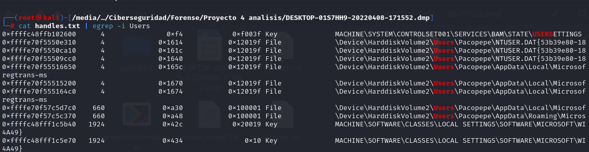
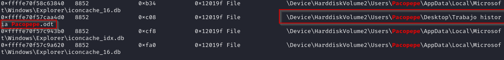
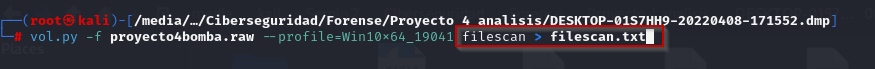
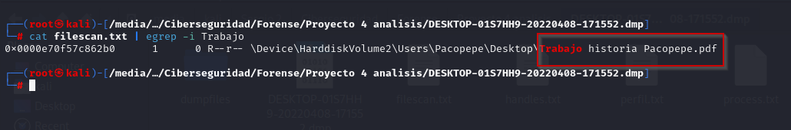
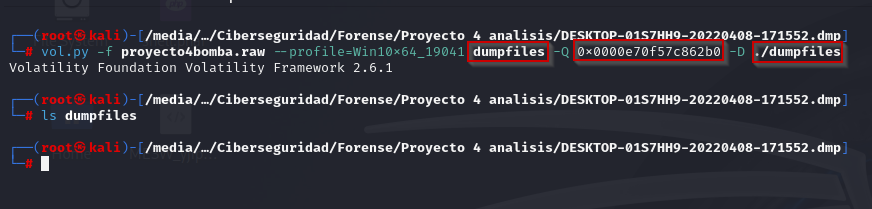

# Índice

1. [Resumen ejecutivo](#resumen-ejecutivo)
2. [Introducción](#introducción)
3. [Objetivos](#objetivos)
4. [Alcance](#alcance)
5. [Metodología](#metodología)
6. [Investigación](#investigación)

   6.1 [Timeline](#timeline)
7. [Conclusiones](#conclusiones)
8. [Anexos](#anexos)

# Resumen ejecutivo

# Introducción

En este documento se detallan los hallazgos encontrados al analizar el volcado de memoria recibido. Se incluyen anexos que hacen referencia a los hallazgos mencionados, a la cadena de custodia y un documento generado sobre la integridad de los ficheros y el volcado de memoria, comprobando y comparando dichos hashes. También se menciona la metodología utilizada y las herramientas que se ha utilizado para el análisis en el proceso de investigación. 

# Objetivos

Determinar si la persona llamada Francisco José Jiménez, alias Pacopepe tiene relación con la llamada anónima alertando de una bomba.

# Alcance

Cualquier información contenida en el volcado de memoria RAM del ordenador de Pacopepe.

# Metodología

A continuación indicamos la metodología utilizada para el proceso:

1. Identificación de hallazgos o vestigios.

En primer lugar comenzamos por identificar los elementos que puedan tener hallazgos o vestigios de forma digital documentandolos:
- Dispositivos fisico.
- Redes y conexiones a internet.
- Software.
- Datos en la nube.
  
2. Adquisición.

Planificamos la adquisición para encontras las distintas fuentes a través de un orden de recogida basandonos en los siguientes criterios.

- Su valor probable: La fuente de datos que mas hallazgos o con mayor calidad podrían contener.
- Volatilidad:
  i. Registros, caché
  ii. Tablas de enrutamientos, caché ARP, tabla de procesos, estadística del núcleo y memoria.
  iii. Sistemas de archivos temporales.
  iv. Disco duro
  v. Datos de registro remoto, logs del sistema y monitorización del sistema.
  vi. Configuración física y topología de la red.
  vii. documentos y archivos físicos.
- Cantidad de esfuerzo requerido.

3. Presentación.

En esta fase el objetivo es mantener la integridad de los hallazgos, para ello se deben aplicar una serie de medidas como:

- Evitar exposición a campos magnéticos y otras interferencias.
- Almacenar el hallazgo, precintarlo y sellarlo en los soportes adecuados.
- Utilizar el material adecuado como indumentaria de protección para evitar daños por descargas electroestáticas entre otros.

4. documentación.

En esta fase se documentará el procedimiento completo de forma detallada y concisa que sigue una línea temporal (fecha, hora, ubicación...).

Se documentarán todos los procesos llevados acabo:

- Tácticas de adquisición
- Tipos de hardware o software
- Configuraciones
- Herramientas utilizadas

Es crucial detallar un registro de todas las personas que han tenido acceso a los hallazgos, es decir, mantener la cadena de custodia para demostrar que los hallazgos no han sido modificadas. La cadena de custodia debería de componerse de:

- Nombre de la persona que manejó la evidencia
- Fecha
- Propósito de cada manipulación

5. Análisis.

En esta fase se llevarán a cabo una serie de procesos y tareas que intentarán dar respuesta a preguntas relacionadas con el evento que se está investigando. Esto incluye:

- Revisar la hora de la BIOS del dispositivos
- Recuperar ficheros borrados
- Analizar los metadatos
- Analizar los registros de red
- Estudiar las particiones y sistemas de ficheros.
- Analizar el sistema operativo
- Estudiar la seguridad implementada en el sistema
- Analizar los registros de autenticación

6. Presentación.

En esta fase se escribirá un informe pericial con toda la información obtenida a lo largo del proceso de análisis. Este informe debe escribirse en un lenguaje entendible para un público no técnico y tener una estructura uniforme. El informe debe incluir la documentación de la cadena de custodia y al finalizar el informe será remitido al organismo solicitante.

**Herramientas usadas**

| Nombre de la herramienta | Empresa      | Versión        |
|--------------------------|--------------|----------------|
| Volatility| Volatility Foundation        | 2.0       |
| Python| Python       | 3.0      |
# Investigación

Se ha analizado con el plugin handles de Volatility los handles que se encuentran en el volcado. 

Para facilitar este trabajo se han exportado los handles a un fichero handles.txt

Una vez realizada la extracción se ha utilizado el comando grep con la cadena "Users" para comprobar que usuarios hay en la máquina.

Una vez encontrada la existencia de un usuario Pacopepe, se ha decidido utilziar el comando mencionado en el párrafo anterior llamado grep para buscar los ficheros que haya podido abrir el usuario.

Analizando detalladamente la salida del comando mostrado en la captura anterior se ha encontrado que el usuario Pacopepe abrió un fichero llamado "Trabajo de historia Pacopepe.odt".

Una vez encontrado el fichero se ha exportado a un fichero .txt la salida del plugin filescan para luego utilizar el comando grep y buscar el fichero encontrado anteriormente.

Se ha utilizado el comando grep para intentar encontrar el fichero y dumpearlo. No se ha encontrado el fichero como tal pero si su versión .pdf.

Se ha intentado dumpear dicho fichero pdf pero no se ha conseguido con la dirección de memoria dada por filescan, con el plugin dumpfiles y en el directorio que se encuentra en la misma carpeta del proyecto llamado dumpfiles.

## Timeline

# Conclusiones

# Anexos
