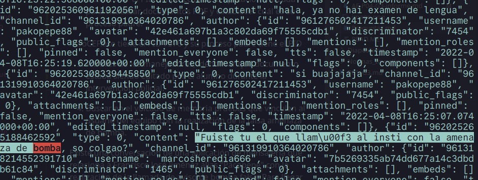
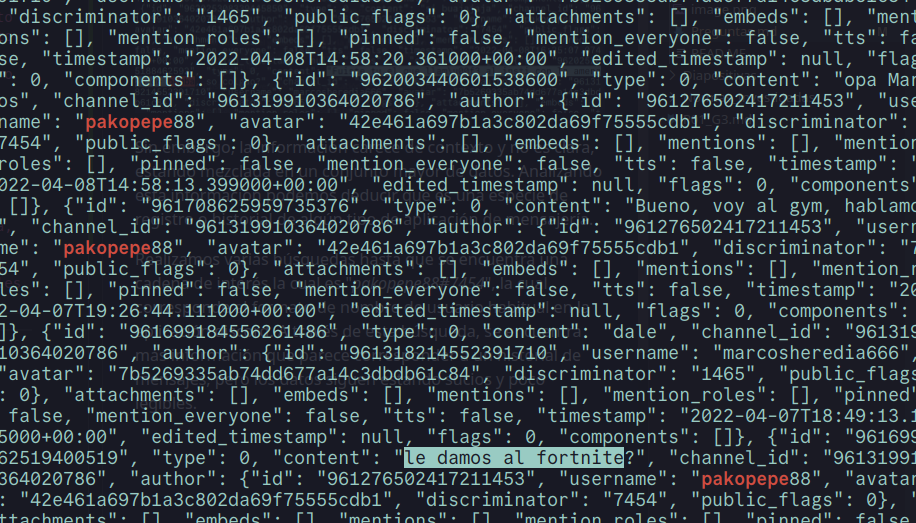

# Índice

1. [Resumen ejecutivo](#resumen-ejecutivo)
2. [Introducción](#introducción)
3. [Objetivos](#objetivos)
4. [Alcance](#alcance)
5. [Metodología](#metodología)
6. [Investigación](#investigación)

   6.1 [Timeline](#timeline)
7. [Conclusiones](#conclusiones)
8. [Anexos](#anexos)

# Resumen ejecutivo

En esta documento se recoge el proceso de análisis por parte _Netmancer Inc._ de una captura de la memoria RAM (de tipo volátil, no persistente) de un equipo intervenido por las autoridades competentes. 

En el proceso de investigación se hace uso de herramientas como Volatility y Python para realizar un excrutinio de la memoria con el propósito de aportar información capaz de relacionar al alumno Francisco José Jiménez con una falsa amenaza de bomba recibida en su instituto. 

Aplicando técnicas informáticas forenses, se recopila información diversa de la máquina del implicado a partir de la captura de memoria, hasta que finalmente se concluye que existe relación de Francisco José con el altercado, habiendo presencia en la captura de memoria volátil de ciertas conversaciones pertenecientes a una aplicación de comunicaciones en la que un usuario "pakopepe88", alias del alumno investigado, confiesa en una conversación grupal la autoría de la supuesta llamada.

# Introducción

En este documento se detallan los hallazgos encontrados al analizar el volcado de memoria recibido. Se incluyen anexos que hacen referencia a los hallazgos mencionados, a la cadena de custodia y un documento generado sobre la integridad de los ficheros y el volcado de memoria, comprobando y comparando dichos hashes. También se menciona la metodología utilizada y las herramientas que se ha utilizado para el análisis en el proceso de investigación. 

# Objetivos

Determinar si la persona llamada Francisco José Jiménez, alias Pacopepe tiene relación con la llamada anónima alertando de una bomba.

# Alcance

Cualquier información contenida en el volcado de memoria RAM del ordenador de Pacopepe.

# Metodología

A continuación indicamos la metodología utilizada para el proceso:

1. Identificación de hallazgos o vestigios.

En primer lugar comenzamos por identificar los elementos que puedan tener hallazgos o vestigios de forma digital documentandolos:
- Dispositivos fisico.
- Redes y conexiones a internet.
- Software.
- Datos en la nube.
  
2. Adquisición.

Planificamos la adquisición para encontras las distintas fuentes a través de un orden de recogida basandonos en los siguientes criterios.

- Su valor probable: La fuente de datos que mas hallazgos o con mayor calidad podrían contener.
- Volatilidad:
  i. Registros, caché
  ii. Tablas de enrutamientos, caché ARP, tabla de procesos, estadística del núcleo y memoria.
  iii. Sistemas de archivos temporales.
  iv. Disco duro
  v. Datos de registro remoto, logs del sistema y monitorización del sistema.
  vi. Configuración física y topología de la red.
  vii. documentos y archivos físicos.
- Cantidad de esfuerzo requerido.

3. Presentación.

En esta fase el objetivo es mantener la integridad de los hallazgos, para ello se deben aplicar una serie de medidas como:

- Evitar exposición a campos magnéticos y otras interferencias.
- Almacenar el hallazgo, precintarlo y sellarlo en los soportes adecuados.
- Utilizar el material adecuado como indumentaria de protección para evitar daños por descargas electroestáticas entre otros.

4. documentación.

En esta fase se documentará el procedimiento completo de forma detallada y concisa que sigue una línea temporal (fecha, hora, ubicación...).

Se documentarán todos los procesos llevados acabo:

- Tácticas de adquisición
- Tipos de hardware o software
- Configuraciones
- Herramientas utilizadas

Es crucial detallar un registro de todas las personas que han tenido acceso a los hallazgos, es decir, mantener la cadena de custodia para demostrar que los hallazgos no han sido modificadas. La cadena de custodia debería de componerse de:

- Nombre de la persona que manejó la evidencia
- Fecha
- Propósito de cada manipulación

5. Análisis.

En esta fase se llevarán a cabo una serie de procesos y tareas que intentarán dar respuesta a preguntas relacionadas con el evento que se está investigando. Esto incluye:

- Revisar la hora de la BIOS del dispositivos
- Recuperar ficheros borrados
- Analizar los metadatos
- Analizar los registros de red
- Estudiar las particiones y sistemas de ficheros.
- Analizar el sistema operativo
- Estudiar la seguridad implementada en el sistema
- Analizar los registros de autenticación

6. Presentación.

En esta fase se escribirá un informe pericial con toda la información obtenida a lo largo del proceso de análisis. Este informe debe escribirse en un lenguaje entendible para un público no técnico y tener una estructura uniforme. El informe debe incluir la documentación de la cadena de custodia y al finalizar el informe será remitido al organismo solicitante.

**Herramientas usadas**

| Nombre de la herramienta | Empresa      | Versión        |
|--------------------------|--------------|----------------|
| Volatility| Volatility Foundation        | 2.0       |
| Python| Python       | 3.11.6      |
# Investigación

Se ha analizado con el plugin handles de Volatility los handles que se encuentran en el volcado. 

El plugin handles lista una sucesión de archivos que están siendo utilizados por los programas en la memoria RAM.


Una vez realizada la extracción se ha utilizado el comando grep con la cadena "Users" para comprobar que usuarios hay en la máquina.


Una vez encontrada la existencia de un usuario Pacopepe, se ha decidido utilziar el comando mencionado en el párrafo anterior llamado grep para buscar los ficheros que haya podido abrir el usuario.


Analizando detalladamente la salida del comando mostrado en la captura anterior se ha encontrado que el usuario Pacopepe abrió un fichero llamado "Trabajo de historia Pacopepe.odt".


Una vez encontrado el fichero se ha exportado a un fichero .txt la salida del plugin filescan para luego utilizar el comando grep y buscar el fichero encontrado anteriormente.


Se ha utilizado el comando grep para intentar encontrar el fichero y dumpearlo. No se ha encontrado el fichero como tal pero si su versión .pdf.


Se ha intentado dumpear dicho fichero pdf pero no se ha conseguido con la dirección de memoria dada por filescan, con el plugin dumpfiles y en el directorio que se encuentra en la misma carpeta del proyecto llamado dumpfiles.


En cuanto a la investigación para determinar si hay vestigios de un posible vínculo del alumno Francisco José Jiménen con el falso aviso de bomba, se ha determinado que existe una conversación perteneciente de una aplicación de mensajería que relaciona a Francisco José Jiménez alias "Pacopepe" con la realización de la llamada de aviso de bomba falsa. 

Para llegar a estos datos se ha seguido el siguiente procedimiento:

En primer lugar se hace uso del comando `strings` de la terminal de linux para encontrar cadenas de texto legibles en un archivo de datos en bruto como es la captura de memoria adjunta al caso.

Utilizamos un filtro en el resultado que busque coincidencias con la palabra "bomba" para ver si existe alguna coincidencia y efectivamente encontramos que existe una cadena sospecha en los datos.



Sin embargo, la información carece de contexto y no es clara, estando mezclada en un conjunto mayor de datos. Analizando esta información podemos deducir que es una especie de registro o historial de algún tipo de aplicación de mensajería. 

Realizamos varias búsquedas hasta que se encuentra una cadena de interés la cual es "_pakopepe88#7454_", la cual corresponde al formato de nombre de usuario habitual en la aplicación discord. A través de esta búsqueda, se encuentra más información que parece corresponder a un historial de mensajes, pero los datos siguen estando sucios y poco legibles.



Debido a las características de los datos, parece corresponder con un formato de archivo estructurado `.json`, que contiene varios campos de tipo clave-valor los cuáles contienen información. Teniendo estos datos, podemos elaborar un script con python 3.11.6 que filtre los datos, los limpie y nos lo muestre de forma ordenada para ver si podemos sacar alguna información de calidad. Para ello almacenamos la salida del comando en un fichero `conversacion.txt`, el cual será utilizado por el script para generar un archivo estructurado `chat.json` ordenado cronológicamente, el cual nos descubre una conversación entre los usuarios "_pakopepe88_" y "_marcosheredia666_", adjuntamos aquí un fragmento clave de la conversación:

```json
    {
        "username": "pakopepe88",
        "timestamp": "2022-04-08T16:25:22.568000+00:00",
        "content": "hala, ya no hai examen de lengua",
        "order": 37
    },
    {
        "username": "pakopepe88",
        "timestamp": "2022-04-08T16:25:19.620000+00:00",
        "content": "si buajajaja",
        "order": 38
    },
    {
        "username": "pakopepe88",
        "timestamp": "2022-04-08T16:25:07.074000+00:00",
        "content": "Fuiste tu el que llamó al insti con la amenaza de bomba, so colgao?",
        "order": 39
    },
    {
        "username": "marcosheredia666",
        "timestamp": "2022-04-08T16:25:34.832000+00:00",
        "content": "ke le den por kulo",
        "order": 40
    },
    {
        "username": "marcosheredia666",
        "timestamp": "2022-04-08T16:26:08.543000+00:00",
        "content": "me dijo el Tom que habian llamado jajaj",
        "order": 41
    },
    {
        "username": "pakopepe88",
        "timestamp": "2022-04-08T16:26:14.287000+00:00",
        "content": "ahora espera que no se chive el benji de mierda.",
        "order": 42
    },
    {
        "username": "pakopepe88",
        "timestamp": "2022-04-08T16:26:27.956000+00:00",
        "content": "mas le vale",
        "order": 43
    }
]
```

Leyendo la conversación puede llegarse a una conclusión lógica de que claramente ambos usuarios tienen conocimiento y conciencia de los hechos acontecidos. La conversación completa se adjunta como "**ANEXO 4 Reconstrucción del Chat**", así como el script y los ficheros de texto adjuntos como "**ANEXO 5 Datos brutos**".

## Timeline

# Conclusiones

En base a los hallazgos y análisis realizados al volcado de memoria proporcionado, se llega a las siguientes conclusiones:

- El ordenador, de nombre DESKTOP-01S7HH9 posee un único usuario de nombre Pacopepe, sin contar con los usuarios predeterminados del sistema.
- El usuario Pacopepe tenía abierto un archivo pdf de nombre Trabajo historia Pacopepe.pdf.
- Se ha encontrado una cadena de caracteres denominada como pakopepe88, la cual coincide con el patrón que suelen seguir los nicknames de las cuentas de Discord.
- La aplicación Discord se encuentra instalada en el equipo, y además se hallaba en ejecución.
- Ha sido localizada una conversación de Discord en la que el usuario pakopepe88 pregunta a otro usuario denominado como marcosheredia666 acerca de la autoría de los hechos, a lo que le responde textualmente "me dijo el Tom que habian llamado jajaj".

# Anexos

- [Anexo 1 - Integridad de los datos y testigos](https://github.com/IES-Rafael-Alberti/G3-ANALISIS-FORENSE/blob/main/AF-P04-G3/Anexos/Anexo%201%20-%20Integridad%20de%20los%20datos%20y%20testigos.xlsx)
- [Anexo 2 - Registro de cadena de custodia](https://github.com/IES-Rafael-Alberti/G3-ANALISIS-FORENSE/blob/main/AF-P04-G3/Anexos/Anexo%202%20-%20Registro%20de%20cadena%20de%20custodia.xlsx)
- [Anexo 4 - Reconstrucción del Chat](https://github.com/IES-Rafael-Alberti/G3-ANALISIS-FORENSE/blob/main/AF-P04-G3/Anexos/Anexo%204%20-%20Reconstrucci%C3%B3n%20del%20chat.json)
- [Anexo 5 - Datos brutos](https://github.com/IES-Rafael-Alberti/G3-ANALISIS-FORENSE/blob/main/AF-P04-G3/Anexos/Anexo%205%20-%20Datos%20brutos.txt)
- [Anexo 6 - Script Python cleaner.py](https://github.com/IES-Rafael-Alberti/G3-ANALISIS-FORENSE/blob/main/AF-P04-G3/Anexos/Anexo%206%20-%20Script%20Python%20cleaner.py)
