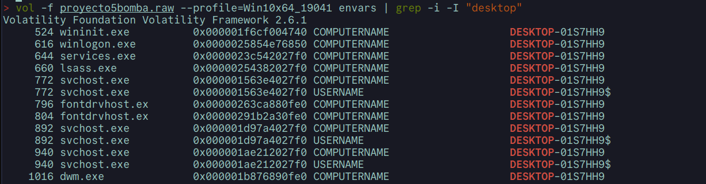

1. Confirmar si la imagen de memoria pertenece al ordenador del alumno, identificado como "DESKTOP-01S7HH9".

Sí, puede confirmarse mediante la investigación en la imagen de 

2. Determinar el PID del proceso de la aplicación utilizada para visualizar documentos PDF y establecer cuál es su proceso padre.

AcroCEF.exe tiene el PID 7376 y su proceso padre tiene el PID

3. A través de los manejadores, identificar qué documento estaba siendo editado por el alumno durante la intervención policial.

4. Buscar en el volcado de memoria pruebas que vinculen al usuario del equipo con la realización de la falsa amenaza de bomba.

