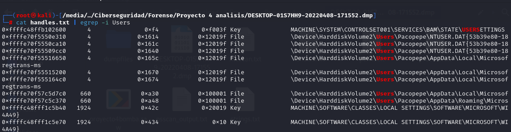

1. Confirmar si la imagen de memoria pertenece al ordenador del alumno, identificado como "DESKTOP-01S7HH9".

Sí, puede confirmarse mediante la investigación en la imagen de 

2. Determinar el PID del proceso de la aplicación utilizada para visualizar documentos PDF y establecer cuál es su proceso padre.

AcroCEF.exe tiene el PID 7376 y su proceso padre tiene el PID

3. A través de los manejadores, identificar qué documento estaba siendo editado por el alumno durante la intervención policial.

Se ha analizado con el plugin handles de Volatility los handles que se encuentran en el volcado. 

Para facilitar este trabajo se han exportado los handles a un fichero handles.txt

Una vez realizada la extracción se ha utilizado el comando grep con la cadena "Users" para comprobar que usuarios hay en la máquina.

Una vez encontrada la existencia de un usuario Pacopepe, se ha decidido utilziar el comando mencionado en el párrafo anterior llamado grep para buscar los ficheros que haya podido abrir el usuario.

Analizando detalladamente la salida del comando mostrado en la captura anterior se ha encontrado que el usuario Pacopepe abrió un fichero llamado "Trabajo de historia Pacopepe.odt".

4. Buscar en el volcado de memoria pruebas que vinculen al usuario del equipo con la realización de la falsa amenaza de bomba.

