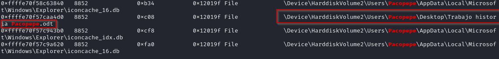
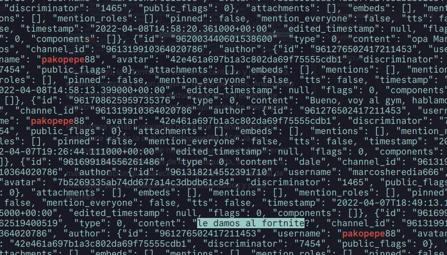

1. **Confirmar si la imagen de memoria pertenece al ordenador del alumno, identificado como "DESKTOP-01S7HH9".**

Sí, puede confirmarse mediante la investigación en la imagen de 


2. **Determinar el PID del proceso de la aplicación utilizada para visualizar documentos PDF y establecer cuál es su proceso padre.**

AcroCEF.exe tiene el PID 7376 y su proceso padre tiene el PID 8664

3. **A través de los manejadores, identificar qué documento estaba siendo editado por el alumno durante la intervención policial.**

Se ha analizado con el plugin handles de Volatility los handles que se encuentran en el volcado. 

Para facilitar este trabajo se han exportado los handles a un fichero handles.txt


Una vez realizada la extracción se ha utilizado el comando grep con la cadena "Users" para comprobar que usuarios hay en la máquina.


Una vez encontrada la existencia de un usuario Pacopepe, se ha decidido utilziar el comando mencionado en el párrafo anterior llamado grep para buscar los ficheros que haya podido abrir el usuario.


Analizando detalladamente la salida del comando mostrado en la captura anterior se ha encontrado que el usuario Pacopepe abrió un fichero llamado "Trabajo de historia Pacopepe.odt".



**4. Buscar en el volcado de memoria pruebas que vinculen al usuario del equipo con la realización de la falsa amenaza de bomba.**

Existe una conversación de una aplicación de mensajería que relaciona a Francisco José Jiménez alias "Pacopepe" con la realización de la llamada de aviso de bomba falsa. Para llegar a estos datos se ha seguido el siguiente procedimiento:

En primer lugar se hace uso del comando `strings` de la terminal de linux para encontrar cadenas de texto legibles en un archivo de datos en bruto como es la captura de memoria adjunta al caso.

Utilizamos un filtro en el resultado que busque coincidencias con la palabra "bomba" para ver si existe alguna coincidencia y efectivamente encontramos que existe una cadena sospecha en los datos.


Sin embargo, la información carece de contexto y no es clara, estando mezclada en un conjunto mayor de datos. Analizando esta información podemos deducir que es una especie de registro o historial de algún tipo de aplicación de mensajería. 

Realizamos varias búsquedas hasta que se encuentra una cadena de interés la cual es "_pakopepe88#7454_", la cual corresponde al formato de nombre de usuario habitual en la aplicación discord. A través de esta búsqueda, se encuentra más información que parece corresponder a un historial de mensajes, pero los datos siguen estando sucios y poco legibles.



Debido a las características de los datos, parece corresponder con un formato de archivo estructurado `.json`, que contiene varios campos de tipo clave-valor los cuáles contienen información. Teniendo estos datos, podemos elaborar un script con python 3.11.6 que filtre los datos, los limpie y nos lo muestre de forma ordenada para ver si podemos sacar alguna información de calidad. Para ello almacenamos la salida del comando en un fichero `conversacion.txt`, el cual será utilizado por el script para generar un archivo estructurado `chat.json` ordenado cronológicamente, el cual nos descubre una conversación entre los usuarios "_pakopepe88_" y "_marcosheredia666_", adjuntamos aquí un fragmento clave de la conversación:

```json
[
    {
        "username": "pakopepe88",
        "timestamp": "2022-04-08T16:26:27.956000+00:00",
        "content": "mas le vale"
    },
    {
        "username": "pakopepe88",
        "timestamp": "2022-04-08T16:26:14.287000+00:00",
        "content": "ahora espera que no se chive el benji de mierda."
    },
    {
        "username": "marcosheredia666",
        "timestamp": "2022-04-08T16:26:08.543000+00:00",
        "content": "me dijo el Tom que habian llamado jajaj"
    },
    {
        "username": "marcosheredia666",
        "timestamp": "2022-04-08T16:25:34.832000+00:00",
        "content": "ke le den por kulo"
    },
    {
        "username": "pakopepe88",
        "timestamp": "2022-04-08T16:25:22.568000+00:00",
        "content": "hala, ya no hai examen de lengua"
    },
    {
        "username": "pakopepe88",
        "timestamp": "2022-04-08T16:25:19.620000+00:00",
        "content": "si buajajaja"
    },
    {
        "username": "pakopepe88",
        "timestamp": "2022-04-08T16:25:07.074000+00:00",
        "content": "Fuiste tu el que llam\\u00f3 al insti con la amenaza de bomba, so colgao?"
    },
    {
        "username": "marcosheredia666",
        "timestamp": "2022-04-08T16:24:56.786000+00:00",
        "content": "bueno, yo eso si"
    },
    {
        "username": "marcosheredia666",
        "timestamp": "2022-04-08T16:17:30.368000+00:00",
        "content": "es ke ni copiar de la wikipedia, te lo juro."
    },
```

Leyendo la conversación puede llegarse a una conclusión lógica de que claramente ambos usuarios tienen conocimiento y conciencia de los hechos acontecidos. La conversación completa se adjunta como "**ANEXO 4 Reconstrucción del Chat**", así como el script y los ficheros de texto adjuntos como "**ANEXO 5 Datos brutos**".