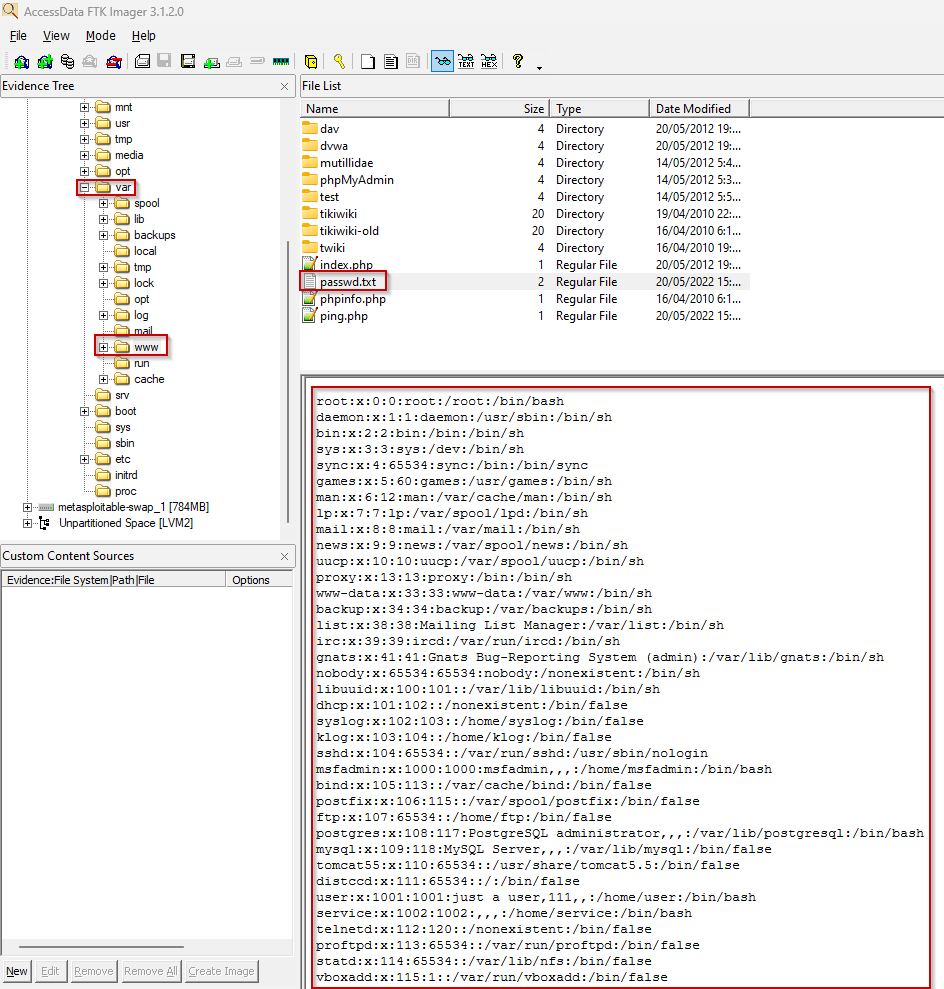

# Índice

1. [Resumen ejecutivo](#resumen-ejecutivo)
2. [Introducción](#introducción)
3. [Objetivos](#objetivos)
4. [Alcance](#alcance)
5. [Metodología](#metodología)
6. [Investigación](#investigación)  
   6.1 [Timeline](#timeline)
7. [Conclusiones](#conclusiones)
8. [Anexos](#anexos)

# Resumen ejecutivo

En el presente informe se recoge el proceso de análisis realizado por *Netmancer Inc.* al volcado de memoria RAM y la imagen del disco tomadas del servidor vulnerado.

Durante el proceso de investigación se hace uso de herramientas como Volatility y Python para realizar un excrutinio de la memoria con el propósito de aportar información que arroje luz sobre la naturaleza y la autoría del incidente acaecido en la empresa.

A partir del volcado de RAM y la imagen de disco suministrados, se ha determinado la naturaleza del ataque como una inyección de comandos a través de la página ping.php, lo que permitió exfiltrar el fichero /etc/passwd del servidor comprometido.

# Introducción

En el presente documento se detallan los hallazgos encontrados tras llevar a cabo el análisis forense del volcado de memoria RAM y la imagen del disco del servidor corporativo comprometido. Se incluyen además, anexos que hacen referencia a los hallazgos mencionados, a la cadena de custodia y un documento generado sobre la integridad de los ficheros y el volcado de memoria, comprobando y comparando dichos hashes. La metodología seguida durante la investigación y las herramientas que se han utilizado a lo largo del proceso de investigación han sido adjuntadas también.

# Objetivos

La investigación forense del caso persigue el objetivo de seguir el rastro digital del perpetrador de la exfiltración de datos, posterior a la explotaxión de la vulnerabilidad presente en la aplicación web usada en la compañía. Como resumen, debemos lograr averiguar la identidad del atacante y descubrir sus motivaciones.

# Alcance

El alcance de la investigación forense se extiende al volcado de RAM realizado sobre el servidor comprometido, así como a la imagen del disco del mismo.

# Metodología

A continuación indicamos la metodología utilizada para el proceso:

1. Identificación de hallazgos o vestigios.

En primer lugar comenzamos por identificar los elementos que puedan tener hallazgos o vestigios de forma digital documentandolos:
- Dispositivos fisico.
- Redes y conexiones a internet.
- Software.
- Datos en la nube.
  
2. Adquisición.

Planificamos la adquisición para encontras las distintas fuentes a través de un orden de recogida basandonos en los siguientes criterios.

- Su valor probable: La fuente de datos que mas hallazgos o con mayor calidad podrían contener.
- Volatilidad:
  i. Registros, caché
  ii. Tablas de enrutamientos, caché ARP, tabla de procesos, estadística del núcleo y memoria.
  iii. Sistemas de archivos temporales.
  iv. Disco duro
  v. Datos de registro remoto, logs del sistema y monitorización del sistema.
  vi. Configuración física y topología de la red.
  vii. documentos y archivos físicos.
- Cantidad de esfuerzo requerido.

3. Presentación.

En esta fase el objetivo es mantener la integridad de los hallazgos, para ello se deben aplicar una serie de medidas como:

- Evitar exposición a campos magnéticos y otras interferencias.
- Almacenar el hallazgo, precintarlo y sellarlo en los soportes adecuados.
- Utilizar el material adecuado como indumentaria de protección para evitar daños por descargas electroestáticas entre otros.

4. documentación.

En esta fase se documentará el procedimiento completo de forma detallada y concisa que sigue una línea temporal (fecha, hora, ubicación...).

Se documentarán todos los procesos llevados acabo:

- Tácticas de adquisición
- Tipos de hardware o software
- Configuraciones
- Herramientas utilizadas

Es crucial detallar un registro de todas las personas que han tenido acceso a los hallazgos, es decir, mantener la cadena de custodia para demostrar que los hallazgos no han sido modificadas. La cadena de custodia debería de componerse de:

- Nombre de la persona que manejó la evidencia
- Fecha
- Propósito de cada manipulación

5. Análisis.

En esta fase se llevarán a cabo una serie de procesos y tareas que intentarán dar respuesta a preguntas relacionadas con el evento que se está investigando. Esto incluye:

- Revisar la hora de la BIOS del dispositivos
- Recuperar ficheros borrados
- Analizar los metadatos
- Analizar los registros de red
- Estudiar las particiones y sistemas de ficheros.
- Analizar el sistema operativo
- Estudiar la seguridad implementada en el sistema
- Analizar los registros de autenticación

6. Presentación.

En esta fase se escribirá un informe pericial con toda la información obtenida a lo largo del proceso de análisis. Este informe debe escribirse en un lenguaje entendible para un público no técnico y tener una estructura uniforme. El informe debe incluir la documentación de la cadena de custodia y al finalizar el informe será remitido al organismo solicitante.

**Herramientas usadas**

| Nombre de la herramienta | Distribuidor | Versión        |
|--------------------------|--------------|----------------|
| FTK Imager               | AccessData   | 4.7.1.2        |
| Volatility   |   Volatility Foundation  | 2.0            |
| Python                   | Python       | 3.11.6         |
| ChatGPT                  | OpenAI       | 3.5 Turbo      |

# Investigación

Comenzamos cargando la imagen del disco del servidor comprometido con el software *FTK Imager*, y empezamos a buscar pistas que arrojen luz sobre los hechos acontecidos. En la ruta */var/www* observamos un fichero **ping.php**, que resulta de gran importancia para el caso. 

Su funcionalidad original consiste en realizar, como su propio nombre indica, ping a la dirección IP que escribas en el cuadro de texto, pero esto esconde una vulnerabilidad de inyección de comandos, que permite al atacante acceder al sistema.

Continuando el análisis en la carpeta */var*, vemos que la aplicación web está hosteada en Apache, de modo que nos dirigimos a la carpeta */var/apache2/log*, donde encontramos los logs de Apache. Si los revisamos veremos una IP distinta al localhost, que resulta ser la 192.168.1.6. Tras esta IP, se accede a la aplicación desde un sistema operativo Linux x86_64, y se hace ping a la dirección 192.168.1.28.

Además de esto, vemos un fichero passwd.txt en la carpeta /var/www que definitivamente no debería estar ahí, por lo que analizamos el volcado de memoria RAM buscando la ejecución de algún comando relacionado con este fichero.

Valiéndonos de comandos de Linux, tomamos el volcado de RAM y buscamos por el comando *cat /etc/passwd*, y encontramos que se redirigió el contenido del fichero **passwd** a través de cat utilizando una inyección de comandos con ping.php.

De esto deducimos que el fichero passwd original no muestra actividad debido a la redirección del contenido de este a otro fichero passwd.txt, por lo que no se abrió el original.

## Timeline

[...]

# Conclusiones

En base a los hallazgos recabados del volcado de memoria RAM y la imagen del disco proporcionadas, llegamos a las conclusiones siguientes:

- Desde la dirección IP 192.168.1.6 y con un sistema operativo Linux x86_64, se hace ping a la dirección 192.168.1.28 a través de la aplicación web ping.php.
- Los ping realizados incluyen el comando *cat /etc/passwd > passwd.txt*, que permite volcar el contenido del fichero passwd en un fichero passwd.txt.
- La aplicación web ping.php presenta una vulnerabilidad de inyección de comandos del sistema operativo.

# Anexos

- [Anexo 1 - Integridad de los datos y testigos](https://github.com/IES-Rafael-Alberti/G3-ANALISIS-FORENSE/blob/main/AF-P04-G3/Anexos/Anexo%201%20-%20Integridad%20de%20los%20datos%20y%20testigos.xlsx)
- [Anexo 2 - Registro de cadena de custodia](https://github.com/IES-Rafael-Alberti/G3-ANALISIS-FORENSE/blob/main/AF-P04-G3/Anexos/Anexo%202%20-%20Registro%20de%20cadena%20de%20custodia.xlsx)
- [Anexo 3 - Índice de hallazgos](https://github.com/IES-Rafael-Alberti/G3-ANALISIS-FORENSE/blob/main/AF-P04-G3/Anexos/Anexo%202%20-%20Registro%20de%20cadena%20de%20custodia.xlsx)
