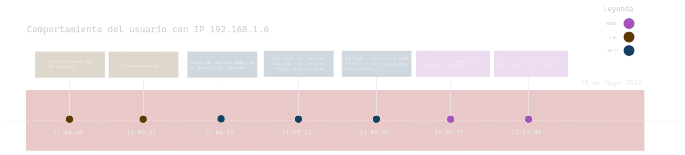
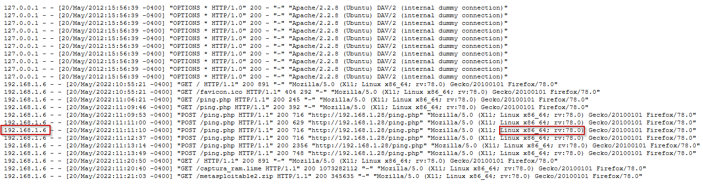
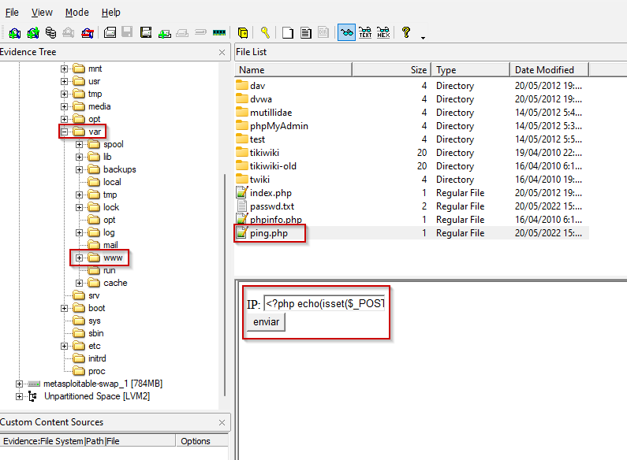
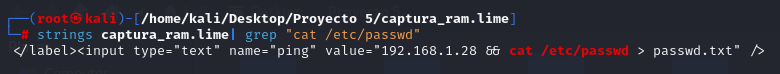

# Índice

1. [Resumen ejecutivo](#resumen-ejecutivo)
2. [Introducción](#introducción)
3. [Objetivos](#objetivos)
4. [Alcance](#alcance)
5. [Metodología](#metodología)
6. [Investigación](#investigación)  
   6.1 [Timeline](#timeline)
7. [Conclusiones](#conclusiones)
8. [Anexos](#anexos)

# Resumen ejecutivo

En el presente informe se recoge el proceso de análisis realizado por *Netmancer Inc.* al volcado de memoria RAM y la imagen del disco tomadas del servidor vulnerado.

Durante el proceso de investigación se hace uso de herramientas como Volatility y Python para realizar un excrutinio de la memoria con el propósito de aportar información que arroje luz sobre la naturaleza y la autoría del incidente acaecido en la empresa.

A partir del volcado de RAM y la imagen de disco suministrados, se ha determinado la naturaleza del ataque como una inyección de comandos a través de la página ping.php, lo que permitió exfiltrar el fichero /etc/passwd del servidor comprometido.

# Introducción

En el presente documento se detallan los hallazgos encontrados tras llevar a cabo el análisis forense del volcado de memoria RAM y la imagen del disco del servidor corporativo comprometido. 

Se incluyen además, anexos que hacen referencia a los hallazgos mencionados, a la cadena de custodia y un documento generado sobre la integridad de los ficheros y el volcado de memoria, comprobando y comparando dichos hashes. La metodología seguida durante la investigación y las herramientas que se han utilizado a lo largo del proceso de investigación han sido adjuntadas también.

# Objetivos

La investigación forense del caso persigue el objetivo de seguir el rastro digital del perpetrador de la exfiltración de datos, posterior a la explotaxión de la vulnerabilidad presente en la aplicación web usada en la compañía. Como resumen, debemos lograr averiguar la identidad del atacante y descubrir sus motivaciones. Es por ello, que se establecen los siguientes objetivos:

- Determinar la vulnerabilidad explotada por el atacante que a través de la cual logró su intrusión
- Conocer la IP del atacante, su sistema operativo y el cliente utilizado como vector de ataque
- Investigar rastros de posibles métodos de escalada de privilegios u otras técnicas ofensivas de seguridad.
- Examinar los posibles datos que fueron exfiltrados durante el ataque

# Alcance

El alcance de la investigación forense se extiende a la totalidad de un volcado de RAM realizado sobre el servidor comprometido, así como a la imagen de disco del mismo.

# Metodología

A continuación indicamos la metodología utilizada para el proceso:

1. Identificación de hallazgos o vestigios.

En primer lugar comenzamos por identificar los elementos que puedan tener hallazgos o vestigios de forma digital documentandolos:
- Dispositivos fisico.
- Redes y conexiones a internet.
- Software.
- Datos en la nube.
  
2. Adquisición.

Planificamos la adquisición para encontras las distintas fuentes a través de un orden de recogida basandonos en los siguientes criterios.

- Su valor probable: La fuente de datos que mas hallazgos o con mayor calidad podrían contener.
- Volatilidad:
  i. Registros, caché
  ii. Tablas de enrutamientos, caché ARP, tabla de procesos, estadística del núcleo y memoria.
  iii. Sistemas de archivos temporales.
  iv. Disco duro
  v. Datos de registro remoto, logs del sistema y monitorización del sistema.
  vi. Configuración física y topología de la red.
  vii. documentos y archivos físicos.
- Cantidad de esfuerzo requerido.

3. Presentación.

En esta fase el objetivo es mantener la integridad de los hallazgos, para ello se deben aplicar una serie de medidas como:

- Evitar exposición a campos magnéticos y otras interferencias.
- Almacenar el hallazgo, precintarlo y sellarlo en los soportes adecuados.
- Utilizar el material adecuado como indumentaria de protección para evitar daños por descargas electroestáticas entre otros.

4. documentación.

En esta fase se documentará el procedimiento completo de forma detallada y concisa que sigue una línea temporal (fecha, hora, ubicación...).

Se documentarán todos los procesos llevados acabo:

- Tácticas de adquisición
- Tipos de hardware o software
- Configuraciones
- Herramientas utilizadas

Es crucial detallar un registro de todas las personas que han tenido acceso a los hallazgos, es decir, mantener la cadena de custodia para demostrar que los hallazgos no han sido modificadas. La cadena de custodia debería de componerse de:

- Nombre de la persona que manejó la evidencia
- Fecha
- Propósito de cada manipulación

5. Análisis.

En esta fase se llevarán a cabo una serie de procesos y tareas que intentarán dar respuesta a preguntas relacionadas con el evento que se está investigando. Esto incluye:

- Revisar la hora de la BIOS del dispositivos
- Recuperar ficheros borrados
- Analizar los metadatos
- Analizar los registros de red
- Estudiar las particiones y sistemas de ficheros.
- Analizar el sistema operativo
- Estudiar la seguridad implementada en el sistema
- Analizar los registros de autenticación

6. Presentación.

En esta fase se escribirá un informe pericial con toda la información obtenida a lo largo del proceso de análisis. Este informe debe escribirse en un lenguaje entendible para un público no técnico y tener una estructura uniforme. El informe debe incluir la documentación de la cadena de custodia y al finalizar el informe será remitido al organismo solicitante.

**Herramientas usadas**

| Nombre de la herramienta | Distribuidor | Versión        |
|--------------------------|--------------|----------------|
| FTK Imager               | AccessData   | 4.7.1.2        |
| Volatility   |   Volatility Foundation  | 2.0            |
| Python                   | Python       | 3.11.6         |
| ChatGPT                  | OpenAI       | 3.5 Turbo      |

# Investigación

En primer lugar se intenta determinar la IP del posible atacante. Para ello se examina con ayuda de la herramienta _volatility_ el histórico de conexiones de red para encontrar que existe una conexión establecida a través del demonio del protocolo SMB, **smbd**, a su puerto habitual **139**, desde la dirección IP **192.168.1.6**. 

Se verifica que la IP de la máquina analizada corresponde con **192.168.1.28** mediante el análisis de la configuración del adaptador de red proporcionado por la herramienta **volatility**.

Tras realizar este hallazgo, se procede al análisis de la imagen de disco proporcionada mediante el software *FTK Imager*. Se siguen buscando más trazas de esta dirección IP hasta dar con una correlación entre el archivo de registros de acceso de **Apache2** y el registro de autenticación del sistema _auth.log_.

En el fichero _var/log/auth.log_, el cual es un registro de autenticación en los sistemas Linux, encontramos repetidos intentos fallidos de inicio de sesión a través de una conexión ssh por el usuario "_msfconsole_" proveniente desde la susodicha IP **192.168.1.6**, seguido de una autenticación exitosa para el usuario administrador **msfadmin**.

Transcurrido apenas 1 min de ese evento, encontramos que el usuario msfadmin copia un fichero llamado `ping.php` del directorio `/home/msfadmin/ping.php` al directorio `/var/www`. Se observa en la captura que se abren y se cierran sesiones para el usuario `root`. Esto se debe al funcionamiento del comando `sudo` de linux, que permite ejecutar ciertas instrucciones aisladas como usuario de máximos privilegios (_root_). Además de copiar el fichero `ping.php`, luego lo abre con el editor de texto `nano` mediante el uso de `sudo`.

Analizando el registro de accesos de Apache2, ubicado en */var/apache2/access.log*, vemos numerosas peticiones de tipo POST de nuevo por parte de la IP **192.168.1.6** solicitando el recurso `/ping.php`, además con códigos HTTP 200, los cuáles significan éxito en la comunicación.

De estos datos pueden inferirse también otros, como el sistema operativo del usuario con la susodicha IP, el cual corresponde con _Linux x86_64_ debido al User agent en la petición HTTP. Por las marcas de tiempo, podemos observar que en primer lugar el archivo `ping.php` fue colocado en ese directorio y luego se solicitó externamente a través de una petición HTTP.

Vemos también en el directorio principal para servir la web de apache, _var/www_, un fichero _passwd.txt_ cuyo contenido es idéntico al archivo principal de usuarios de Linux _passwd_, como puede verse en la siguiente imagen comparativa:

> *Ambos extraídos de la captura de disco del servidor afectado, a la izquierda el fichero original de usuarios ubicado en /etc/passwd y a la derecha el fichero passwd.txt ubicado en var/www*

Debido a estos hallazgos, procedemos a analizar el volcado de memoria RAM buscando la ejecución de algún comando relacionado con este fichero.

Utilizando el comando `strings` de Linux, que busca cadenas de texto legibles en un archivo, tomamos el volcado de RAM y realizamos varias pruebas que involucren comandos de linux habituales (`ls`, `cat`, `copy`...) y la cadena *passwd*, y encontramos una cadena de código HTML que involucra la ruta básica del archivo */etc/passwd* y el archivo *passwd.txt*.  

El atributo "value" contiene lo que parece ser una cadena que podría en ciertos casos interpretarse como maliciosa, ya que añade un operador lógico `&&` junto a un comando de terminal de linux, que involucraría a `cat` y una URI de un archivo. Esto es una práctica frecuente en las denominadas inyecciones de código. 

Sin intención de declarar el hecho de que el archivo `ping.php` haya sido utilizado para fines maliciosos, tan solo efectuando una suposición que quizá aporte un contexto importante, es un detalle importante mencionar que en el caso de que el archivo `ping.php` hubiese sido el que efectuara esta instrucción, debido al funcionamiento base del comando `cat` de Linux, el archivo resultante que se establece como salida, es decir *passwd.txt*, habría quedado ubicado en el mismo directorio donde estuviera el archivo `ping.php`, es decir, `/var/www`, donde se ubica. 

De esto podemos deducir también que el fichero _passwd_ original no muestra actividad debido a la redirección del contenido de este a otro fichero passwd.txt, por lo que no se abrió el original.

## Timeline

[...]

# Conclusiones

En base a los hallazgos recabados del volcado de memoria RAM y la imagen del disco proporcionadas, llegamos a las conclusiones siguientes:

- Se ha realizado una autenticación remota exitosa a través de `ssh` en la máquina tras múltiples intentos fallidos repetidos para la dirección IP **192.168.1.6**.
- Desde la dirección IP 192.168.1.6 y con un sistema operativo Linux x86_64, a través de una petición HTTP se solicita el recurso `/ping.php` repetidas veces, tras ser ubicado previamente en el directorio `/var/www` por el usuario *msfadmin*.
- En la memoria volátil de la máquina existe presencia de una cadena frecuentemente utilizada en los ataques de tipo inyección de código concretamente `192.168.1.28 && cat /etc/passwd > passwd.txt`, que permitiría volcar el contenido del fichero passwd en un fichero passwd.txt.
- La actual implementación del archivo `ping.php`, presente en la captura del disco de la máquina, presenta una vulnerabilidad de inyección de comandos del sistema operativo al no tener el input del usuario sanitizado.

# Anexos

- [Anexo 1 - Integridad de los datos y testigos](https://github.com/IES-Rafael-Alberti/G3-ANALISIS-FORENSE/blob/main/AF-P04-G3/Anexos/Anexo%201%20-%20Integridad%20de%20los%20datos%20y%20testigos.xlsx)
- [Anexo 2 - Registro de cadena de custodia](https://github.com/IES-Rafael-Alberti/G3-ANALISIS-FORENSE/blob/main/AF-P04-G3/Anexos/Anexo%202%20-%20Registro%20de%20cadena%20de%20custodia.xlsx)
- [Anexo 3 - Índice de hallazgos](https://github.com/IES-Rafael-Alberti/G3-ANALISIS-FORENSE/blob/main/AF-P04-G3/Anexos/Anexo%202%20-%20Registro%20de%20cadena%20de%20custodia.xlsx)
