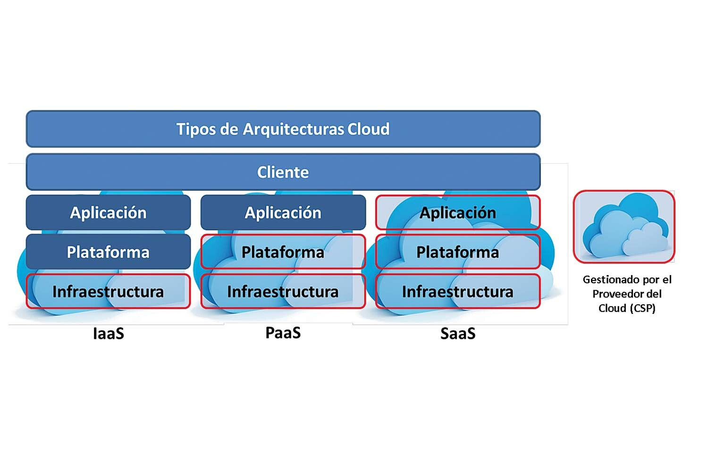

# Índice

1. [Resumen ejecutivo](#resumen-ejecutivo)
2. [Introducción](#introducción)
3. [Características de la nube y su impacto en el análisis forense](#características-de-la-nube-y-su-impacto-en-el-análisis-forense)
4. [Estrategias](#estrategias)

    4.1 [Algunos tipos de metodología](#algunos-tipos-de-metodología)
5. [Metodología](#metodología)
6. [Requerimientos legales y regulaciones aplicables a entornos en la nube](#requirimientos-legales-y-regulaciones-aplicables-a-entornos-de-nube)
7. [Recomendaciones](#recomendaciones-para-facilitar-el-análisis-forense)
8. [Referencias](#referencias)

# Resumen ejecutivo

# Introducción

En vista al auge de la computación en la nube, la infraestructura como servicio (_IaaS_) y las nubes de almacenamiento las organizaciones están adoptando cada vez más servicios basados en la nube para almacenar y procesar datos. Si bien la nube ofrece numerosas ventajas, también plantea diferentes enfoques y aspectos a tener en cuenta para el análisis forense. 

Este documento explora las características de la nube que impactan el análisis forense, describe las estrategias para recopilar evidencia de la nube y analiza los requisitos legales y reglamentarios aplicables a los entornos de nube. Al final del mismo además encontraremos una serie de recomendaciones que nos ayuden a enfrentar mejor una situación que requiera de análisis forense en la nube, así como mejorar la efectividad de las investigaciones.

# Características de la nube y su impacto en el análisis forense

Hoy en día es muy normal en internet encontrarnos con el término "nube" pero no mucha gente sabe realmente qué es, que características tiene y en el caso del análisis forense, su impacto teniendo en cuenta una serie de inconvenientes que dificultan más el análisis de los datos.

Antes de entrar en materia, es bueno saber que es la nube y cuales son las características que la componen.

La "nube" permite almacenar y acceder a datos a través de internet en lugar de tener el dispositivo de almacenamiento en nuestro ordenador. No solo permite el almacenamiento de archivos, también permite acceder a aplicaciones que solemos tener en nuestros dispositivos informáticos sin necesidad de tenernos instalados en nuestro equipo. Los usuarios que hayan contratado los servicios, pueden tener acceso a la nube siempre que tengan una conexión a internet.

Como tal la componen un conjunto de servidores remotos que estan conectados y funcionan de manera coordinada como un único ecosistema.

Hoy en día existen cuatro tipos de nubes, nube pública, nube comunitaria, nube privada y nube híbrida. Como bien indica su nombre, la nube pública ofrece sus servicios a cualquier usuario de internet.

Una nube comunitaria ofrece servicios de manera exclusiva por una comunidad de consumidores de una organización.

La nube privada ofrece los servicios a usuarios limitados por ejemplo a través de redes empresariales y la híbrida ofrece estos servicios de manera pública o privada en función de las necesidades.

Obviamente tener nuestros datos en la nube tiene una serie de inconvenientes para los expertos en la ciencia forense ya que dependiendo del tipo de servicio y sus características dificultan el análisis forense siempre teniendo en cuenta el responsable de la gestión de los datos almacenados y el softare.

En el caso del software como servicio o SaaS, el software y los datos se encuentran disponibles constantemente en la nube, siendo el usuario el que accede directamente a la misma. El proveedor del servicio será el responsable de gestionar los datos y el software.

En el caso de la plataforma como servicio o PaaS, el propietario de la plataforma es el responsable de los datos y aplicaciones que contienen, sin serlo referente al almacenamiento, la red, los servidores o el sistema operativo.

Y por último en el caso de infraestructura como servicio o Iaas, se aloja en un proveedor de nube externo. El proveedor es el propietario de la red y del almacenamiento, pero el desarrollador del servicio final es el responsable de la integridad de los datos, las aplicaciones y el sistema operativo.

Como bien sabemos el uso de la nube existen muchos procesos y usuarios que estan utilizando el software, hardware y recursos que estamos analizando haciendo que la plataforma no sea estable. Tenemos que tener en cuenta también que la jurisdicción física debe ser donde se encuentra el servidor y dependiendo de donde se encuentre, dependerá de la legislación local.

Como vemos no tenemos el control sobre el entorno y el hardware necesitando siempre la colaboración del tercero para realizar el análisis forense.

Las pruebas forenses podrían ser contaminadas teniendo en cuenta que la compartición de los recursos y los datos pueden ser utilizados por otras compañías o usuarios de manera pública y constante.

La dificultad para recuperar por ejemplo datos borrados se complica dada la volatilidad y la movilidad de los datos y la gran cantidad de información que se involucra.

Otra dificultad nos la encontramos al momento de utilizar herramientas tradicionales siendo necesaria la creación de herramientas específicas para las plataformas como Google Drive, AWS etc..

Además, los proveedores tienen distintas formas de proceder y entender la nube teniendo que aprender como funciona cada plataforma gestionada por cada proveedor y como la manejan.

Viéndolo desde la perspectiva del forense podemos comprobar que se complica mucho la recuperacion de "evidencias" y podemos verlo con un ejemplo sobre la mesa, si los datos que se encuentran en el disco duro que está como servicio en la nube se le borran, complica la recuperación de los mismos si no se han creado snapshots o copias de seguridad de ellos. 

Y como se ha mencionado anteriormente el hecho de que los servicios sean accesibles de manera pública, la movilidad de los datos a través de internet cosa que posibilita la contaminación de las pruebas y añadiendo, la elasticidad de los servicios ampliándolos o disminuyéndolos, complica mucho la recuperación de los datos borrados y el análisis de los mismos.

# Estrategias

El ***análisis forense en cloud*** o también conocido como ***cloud forensics*** focaliza su atención en la investigación de delitos informáticos perpetrados en entornos cloud, como su propio nombre indica. En estos entornos, la obtención de pruebas resulta más compleja, debido a la dificultad de delimitar la propietariedad de las pruebas, así como en qué tribunal son admisibles.  

Si deseamos establecer una estrategia apropiada para llevar a cabo un análisis forense satisfactoriamente, debemos tener en cuenta los **modelos de servicio** en el cloud que existen, de modo que podamos determinar al responsable último de la gestión de los datos y el software. También es importante saber si estamos tratando con un cloud privado, público o híbrido. Los servicios mencionados se dividen en:

- **SaaS:** En el modelo de _Software como Servicio_, tanto este como los datos se encuentran alojados permanentemente en la nube. El usuario accede a las aplicaciones directamente en la nube, por lo que será el *proveedor de servicio del cloud* (CSP) quien gestione tanto ese software como los datos asociados y generados por él.
- **PaaS:** Las _Plataformas como Servicio_ o PaaS dependen de una gestión directa de los datos y las aplicaciones que contienen, encargándose de esta labor el propietario de la propia plataforma. Esta gestión no se extiende al ámbito del almacenamiento, la red, los servidores o el sistema operativo.
- **IaaS:** Los modelos de cloud basados en _Infraestructura como Servicio_ se alojan en un proveedor de nube externo. En este caso, el propietario es a su ve el proveedor de la red y el almacenamiento, dejando la integridad de los datos, el middleware, las aplicaciones y el sistema operativo como trabajo al desarrollador del servicio final.

Además, es crucial tener en cuenta que en los entornos en la nube, la plataforma analizada no es estable, como sí ocurre con la forensia informática tradicional, donde se congela el entorno de trabajo, para poder confiscar los activos para el análisis. También es importante tener identificado el proveedor de cloud (CSP) porque se aborda de distinta manera el análisis a ejecutar si se está en Azure, GCP, etc.

Otro paso de gran importancia consiste en la recopilación de evidencias, donde debemos tener en cuenta que haablamos de ***snapshots*** o imágenes instantáneas y no de discos clonados, y que nos resultará imposible verificar la integridad de los datos. Aun así, podremos restaurar dichos snapshots en una máquina virtual local y proceder a su análisis a fin de obtener información del estado de ejecución y realizar un análisis forense tradicional. 

Después de establecer el modelo de servicio cloud, identificar al CSP y tener en cuenta los detalles anteriormente mencionados, debemos enfocarnos en el **modelo de despliegue**, dado que si este es de tipo nube privada, podremos optar por un enfoque más tradicional en cuanto al análisis forense se refiere, y esto se debe a que el proceso  solo deberá adaptarse a la nube para considerar la capa de virtualización utilizada. Sin embargo, si nos encontramos ante un modelo de despliegue público o híbrido, habremos de considerar múltiples factores adicionales como la interconexión entre cliente y proveedor o a qué información puede acceder el cliente.

La tecnología empleada para ofrecer el servicio, como la infraestructura usada y para soportarlo, como la capa del hipervisor, pueden incidir en la estrategia. Algunos aspectos a considerar para elaborar la estrategia son el sistema operativo instalado, la solución de virtualización empleada, los métodos de acceso en el lado del cliente y las tecnologías de almacenamiento. Además, hay que tener en cuenta la versión desplegada.

## Algunos tipos de metodología

Como tal existen las metodologías clásicas para el análisis forense informático convecional, como la Norma UNE 71506:2013, el NIST, el modelo DFRWS (_Digital Forensic Research Workshop_) o las fases del SANS (_SysAdmin, Audit, Network y Security_).

Aún así, podremos modificar ligeramente alguna de las metodologías que elijamos para llevar a cabo un análisis forense de una manera correcta y adecuada sobre un entorno cloud. Para lograr esto, si queremos alcanzar una adquisición y el análisis de pruebas digitales completo, tendremos que tener en cuenta, como primer paso, obtener los siguientes datos:

- Paquetes de red para el análisis de tráfico.
- Memoria de la carga de trabajo.
- Volúmenes de disco de la carga de trabajo.
- Registros y datos de eventos de las cargas de trabajo y entornos en la nube.

Las técnicas y herramientas de informática forense utilizadas dependen directamente del lugar desde el cual los analistas forenses recopilen la evidencia, incluyendo cargas de trabajo, contenedores y otras áreas en la red.

## Recopilación de cargas de trabajo en la nube

Esta varía según los tipos de cargas de trabajo utilizadas. Capturar el disco en una instancia en ejecución es similar a realizar una captura de disco en entornos virtuales internos. Esto se debe a que los principales proveedores de infraestructura como servicio (IaaS) permiten a los clientes realizar una captura instantánea de una carga de trabajo de máquina virtual (VM). Los analistas pueden convertir la instantánea en un volumen de análisis en vivo y adjuntarlo a una estación de trabajo forense en la nube o en las instalaciones. En la mayoría de los entornos en la nube, los clientes pueden capturar los sistemas operativos (SO) y las unidades de datos de IaaS directamente desde el portal de administración.

La captura de la memoria en un entorno compartido requiere un método de captura por instancia. Para adquirir la memoria en ejecución de las instancias, los equipos de seguridad necesitan herramientas separadas, ya sea remotas o locales.

## Recopilación de evidencia en entornos basados en contenedores 

En entornos de contenedores donde la organización controla el motor de ejecución subyacente, herramientas como Docker Forensics Toolkit y Docker Explorer pueden ayudar a evaluar el sistema de archivos compartido de la unión con los registros individuales de los contenedores y su historial.

Para la infraestructura de contenedores en la nube, como Amazon Elastic Kubernetes Service, Azure Kubernetes Service y Google Kubernetes Engine, una nueva característica en Kubernetes conocida como API de Punto de Control de Kubelet permite a los analistas crear una copia o una imagen de contenedor en ejecución para su análisis sin conexión. Es importante señalar que esta capacidad podría no estar disponible en todos los modelos de Plataforma como Servicio (PaaS) en la actualidad.

## Recopilación de evidencia en la informática forense de redes

La recopilación de evidencia en la informática forense de redes es posible en la mayoría de los entornos en la nube gracias a las capacidades emergentes de mirroring de tráfico de red y captura de paquetes. Los equipos pueden utilizar datos de registros de flujo (flow log data) para construir modelos de comportamiento del tráfico de red.

Además, cualquier cliente puede utilizar el Mirroring de Tráfico de Red de Virtual Private Cloud (VPC) en AWS y el Mirroring de Paquetes de Google Cloud. Estos servicios permiten al cliente copiar automáticamente el tráfico hacia un sistema de detección de intrusiones en la red o una ubicación de almacenamiento para el análisis forense.

# Requirimientos legales y regulaciones aplicables a entornos de nube

Al pensar en las cuestiones legales referidas al análisis forense en la nube podemos plantearnos una serie de preguntas:

¿Quien debe ceder el acceso a la información, la empresa que propietaia de los discos que contienen la información o del usuario en sí? ¿Es necesario siempre extraer la información de la nube? ¿Si subo una foto a un servidor externo que tiene una infraestructura de tipo cloud, es información pública?

Bien, para comenzar debemos tener en cuenta que la normativa general que se aplica al análisis forense en las infraestructuras cloud es la misma que a nivel internacional, es decir:

- **El convenio de Budapest**: Un marco de normas y estándares que sirve como guía internacional para desarrollar legislación en materia de cibercrimen. Cualquier país puede adherirse a él
- **Reglamento general de protección de datos**: Es la  normativa general europea cuyo objetivo es proteger la privacidad y datos personales de los ciudadanos. Establece una serie de requisitos para tratar nuestra información digital y define sanciones por su incumplimiento.
- **Directiva NIS**: ES otra normativa de la unión europea con el objetivo de mejorar la ciberseguridad general europea. Esta normativa incluye obligaciones para que los operadores tomen medidas adecuadas para gestionar riesgos de seguridad y notificar los incidentes que sufran y sean significativos para la integridad, confidencialidad y disponibilidad de los datos.

Estas normativas son aplicadas de forma general y a nivel internacional (convenio de Budapest) y europeo (RGPD Y NIS). 

Teniéndolas en cuenta, a un nivel muy superficial se debe realizar una diferencia fundamental en la información de la nube: 
**El hecho de necesitar contraseña para su acceso.** 

Cuando un usuario sube una foto a los servidores de _Instagram_, y la publica, valga la redundancia, en el apartado público de su perfil, automáticamente podríamos referirnos a esa foto como información de fuentes abiertas y podría analizarse sin ningún tipo de orden judicial por un agente de la ley. 

Sin embargo, para que esa persona pueda acceder a sus chats de _Instagram_, es necesario que acceda a su cuenta con sus credenciales de usuario. Si se quisiera consultar esos chats, aún estando en la nube, sería necesaria una orden de registro oficial por parte de las autoridades, lo que a su vez requiere de establecer una *causa probable* judicial. Por supuesto, todo ello debe tener en cuenta que los datos almacenados en aquellos dispositivos que sean catalogados como propiedad privada de una empresa requieren también de esta orden, entre ellos, los servidores que conformarían una posible nube o lo necesario para que exista **IaaS** (*Infrastructure as a service*). 

Podríamos considerar un caso interesante: Supongamos el hecho de que se requisa un teléfono móvil y éste dispone de una cuenta ya autenticada de Instagram o cualquier red social. Al estar el télefono requisado legalmente y con orden de registro, es lícito revisar el contenido privado de esa cuenta de Instagram ya logueada, aunque esté la información como tal en los servidores de la aplicación (Barnhart, H.). Aún así, la ley de protección de datos (RGPD) debe cumplirse y por ejemplo el propietario del teléfono móvil tendría derecho a saber que sus datos se están tratando (Unión Europea, 2016, Art. 13).

# Recomendaciones para facilitar el análisis forense

Para conseguir ser más eficientes y tener mejores prácticas en el proceso de análisis forense podríamos tener una serie de detalles a tener en cuenta.

Por ejemplo, **no siempre debemos acceder a la nube como tal para investigar... la nube**, es decir; muchas aplicaciones, por ejemplo las de mensajería, a pesar de que almacenan en la nube muchos de sus datos, generan **logs** de que lo están haciendo: metadatos, registros, _thumbnails_... etc. Todo ello son artefactos a los que deben prestarse especial atención y pueden resultar muy útil en un caso de análisis forense en la nube (Barnhart, H.)..

También, debido a lo comentado en la sección de [Requerimientos legales y regulaciones aplicables](#requirimientos-legales-y-regulaciones-aplicables-a-entornos-de-nube), deben tenerse muy en cuenta la captura, recolección y preservación de la evidencia en vivo, debido a que esta puede mantener conexiones, sesiones abiertas y caché que podrían ser de gran utilidad.

Otra medida, esta vez como usuarios o propietarios, que podríamos tomar, es la automatización de _snapshots_ del sistema o captura del estado regular de nuestros servicios de nube, hosting o similar. Muchas de estas plataformas disponen de esta opción, y activarla nos garantizaría algo similar a una imagen de disco que puede resultar de utilidad en el proceso de análisis (Tidmarsh, D.).

Además, es importante fomentar la colaboración entre equipos de seguridad, administradores de sistemas y personal forense tanto de una posible empresa como de su proveedor de servicios o IaaS es fundamental para mejorar la efectividad del análisis forense en la nube. Al establecer protocolos claros de comunicación y procedimientos de colaboración puede agilizar la respuesta a incidentes, compartir información relevante y garantizar una gestión coordinada de la seguridad.

# Referencias

- Techtarget. (s.f.). Cloudcomputing forensics techniques for evidence acquisition. Recuperado de [https://www.techtarget.com/searchsecurity/tip/Cloudcomputing-forensics-techniques-for-evidence-acquisition](https://www.techtarget.com/searchsecurity/tip/Cloudcomputing-forensics-techniques-for-evidence-acquisition)

- Mahalik Barnhart, H. (s.f.). How to Lawfully Collect and Examine Data in the Cloud. *Forensic Magazine*. Recuperado de [https://www.forensicmag.com/3425-Featured-Article-List/575758-How-to-Lawfully-Collect-and-Examine-Data-in-the-Cloud/](https://www.forensicmag.com/3425-Featured-Article-List/575758-How-to-Lawfully-Collect-and-Examine-Data-in-the-Cloud/)

- Tidmarsh, D. (s.f.). What do you need to know about cloud forensics? *CybersecurityExchange*. Recuperado de [https://www.eccouncil.org/cybersecurity-exchange/computer-forensics/what-is-cloud-forensics/](https://www.eccouncil.org/cybersecurity-exchange/computer-forensics/what-is-cloud-forensics/)

- Council of Europe. (junio de 2021). Cyber-buda benefits [PDF]. Recuperado de [https://rm.coe.int/cyber-buda-benefits-junio2021a-es/1680a2e4de](https://rm.coe.int/cyber-buda-benefits-junio2021a-es/1680a2e4de)

- ¿Qué es la nube y como funciona internet? (s.f). Recuperado de [https://www.implika.es/blog/que-es-nube-internet](https://www.implika.es/blog/que-es-nube-internet)

- Fuentes, F. (7 de Noviembre de 2022). Análisis forense en la nube ¿Qué es y en qué consiste?. Recuperado de [https://www.arsys.es/blog/analisis-forense-cloud](https://www.arsys.es/blog/analisis-forense-cloud)

- De Pedro Pérez, Ó., & Mora López, I. (28 de Octubre de 2020). Introducción al análisis forense en entornos 'cloud'. Recuperado de [https://www.redseguridad.com/especialidades-tic/cloud-y-virtualizacion/introduccion-al-analisis-forense-en-entornos-cloud_20201028.html](https://www.redseguridad.com/especialidades-tic/cloud-y-virtualizacion/introduccion-al-analisis-forense-en-entornos-cloud_20201028.html)

- Técnicas para Análisis Forense Digital en la Nube: Guía completa. (s.f) Recuperado de [https://newformacion.com/seguridad-2/tecnicas-analisis-forense-digital-nube/](https://newformacion.com/seguridad-2/tecnicas-analisis-forense-digital-nube/)

- European Union Agency for Cybersecurity. (s.f.). NIS Directive - New. Recuperado de [https://www.enisa.europa.eu/topics/cybersecurity-policy/nis-directive-new](https://www.enisa.europa.eu/topics/cybersecurity-policy/nis-directive-new)

- Departamento de Seguridad Nacional (España). (s.f.). Publicación Directiva NIS. Recuperado de [https://www.dsn.gob.es/es/actualidad/sala-prensa/publicacion-directiva-nis](https://www.dsn.gob.es/es/actualidad/sala-prensa/publicacion-directiva-nis)

- Unión Europea. (2016). Reglamento (UE) 2016/679 del Parlamento Europeo y del Consejo de 27 de abril de 2016. Boletín Oficial del Estado. Recuperado de https://www.boe.es/doue/2016/119/L00001-00088.pdf

- Cloud Audit & Forensics. Análisis de retos y estrategias de Auditoría y Análisis Forense en entornos Cloud - Recuperado de [https://www.ismsforum.es/ficheros/descargas/cloudauditforensics2018v41544463021.pdf](https://www.ismsforum.es/ficheros/descargas/cloudauditforensics2018v41544463021.pdf) 

- Introducción al Análisis Forense en Entornos Cloud - Recuperado de [https://www.redseguridad.com/especialidades-tic/cloud-y-virtualizacion/introduccion-al-analisis-forense-en-entornos-cloud_20201028.html](https://www.redseguridad.com/especialidades-tic/cloud-y-virtualizacion/introduccion-al-analisis-forense-en-entornos-cloud_20201028.html)
