# Índice

1. [Resumen ejecutivo](#resumen-ejecutivo)
2. [Introducción](#introducción)
3. [Objetivos](#objetivos)
4. [Alcance](#alcance)
5. [Metodología](#metodología)
6. [Investigación](#investigación)  
   6.1 [Timeline](#timeline)
7. [Conclusiones](#conclusiones)
8. [Anexos](#anexos)

# Resumen ejecutivo

[...]

# Introducción

[...]

# Objetivos

Los objetivos que se persiguen cumplir en este informe son los siguientes:

- Construir una línea de tiempo que clarifique y contextualicen los eventos acontecidos
- Conseguir vestigios que indiquen acoso a la estudiante Lassandra Cordalis en aplicaciones de chat.
- Comprobar si Atalus Grasstem está involucrado en un posible _defacement_ (modificación sin consentimiento del perfil de la víctima). 

# Alcance

El alcance de este informe se limita a las siguientes fuentes de evidencia digital, organizadas según su origen o propietario:

### General
- ./img/imagen de memoria de una tarjeta SD perteneciente a una cámara IP de una de las Aulas.

### Lassandra Cordalis (Víctima) (Formato de referencia LC.\<Num.Evid.>)
1. ./img/imagen del disco duro del PC de clase
2. Copia de seguridad de su teléfono móvil (ADB - Android Debug Bridge): **Xiaomi Redmi Note 11** 
3. Extracto de una copia de seguridad del servidor de google.
4. Extracto de sus conversaciones de WhatsApp
5. Extracto de sus conversaciones de Telegram
6. Extracto de copia de seguridad del servidor de Instagram

### Atalus Grasstem (Principal sospechoso) (Formato de referencia AG.\<Num.Evid.>)
1. Extracto de sus conversaciones de WhatsApp
2. Copia de seguridad de su teléfono móvil (ADB - Android Debug Bridge): X25
3. Extracción de copia seguridad del servidor de google.

### Camillo Richbald (Formato de referencia CR.\<Num.Evid.>)
1. Copia de seguridad de su teléfono móvil (ADB - Android Debug Bridge): Xiaomi Redmi Note 11
2. Extracción de copia de seguridad de WhatsApp
3. Extracción copia de seguridad del servidor Google

Cada uno de estas fuentes será analizadas con las herramientas pertinentes en su totalidad sin restricciones.

# Metodología

A continuación indicamos la metodología utilizada para el proceso:

1. Identificación de hallazgos o vestigios.

En primer lugar comenzamos por identificar los elementos que puedan tener hallazgos o vestigios de forma digital documentandolos:
- Dispositivos fisico.
- Redes y conexiones a internet.
- Software.
- Datos en la nube.
  
2. Adquisición.

Planificamos la adquisición para encontras las distintas fuentes a través de un orden de recogida basandonos en los siguientes criterios.

- Su valor probable: La fuente de datos que mas hallazgos o con mayor calidad podrían contener.
- Volatilidad:
  i. Registros, caché
  ii. Tablas de enrutamientos, caché ARP, tabla de procesos, estadística del núcleo y memoria.
  iii. Sistemas de archivos temporales.
  iv. Disco duro
  v. Datos de registro remoto, logs del sistema y monitorización del sistema.
  vi. Configuración física y topología de la red.
  vii. documentos y archivos físicos.
- Cantidad de esfuerzo requerido.

3. Presentación.

En esta fase el objetivo es mantener la integridad de los hallazgos, para ello se deben aplicar una serie de medidas como:

- Evitar exposición a campos magnéticos y otras interferencias.
- Almacenar el hallazgo, precintarlo y sellarlo en los soportes adecuados.
- Utilizar el material adecuado como indumentaria de protección para evitar daños por descargas electroestáticas entre otros.

4. documentación.

En esta fase se documentará el procedimiento completo de forma detallada y concisa que sigue una línea temporal (fecha, hora, ubicación...).

Se documentarán todos los procesos llevados acabo:

- Tácticas de adquisición
- Tipos de hardware o software
- Configuraciones
- Herramientas utilizadas

Es crucial detallar un registro de todas las personas que han tenido acceso a los hallazgos, es decir, mantener la cadena de custodia para demostrar que los hallazgos no han sido modificadas. La cadena de custodia debería de componerse de:

- Nombre de la persona que manejó la evidencia
- Fecha
- Propósito de cada manipulación

5. Análisis.

En esta fase se llevarán a cabo una serie de procesos y tareas que intentarán dar respuesta a preguntas relacionadas con el evento que se está investigando. Esto incluye:

- Revisar la hora de la BIOS del dispositivos
- Recuperar ficheros borrados
- Analizar los metadatos
- Analizar los registros de red
- Estudiar las particiones y sistemas de ficheros.
- Analizar el sistema operativo
- Estudiar la seguridad implementada en el sistema
- Analizar los registros de autenticación

6. Presentación.

En esta fase se escribirá un informe pericial con toda la información obtenida a lo largo del proceso de análisis. Este informe debe escribirse en un lenguaje entendible para un público no técnico y tener una estructura uniforme. El informe debe incluir la documentación de la cadena de custodia y al finalizar el informe será remitido al organismo solicitante.

**Herramientas usadas**

| Nombre de la herramienta | Distribuidor | Versión        |
|--------------------------|--------------|----------------|
| FTK ./img/imager               | AccessData   | 4.7.1.2        |
| Volatility   |   Volatility Foundation  | 2.0            |
| Python                   | Python       | 3.11.6         |
| ChatGPT                  | OpenAI       | 3.5 Turbo      |

# Investigación

  En un primer lugar se comienza examinando los datos extraídos del servidor de Instagram de Lassandra Cordalis. En ellos se encuentran una serie de puntos de partida sobre los que cimentar nuestra investigación. 
  
  Principalmente, se hayan una serie de inicios de sesión con sus respectivas marcas de tiempo, y agentes de usuario, cada uno en un día distinto. Esto puede verse con una mayor claridad en la [timeline](#timeline) construida para este caso. 
  

>  [!WARNING] 
>  Aclaración
>
>   Hay que indicar un ajuste realizado en la hora de los datos aportados de Instagram, lo cual se ha realizado en base a una contextualización de los datos y hay inicios de sesión que podrían ser verificados por la propia víctima para justificar el ajuste. La hora aportada por los registros de Instagram poseen un aumento de 10 horas, que en base al contexto del resto de datos, puede comprobarse coherente. Este desfase puede deberse a la zona horaria del servidor de donde se extrajo o del dispositivo móvil con el que se solicitó, entre otros. 
>
> También, debe indicarse que la zona horaria del ordenador de Lassandra Cordalis es SRT (Standard Romance Time), la cual se ajusta a GMT +2, zona horaria española en Abril debido al horario de verano.
>
> Teniendo esto en cuenta:
  

  Básicamente partimos de un inicio de sesión en Instagram desde un dispositivo Windows (marcado por su agente de usuario) el **Viernes 28 de abril de 2023 a las 18:29** (ID). Este hecho parece verse correlacionado con múltiples hallazgos. En primer lugar encontramos en **la tarjeta SD de la cámara IP** investigada un vídeo en el que dos individuos, un chico y una chica, se sientan frente a un ordenador con lo que aparentemente resulta el sistema operativo Windows 10 (ID).   Este video tiene una marca de tiempo que indica que fue grabado a el **Viernes 28 de abril a las 18:00:32**. Sería de vital importancia determinar el origen de ésta cámara IP, ya que a pesar de que se aporta como fuente de evidencia no se especifica donde estaba ubicada ni de donde proviene.
  
  En el PC de la víctima encontramos entre sus registros la existencia de un script en el lenguaje _powershell_ que ha sido identificado como un _keylogger_, un archivo malicioso cuya funcionalidad consiste en crear un registro de las teclas presionadas en un dispositivo. Se ha llegado a esta conclusión mediante el examen por nuestra parte de la naturaleza de su código y el servicio proporcionado por la web VirusTotal, una organización de terceros que ofrece un análisis gratuito de este tipo de archivos sospechosos de ser maliciosos, la cual determina que efectivamente existe relación con malware concretamente del tipo _keylogger_:

 

 El archivo ha sido extraído y adjunto en el índice de hallazgos para la verificación de su hash presente en la ./img/imagen o su análisis por parte del mismo servicio. En el hallazgo (ID) se muestra el historial de la terminal _powershell_ (ID) del ordenador de Lassandra, con última fecha de modificación datada en el día **28 de Abril de 2023 a las 18:28:30**, en el contenido del mismo se registran múltiples ejecuciones del anteriormente mencionado archivo. 
 
 Otro hallazgo importante en la cámara IP es un vídeo que muestra como un encapuchado manipula e interactúa con el mismo ordenador mencionado previamente. En las imágenes puede apreciarse como sujeta algo con la mano derecha que parece introducir en el ordenador. Se han revisado los registros del ordenador de Lassandra Cordalis para determinar si se conectó algún dispositivo USB durante las fechas de los eventos acontecidos, pero las únicas conexiones registradas datan del día **26 de Abril de 2023**. Asímismo, el último inicio de sesión del usuario "admin" contenido en este ordenador fue el día **28 de Abril del 2023 a las 18:21:37**. 
 
 Asociamos a estos eventos el siguiente hallazgo encontrado en las conversaciones de Telegram entre el sospechoso Atalus Grasstem y la víctima Lassandra Cordalis momentos después de los eventos alrededor al inicio de sesión en instagram, las imágenes de las cámaras y la ejecución del archivo malicioso, el cual consiste en varios mensajes en los que Atalus afirma, cito textualmente según el contenido de los mensajes: 
 > "Me he tomado la libertad de encontrar tus datos debido a tu pequeño desliz. No me gusta que me ignoren. Lo único que quería era un poco de tu atención (...)

 Puede comprobarse en el hallazgo (ID) el cual consiste en un extracto de la conversación de telegram aportada desde la fuente de evidencia **LC.5**.

 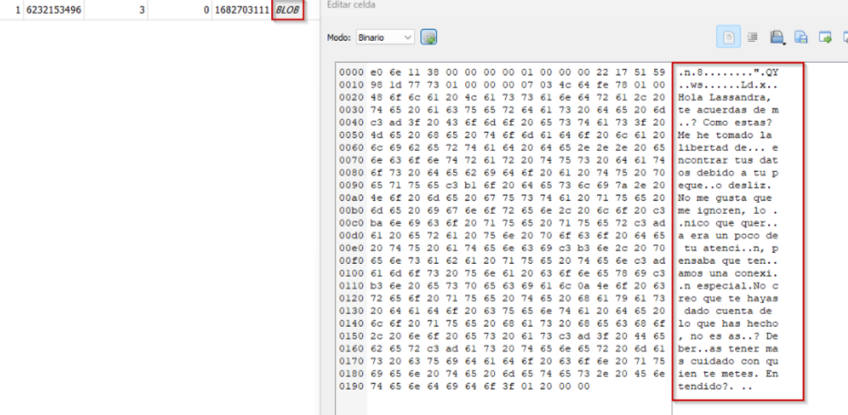

 Tras estos eventos sucedidos alrededor de ese inicio de sesión de Instagram, podemos movernos al **Sábado 29 de Abril de 2023**, en el cuál existe un inicio de sesión en la cuenta de _Instagram_ de Lassandra Cordalis a las **22:44** desde un móvil con Android 9. En primera instancia se detecta una discordancia en este hecho, ya que Lassandra Cordalis posee un smartphone Xiaomi Redmi Note 11 con Android 11. 
 
 Debido a ello, se decide investigar más en profundidad y se encuentra que el _User Agent_ del móvil del sospechoso Atalus Gresstem coincide exactamente con el registrado por la base de datos de _Instagram_, lo que ratifica que se inició sesión desde ese dispositivo concretamente. Se comprueba la versión de Android del dispositivo móvil de Atalus Gresstem y se confirma además que su versión es Android 9.

Se adjuntan capturas de la fuente de vestigios **AG.3** y **LC.6** en la que se comprueba la versión de Android y el _User Agent_ de Atalus Gresstem frente a los datos registrados por el inicio de sesión de _Instagram_:

 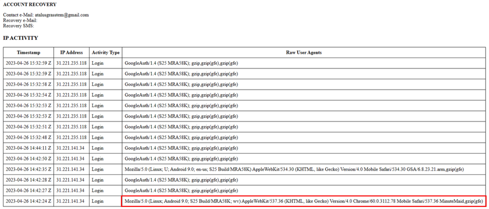
_Registro de actividad de Google de Atalus Gresstem_
 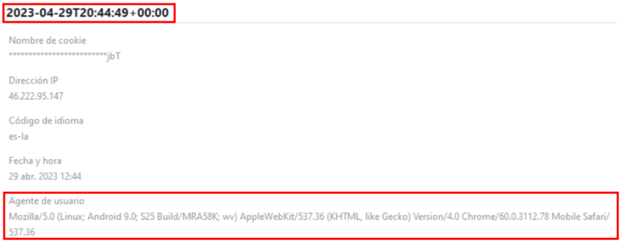
_Registro de inicio de sesión de Instagram para Lassandra Cordalis_

En ese mismo día, existen registros recuperados de la fuente de vestigios **CR.2** los cuales consisten en una serie de mensajes intercambiados entre Atalus Gresstem y Camillo Richbald, de entre los cuáles se destacan los siguientes:

> ### Aclaracion
> La segunda columna de esta tabla corresponde al campo de la base de datos de WhatsApp "_received_timestamp_", la cuál corresponde con la marca de tiempo de recepción de un mensaje. En caso de ser 0 indica que el mensaje no se recibió, si no que se envió, por lo que todas aquellas que no tengan este campo pertenecen al propietario de esta cuenta de WhatsApp, en este caso Camillo Richbald (**CR.2**). Existe un campo "_from_me_" que indica lo mismo y puede revisarse manualmente, pero en las capturas debido a enfocar el contenido del mensaje no se muestra.

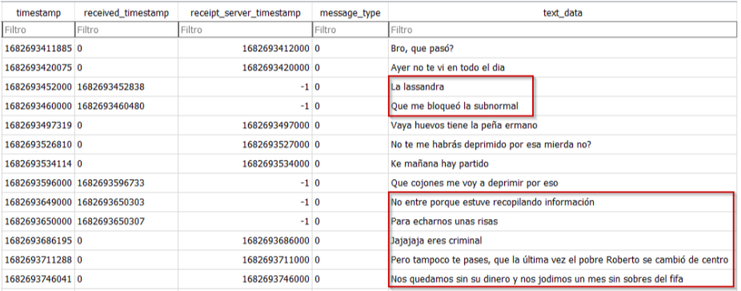

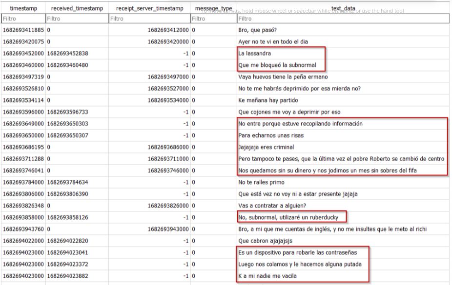

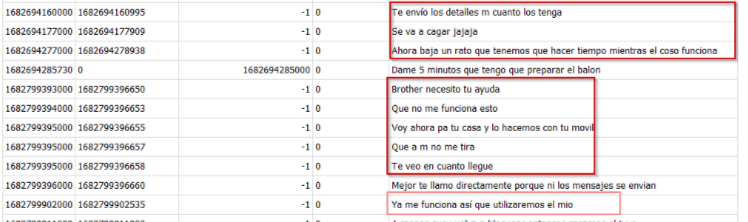

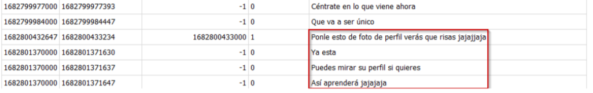

Se adjunta en esta ./img/imagen todos los contactos de la cuenta de WhatsApp de Camillo Richbald, en la cual únicamente está Atalus Grasstem.

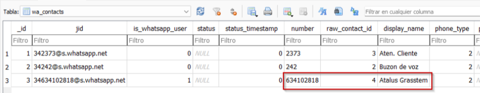

En estas conversaciones se menciona el término "_Rubber Ducky_", el cual es un dispositivo de seguridad informática que consiste en un USB que se comporta como un teclado automático, capaz de realizar acciones en un ordenador a una alta velocidad una vez conectado, podría escribir programas en segundos, realizar largas secuencias de comandos que incluyan descarga y ejecución de archivos. Debido a este hallazgo, se decidió investigar en busca de este término para acabar encontrando vestigios de búsquedas de este término en el historial de búsqueda de Google de Atalus Grasstem el **Jueves 27 de Abril de 2023**:

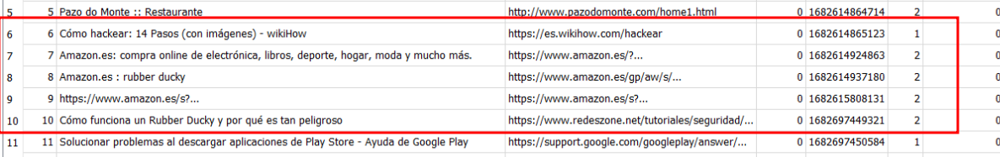

Sumado a esto, se realiza un hallazgo en las búsquedas de Google de Atalus Grasstem (Fuente de vestigios **AG.3**) en las que se encuentra la misma foto que se colocó como avatar de la cuenta de Instagram de Lassandra Cordalis el **Sábado 29 de Abril de 2023 a las 22:46**:

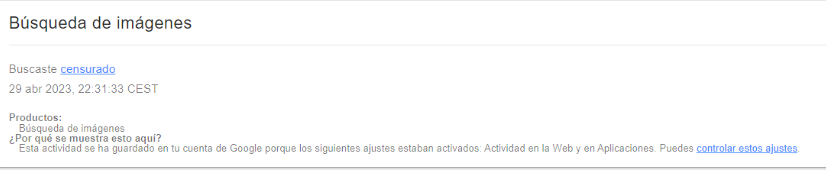
_Búsqueda encontrada en la fuente de vestigios **AG.3**_

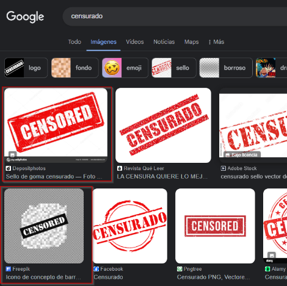

_Recreación de la búsqueda_

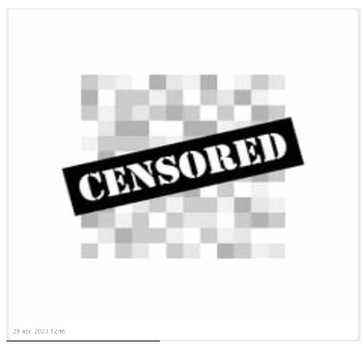

_Foto establecida el Sábado 29 de Abril de 2023 a las 22:46 (Ajustada por la razón previamente establecida en el aviso)_

Debido a la proximidad entre el inicio de sesión de instagram registrado podríamos inferir que el avatar fue cambiado en esa  misma sesión. Existe además un cambio en la biografía de la cuenta datado minutos después de este cambio. Todos estos eventos y su secuencia, así como su proximidad temporal, pueden visualizarse con mayor claridad en la [timeline](#timeline) aportada.

Finalmente tenemos un último inicio de sesión en Instagram con fecha del **Domingo 30 de Abril de 2023**, que parece corresponderse con la extracción de los datos de _Instagram_, es decir, la adquisición de la fuente de vestigios **LC.6**, debido a las marcas de tiempo de los archivos que indican que se modificaron por última vez el **30 de Abril de 2023 a las 20:31:11**.

## Timeline

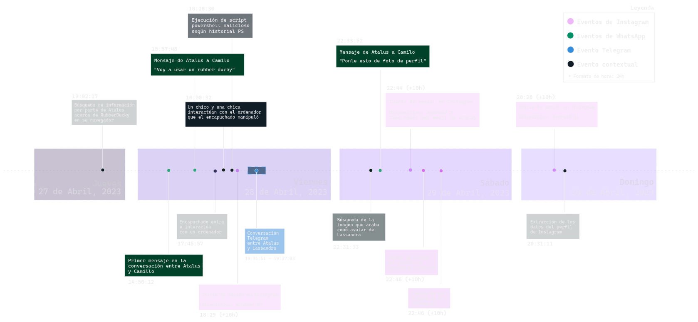

# Conclusiones

En base a la investigación realizada, los hallazgos realizados y el contexto aportado por la interrelación de los elementos mencionados en la sección de [investigación](#investigación) para finalizar este informe se llega a las siguientes conclusiones:

1. Existen búsquedas en el historial de búsqueda de Google de Atalus Grasstem sobre un dispositivo Rubber Ducky.
2. Existe un inicio de sesión en la cuenta de Instagram de Lassandra Cordalis desde un dispositivo con Android 9, cuyo _User Agent_ coincide con el encontrado en el teléfono móvil de Atalus Grasstem.
3. Camillo Richbald recibió mensajes de Atalus Grasstem que mencionaban un Rubber Ducky y una supuesta recopilación de datos.
4. Se realizó una búsqueda en Google con la cuenta de Atalus Grasstem que incluía una de las fotos que fueron establecidas como foto de perfil de la cuenta de Instagram de Lassandra Cordalis.
5. Se ha producido una ejecución de un archivo potencialmente malicioso, concretamente un _keylogger_, un programa para registrar en todo momento lo que se escriba en un teclado, sin filtro alguno de si es información personal o confidencial, en el ordenador de Lassandra Cordalis.

# Anexos

- [Anexo 1 - Integridad de los datos y testigos](https://github.com/IES-Rafael-Alberti/G3-ANALISIS-FORENSE/blob/main/AF-P07-G3/Anexos/Anexo%201%20-%20Integridad%20de%20los%20datos%20y%20testigos.xlsx)
- [Anexo 2 - Registro de cadena de custodia](https://github.com/IES-Rafael-Alberti/G3-ANALISIS-FORENSE/blob/main/AF-P07-G3/Anexos/Anexo%202%20-%20Registro%20de%20cadena%20de%20custodia.xlsx)
- [Anexo 3 - Índice de hallazgos](https://github.com/IES-Rafael-Alberti/G3-ANALISIS-FORENSE/blob/main/AF-P07-G3/Anexos/Anexo%202%20-%20Registro%20de%20cadena%20de%20custodia.xlsx)
