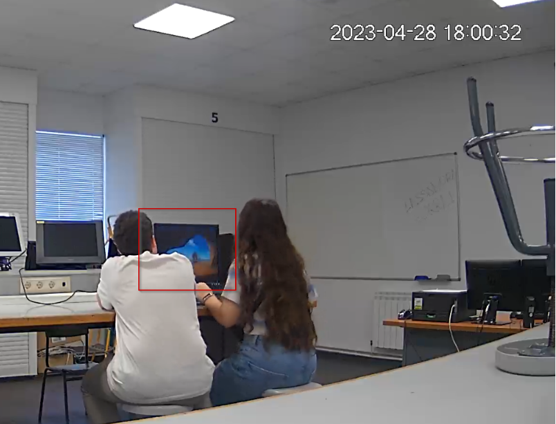

 # Índice de hallazgos

## Keylogger

Esta captura de pantalla muestra el malware encontrado en el equipo de Lassandra.

| ID | Contenido | Tamaño lógico | Ruta | Modification Time | Access Time | Creation Time | Hash SHA-256 |
|----|-----------|---------------|------|-------------------|-------------|---------------|--------------|
| 1 |  | 2.377 bytes | C:\\Users\\admin\\keylogger.ps1| 26/04/2023 15:35:08 | 28/04/2023 16:28:30 | 28/04/2023 16:27:49 | 1889E0226E042E540B7DD28B24530D6A536EC117EFF758D24E3C607A47D68052 |

## Historial de PowerShell

Esta captura de pantalla muestra el historial de PowerShell en el equipo de Lassandra.

| ID | Contenido | Tamaño lógico | Ruta | Modification Time | Access Time | Creation Time | Hash SHA-256 |
|----|-----------|---------------|------|-------------------|-------------|---------------|--------------|
| 2 |  | 288 bytes | C:\\Users\\admin\\AppData\\Roaming\\Microsoft\\Windows\\PowerShell\\PSReadline\\ConsoleHost_history.txt | 28/04/2023 16:28:30 | 28/04/2023 16:28:30 | 26/04/2023 16:13:09 | 9C663F3981A296CBB137A8DA730E46CEA16181C345906584038B6E14358B7D7D |

## Historial de Chrome del móvil de Atalus

Esta captura de pantalla muestra la base de datos que contiene el historial de Chrome del teléfono móvil de Atalus.

| ID | Contenido | Tamaño lógico | Ruta | Modification Time | Access Time | Creation Time | Hash SHA-256 |
|----|-----------|---------------|------|-------------------|-------------|---------------|--------------|
| 3 |  | 1.093.632 bytes | /storage/emulated/0/Android/apps/com.android.browser/db/browser2.db | 29/04/2023 22:47:53 | - | - | A2BE3A1C3BF4F32BCEA3CFF31DDE9DE2363A5FCA2792835543B15C9654D4D1B8 |

## Historial de Telegram

Esta captura de pantalla muestra la base de datos que contiene el historial de Telegram del teléfono móvil de Atalus.

| ID | Contenido | Tamaño lógico | Ruta | Modification Time | Access Time | Creation Time | Hash SHA-256 |
|----|-----------|---------------|------|-------------------|-------------|---------------|--------------|
| 4 |  | 1.388.544 bytes | /apps/org.telegram.messenger/f/cache4.db | 5/5/2023 17:02:16 | - | - | 2A8C5AF4B19E1144088FF271EC893E963A454107FACB5F7155C2EC33CFA17B6A |

## Vídeos de la Cámara IP

Esta captura de pantalla muestra una imagen de un vídeo contenido en la tarjeta SD de la cámara IP. La MAC Time pertenece a la carpeta que engloba todos los vídeos, así como el tamaño lógico.

| ID | Contenido | Tamaño lógico | Ruta | Modification Time | Access Time | Creation Time | Hash SHA-256 |
|----|-----------|---------------|------|-------------------|-------------|---------------|--------------|
| 5 |  | 7.260.842 bytes | H:\2023-04-28\001\dav\17 | 28/04/2023 14:01:14 | 27/04/2023 22:00:00 | 28/04/2023 14:01:14 | --- |

**Lista de Hashes**

| ID | Nombre | Tamaño lógico | Ruta | Modification Time | Access Time | Creation Time | Hash SHA-256 |
|----|-----------|---------------|------|-------------------|-------------|---------------|--------------|
| 5.1 | ii | 192 bytes | H:\2023-04-28 [AD1]\001\dav\17\ii | 28/04/2023 14:01:14 | 03/05/2023 22:00:00 | 28/04/2023 14:01:14 | 16B516B8DB7E49CB65B28089584E1F3E,"66A62F754EA02D33B5B2918C218DB4D5F7629C48 |
| 5.2 | 17.39.20-17.39.44[M][0@0][0].dav | 620.024 bytes | H:\2023-04-28 [AD1]\001\dav\17\17.39.20-17.39.44[M][0@0][0].dav | 28/04/2023 13:39:44 | 03/05/2023 22:00:00 | 28/04/2023 13:39:44 | 938AC4AEB9593CF2284E4139C525933A,"312560E5665736B82E1BB2750B688C96AE15149F |
| 5.3 | 17.39.20-17.39.44[M][0@0][0].idx | 25.446 bytes | H:\2023-04-28 [AD1]\001\dav\17\17.39.20-17.39.44[M][0@0][0].idx | 28/04/2023 13:39:44 | 03/05/2023 22:00:00 | 28/04/2023 13:39:44 | 8701847B3361DFB5E87A7E04FA22CE90,"A43C970E867366EA69A5C050FA590A89E15676A9 |
| 5.4 | 17.44.47-17.46.36[M][0@0][0].dav | 3.067.287 bytes | H:\2023-04-28 [AD1]\001\dav\17\17.44.47-17.46.36[M][0@0][0].dav | 28/04/2023 13:46:36 | 03/05/2023 22:00:00 | 28/04/2023 13:46:36 |  D3FA864032CD8FFD1CEF129A36CF12F2,"737F7763786FC9D1ACF2699C2B829A9FF0D451DC |
| 5.5 | 17.44.47-17.46.36[M][0@0][0].idx | 119.810 bytes | H:\2023-04-28 [AD1]\001\dav\17\17.44.47-17.46.36[M][0@0][0].idx | 28/04/2023 13:46:36 | 03/05/2023 22:00:00 | 28/04/2023 13:46:36 |  79BF20A1F935192798CB2667347B77C5,"037313A2E63C95BFDFB5388A89D23A6D62D6C14C |
| 5.6 | 17.59.49-18.01.13[M][0@0][0].dav | 3.331.929 bytes | H:\2023-04-28 [AD1]\001\dav\17\17.59.49-18.01.13[M][0@0][0].dav | 28/04/2023 14:01:12 | 03/05/2023 22:00:00 | 28/04/2023 14:01:13 |  12ECF537472C82E6BF0E468943DDB3AF,"C7C170BE32919CA2E1DA9FC77162F544263B34A9 |
| 5.7 | 17.59.49-18.01.13[M][0@0][0].idx | 96.154 bytes | H:\2023-04-28 [AD1]\001\dav\17\17.59.49-18.01.13[M][0@0][0].idx | 28/04/2023 14:01:12 | 03/05/2023 22:00:00 | 28/04/2023 14:01:13 |  A6A70E8F3FE7DFE7E253B96523C71061,"3CBE3615CAEBD04F0D55B86E3F4FDD68E32A361A |