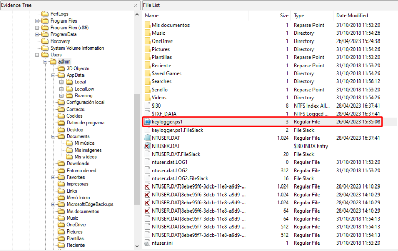

 # Índice de hallazgos

## Keylogger

Esta captura de pantalla muestra el malware encontrado en el equipo de Lassandra.

| ID | Contenido | Tamaño lógico | Ruta | Modification Time | Access Time | Creation Time | Hash SHA-256 |
|----|-----------|---------------|------|-------------------|-------------|---------------|--------------|
| 1 |  | 2.377 bytes | C:\\Users\\admin\\keylogger.ps1| 26/04/2023 15:35:08 | 28/04/2023 16:28:30 | 28/04/2023 16:27:49 | 1889E0226E042E540B7DD28B24530D6A536EC117EFF758D24E3C607A47D68052 |

## Historial de PowerShell

Esta captura de pantalla muestra el historial de PowerShell en el equipo de Lassandra.

| ID | Contenido | Tamaño lógico | Ruta | Modification Time | Access Time | Creation Time | Hash SHA-256 |
|----|-----------|---------------|------|-------------------|-------------|---------------|--------------|
| 2 |  | 288 bytes | C:\\Users\\admin\\AppData\\Roaming\\Microsoft\\Windows\\PowerShell\\PSReadline\\ConsoleHost_history.txt | 28/04/2023 16:28:30 | 28/04/2023 16:28:30 | 26/04/2023 16:13:09 | 9C663F3981A296CBB137A8DA730E46CEA16181C345906584038B6E14358B7D7D |

## Datos brutos

| ID | Contenido | Tamaño lógico | Ruta | Modification Time | Access Time | Creation Time | Hash SHA-256 |
|----|-----------|---------------|------|-------------------|-------------|---------------|--------------|
| 3 |  | - | - | - | - | - | 69CD6E9CDF2E30C54FAE4575A5FE80E73E7DF3B7D99632701B42D0D306A69957 |
