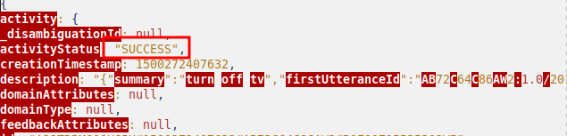

## Índice

- [1. Juramento de causa](#1-juramento-de-causa)
  - [1.1 Declaración de abstención y tachas](#11-declaración-de-abstención-y-tachas)
  - [1.2 Juramento de Promesa](#12-juramento-de-promesa)
- [2. Glosario de Palabras clave](#2-glosario-de-palabras-clave)
- [3. Índice de figuras](#3-índice-de-figuras)
- [4. Resumen ejecutivo](#4-resumen-ejecutivo)
- [5. Introducción](#5-introducción)
  - [5.1 - Antecedentes](#51---antecedentes)
  - [5.2 Objetivos](#52-objetivos)
- [6. Fuentes de información](#6-fuentes-de-información)
- [6.1 Adquisición de evidencias](#61-adquisición-de-evidencias)
- [7. Análisis](#7-análisis)
  - [7.1 Herramientas usadas](#71-herramientas-usadas)
  - [7.2 Procesos](#72-procesos)
    - [7.2.1 Análisis del móvil del marido de la víctima](#721-análisis-del-móvil-del-marido-de-la-víctima)
    - [7.2.2 Análisis del móvil encontrado (FI.)](#722-análisis-del-móvil-encontrado-fi)
    - [7.2.3 Timeline](#723-timeline)
- [8. Limitaciones](#8-limitaciones)
- [9. Conclusiones](#9-conclusiones)
- [Anexos](#anexos)
- [Referencias](#referencias)

# 1. Juramento de causa

## 1.1 Declaración de abstención y tachas
Los abajo firmantes D. Christian Romero Oliva, D. Sergio Guerrero Merlo y D. Juan Manuel Cumbrera López, alumnos del Curso de Especialización en Seguridad en Entornos de las Tecnologías de la Información que se imparte en el Instituto de Educación Secundaria Rafael Alberti,

DECLARAN,

En lo concerniente a los temas y alcance tratados, así como las partes y terceros involucrados o afectadas por el mismo y conocidos hasta este momento, en base a los expresados en el art. 105 de la Ley de Enjuiciamiento Civil y el art. 219 De la Ley Orgánica del Poder Judicial, a priori y en la fecha de elaboración del informe, desconocer causa o motivo alguno por la que deba de abstenerse de la realización del presente informe. 
Y en base al art. 343 de la Ley de Enjuiciamiento Civil declara a priori y en la fecha de elaboración del informe,

DECLARAN,

Desconocer causa o motivo alguno por el cual el perito pueda ser tachado por Tercero interesado o Parte en un proceso judicial derivado de las acciones posteriores llevadas a cabo con el presente informe o dictamen judicial.

## 1.2 Juramento de Promesa
El perito firmante del presente informe o dictamen, en lo concerniente a los temas y el alcance tratados en el mismo, y en base a lo expresado en art. 335 de la Ley de Enjuiciamiento Civil,

DECLARAN, 

Decir la verdad y haber actuado con la mayor objetividad e imparcialidad posible tomando en consideración tanto lo que pueda favorecer como lo que sea susceptible de causar perjuicio a tercero o parte solicitante del informe y conoce las responsabilidades civiles, penales, disciplinarias y asociativas que comporta la aceptación de la elaboración de un informe o dictamen judicial.

Asimismo, bajo su única responsabilidad, 

DECLARAN,

Que lo expresado y reflejado en el presente informe o dictamen pericial está basado en los hechos, información y circunstancias que se han podido constatar, por medio de los conocimientos propios y la experiencia adquirida a lo largo de la trayectoria académica, quedando las conclusiones siempre sujetas y abiertas a la consideración de nuevas informaciones, exámenes y aportaciones o de un mejor criterio u opinión que pudiese ser aportado.

# 2. Glosario de Palabras clave
(Solo las palabras que aparecen en el resumen jurídico o conclusiones)

# 3. Índice de figuras

# 4. Resumen ejecutivo

# 5. Introducción

## 5.1 - Antecedentes

El presente informe se realiza en relación a los hechos acontecidos el 17 de julio de 2017, a las 15:31, día en el que se recibió una llamada en el número de emergencias 112 por parte de un conserje, quien afirmó que uno de los vecinos le había informado que su mujer había sido atacada en su hogar. Ese mismo día la policía llegó al lugar a las 15:40 y encontró al conserje y al marido de la víctima en la escena del crimen. Tras asegurar la zona, se pudo comprobar que la mujer se encontraba sin signos vitales en el salón de la vivienda. El examen traumatólogico inicial sugiere que la víctima murió a causa de múltiples puñaladas. Los servicios médicos confirmaron el fallecimiento.

A las 15:50, la policía comenzó a interrogar al conserje y al marido de la víctima. El conserje afirmó que el marido bajó corriendo llamando a la policía a gritos. Por su parte, el marido de la víctima, quien trabaja como programador, vivía con ella en el apartamento donde se encontró el cuerpo. Según su testimonio, se habían mudado recientemente y no conocían a nadie en la zona que pudiera haber querido hacer daño a su mujer. Se declara que la hora de llegada a su casa fue alrededor de las 15:00 (UTC+9), que el estaba viendo una película en el dormitorio y que al terminar, encontró a su esposa sin vida en el salón. Asimismo, señaló que no pudo haber escuchado nada ya que estaba usando auriculares debido a que su mujer había puesto música.

El marido colaboró y permitió el acceso a todos los dispositivos, identificando la pulsera inteligente y el teléfono móvil como pertenencias de la víctima. Sin embargo, aseguró desconocer las contraseñas de dichos dispositivos. La contraseña de la red Wi-Fi del hogar era "*iot14306*", se declara también la existencia de una red de invitados con la contraseña "*iot14305*".

## 5.2 Objetivos

En base a los antecedentes y las fuentes de información aportadas, en calidad de peritos forenses hemos decidido establecer los siguientes objetivos

1. Estudiar y confirmar que las horas de las declaraciones aportadas en los antecedentes son coherentes y resultan correctas.
2. Confirmar que efectivamente los auriculares estaban encendidos o tienen registros coherentes con la hora en la que se declara en los antecedentes por el marido.
3. Confirmar que las contraseñas aportadas del router WiFi son correctas.
4. Confirmar que el smartphone encontrado junto a al víctima es efectivamente propiedad de la misma.
5. Realizar análisis profundos de las fuentes de informacicón para intentar encontrar anomalías, incoherencias o hallazgos significativos que puedan aportar a la investigación.

# 6. Fuentes de información

Las fuentes se clasificarán utilizando un código conformado por una letra para intentar facilitar la navegabilidad y legibilidad del informe. 

Estas fuentes de evidencias se referenciaran utilizando el siguiente formato: FI.1 se referiría a la fuente de información número 1, es decir, los sensores en la puerta principal. 

1. Sensores en la puerta principal.
2. Sensores de movimiento en la estantería
3. Pulsera smart en el suelo, donde se encontró a la víctima.
4. Smartphone Samsung en el suelo, donde se encontró a la víctima.
5. Dispositivo Amazon Echo con Alexa.
6. Router wifi Google OnHub conectado a un Hub SmartThings y switch IPTime.
7. Hub Samsung SmartThings.
8. Switch IPTime OnHub y Modem.
9. Un Raspberry Pi conectado a una TV a través de HDMI, haciendo funciones de SmartTV.
10. Auriculares Bluetooth.
11. Sensor en la puerta del dormitorio.
12. Smartphone en posesión del marido de la víctima.

# 6.1 Adquisición de evidencias
(Cómo se adquirieron las evidencias)

# 7. Análisis
A continuación en esta sección se procede a exponer los análsis de las fuentes de información proporcionadas.
 
## 7.1 Herramientas usadas

## 7.2 Procesos
En primer lugar se ha procedido a comenzar la investigación revisando los dispositivos móviles para comenzar a intentar completar nuestro [*Objetivo 1*](#52---objetivos). Lo único destacable que podemos encontrar es, en el proceso de investigación de los mismos se revisaron las conexiones bluetooth, y de ello podemos extraer la dirección MAC del dispositivo la cual es `b8:ad:3e:01:5b:6a`.

*Fig 1.1*

Continuando con el estudio del [*Objetivo 1*](#52---objetivos), se realiza el análisis de la fuente de información [FI.9](#6-fuentes-de-información) debido a que en los antecedentes se declara que se estaba visualizando una película con auriculares en las horas circundantes a los hechos. Durante el análisis del disco con la herramienta FTK Imager, se realiza el hallazgo de la aplicación "*Kodi*", instalada el dispositivo del que se extrae la [FI.9](#6-fuentes-de-información), la cual se utiliza para reproducir contenidos multimedia, entre ellos series o películas.

Es por ello que se profundiza más en este hallazgo y se realiza el hallazgo de la base de datos de los contenidos visualizados en el dispositivo. Se focaliza el enfoque la investigación en las horas relacionadas con el caso y se encuentra que en ese marco horario se visualizaron dos vídeos cuyas marcas de tiempo indican las **2:07:30** y **2:19:37** ambas del día **17 de Julio de 2017**, estos dos datos se verán reflejados en la [*Timeline*](#723-timeline) adjunta en las siguientes secciones.

*Fig 1.2*

> [!NOTE]  
> Los dispositivos como raspberryPi, del cuál se ha extraído la FI.9, consisten en términos muy simples en un ordenador de sobremesa pero con un tamaño de bolsillo, que utiliza Linux o una variante del mismo llamada distribución para operar.

Se ha podido constatar que estas horas se encuentran en un horario diferente, viniendo definidas por la zona horaria "*America/New_York*" del sistema operativo *Linux*, la cual se puede verificar mediante la comprobación del archivo de configuración ubicado en el directorio `/etc/timezone` por defecto en este tipo de sistema operativo.

*Fig 1.3*

Por lo tanto las horas resultantes tras los ajustes del ajuste horario aportado en los antecedentes de **UTC+9** y la zona horaria de "*America/New_York*" que corresponde a **UTC-4** serían **15:07:30** y el segundo a las **15:19:37**.

En el mismo análisis de la [FI.9](#6-fuentes-de-información), ya que se dispone de la MAC de los auriculares 

Se observa cierta anomalía de la que se considera relevante dejar constancia en este informe, y es que, mediante el análisis de la [FI.5](#6-fuentes-de-información), se encuentra un registro que indica al dispositivo Alexa que apague la televisión. En la [FI.5](#6-fuentes-de-información) se incluyen junto a las grabaciones de las órdenes recibidas un archivo en formato `.json` que contiene datos acerca de esa misma orden. Concretamente, el archivo de orden de apagado al que nos referimos es el `3.wav` junto a su archivo de datos `3.json`, en el que puede verificarse que la orden se ejecutó con éxito

*Fig 1.4*

### 7.2.1 Análisis del móvil del marido de la víctima
### 7.2.2 Análisis del móvil encontrado (FI.)
### 7.2.3 Timeline

# 8. Limitaciones
(Los objetivos no cumplidos y lo que no se ha conseguido)

# 9. Conclusiones
(Respuestas a los objetivos, judicialmente numeradas y lo que no se ha conseguido)

# Anexos

- Anexo 1 - Sobre el perito
(Información sobre ti como perito)

- Anexo 2 - Sumas de verificación

- Anexo 3 - Otras necesidades
(Ejemplo de nombre, puede no ser necesario)

# Referencias

- Declaración de tacha:

>  Adrián Ramírez Correa (2021). Ejemplo de Informe Pericial. Recuperado de https://gestionadocs.com/wp-content/uploads/2021/05/gestioandocs-informe-pericial.pdf
