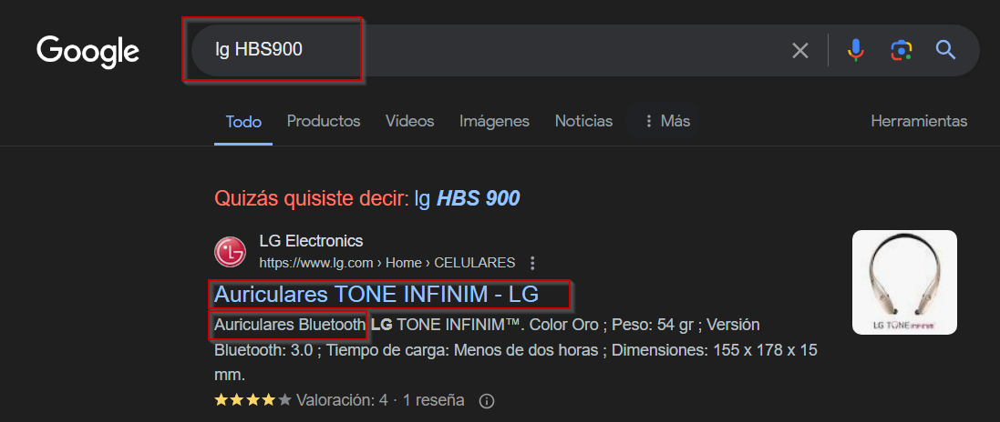
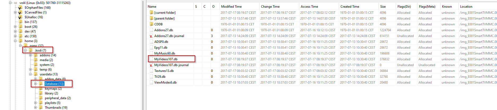
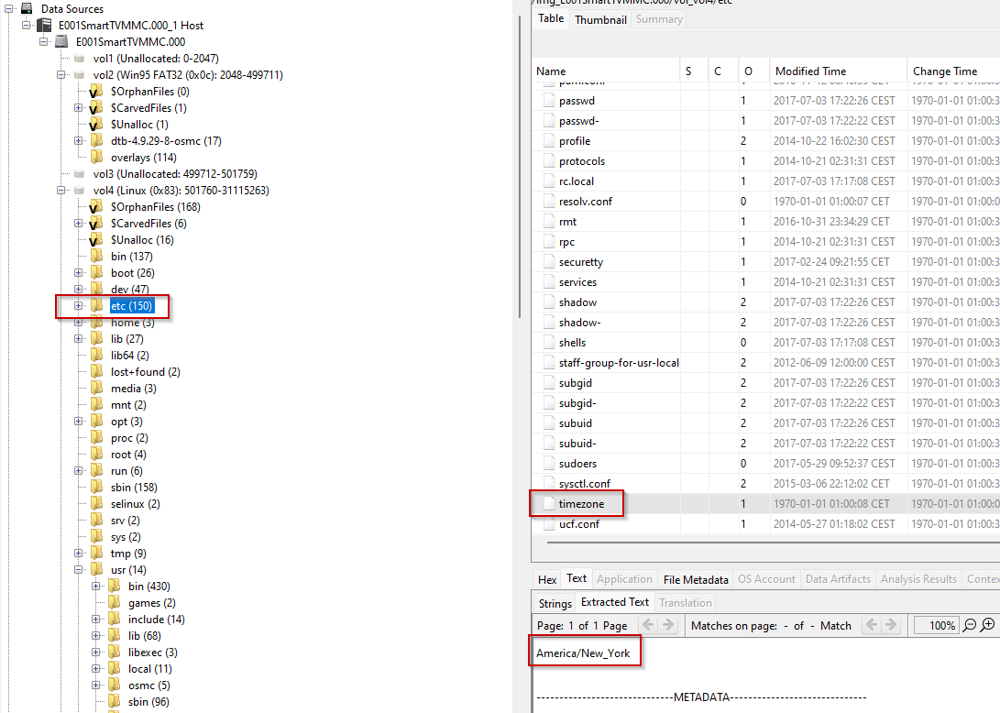
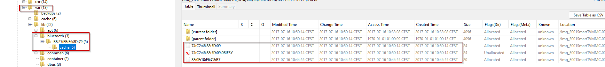
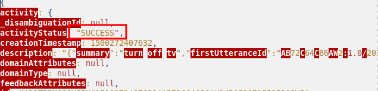
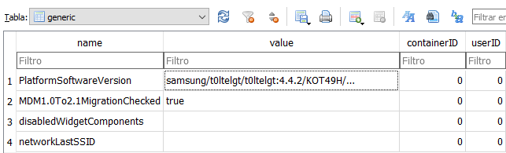
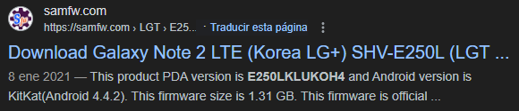
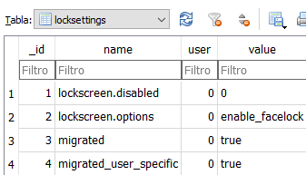
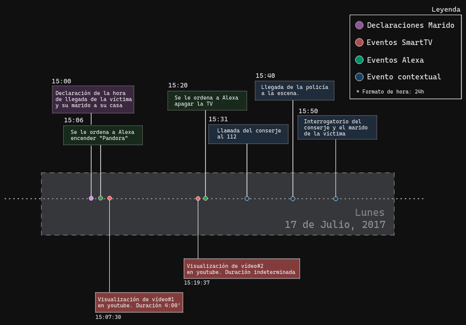

# Índice

- [1. Juramento de causa](#1-juramento-de-causa)
  - [1.1 Declaración de abstención y tachas](#11-declaración-de-abstención-y-tachas)
  - [1.2 Juramento de Promesa](#12-juramento-de-promesa)
- [2. Glosario de Palabras clave](#2-glosario-de-palabras-clave)
- [3. Índice de figuras](#3-índice-de-figuras)
- [4. Resumen ejecutivo](#4-resumen-ejecutivo)
- [5. Introducción](#5-introducción)
  - [5.1 - Antecedentes](#51---antecedentes)
  - [5.2 Objetivos](#52-objetivos)
- [6. Fuentes de información](#6-fuentes-de-información)
- [6.1 Adquisición de evidencias](#61-adquisición-de-evidencias)
- [7. Análisis](#7-análisis)
  - [7.1 Herramientas usadas](#71-herramientas-usadas)
  - [7.2 Procesos](#72-procesos)
    - [7.2.1 Análisis del móvil del marido de la víctima](#721-análisis-del-móvil-del-marido-de-la-víctima)
    - [7.2.2 Análisis del móvil encontrado (FI.)](#722-análisis-del-móvil-encontrado-fi)
    - [7.2.3 Alexa](#723-alexa)
    - [7.2.4 Smart Tv](#724-smart-tv)
    - [7.2.5 Google on Hub](#725-google-on-hub)
    - [7.2.6 Tráfico de red](#726-tráfico-de-red)
    - [7.2.7 Timeline](#727-timeline)
- [8. Limitaciones](#8-limitaciones)
- [9. Conclusiones](#9-conclusiones)
- [Anexos](#anexos)
- [Referencias](#referencias)

# 1. Juramento de causa

## 1.1 Declaración de abstención y tachas
Los abajo firmantes D. Christian Romero Oliva, D. Sergio Guerrero Merlo y D. Juan Manuel Cumbrera López, alumnos del Curso de Especialización en Seguridad en Entornos de las Tecnologías de la Información que se imparte en el Instituto de Educación Secundaria Rafael Alberti,

DECLARAN,

En lo concerniente a los temas y alcance tratados, así como las partes y terceros involucrados o afectadas por el mismo y conocidos hasta este momento, en base a los expresados en el art. 105 de la Ley de Enjuiciamiento Civil y el art. 219 De la Ley Orgánica del Poder Judicial, a priori y en la fecha de elaboración del informe, desconocer causa o motivo alguno por la que deba de abstenerse de la realización del presente informe. 
Y en base al art. 343 de la Ley de Enjuiciamiento Civil declara a priori y en la fecha de elaboración del informe,

DECLARAN,

Desconocer causa o motivo alguno por el cual el perito pueda ser tachado por Tercero interesado o Parte en un proceso judicial derivado de las acciones posteriores llevadas a cabo con el presente informe o dictamen judicial.

## 1.2 Juramento de Promesa
El perito firmante del presente informe o dictamen, en lo concerniente a los temas y el alcance tratados en el mismo, y en base a lo expresado en art. 335 de la Ley de Enjuiciamiento Civil,

DECLARAN, 

Decir la verdad y haber actuado con la mayor objetividad e imparcialidad posible tomando en consideración tanto lo que pueda favorecer como lo que sea susceptible de causar perjuicio a tercero o parte solicitante del informe y conoce las responsabilidades civiles, penales, disciplinarias y asociativas que comporta la aceptación de la elaboración de un informe o dictamen judicial.

Asimismo, bajo su única responsabilidad, 

DECLARAN,

Que lo expresado y reflejado en el presente informe o dictamen pericial está basado en los hechos, información y circunstancias que se han podido constatar, por medio de los conocimientos propios y la experiencia adquirida a lo largo de la trayectoria académica, quedando las conclusiones siempre sujetas y abiertas a la consideración de nuevas informaciones, exámenes y aportaciones o de un mejor criterio u opinión que pudiese ser aportado.

# 2. Glosario de Palabras clave
(Solo las palabras que aparecen en el resumen jurídico o conclusiones)

# 3. Índice de figuras

- [Fig 1.1](#fig-11)
- [Fig 1.2](#fig-12)
- [Fig 1.3](#fig-13)
- [Fig 1.4](#fig-14)
- [Fig 1.5](#fig-15)
- [Fig 1.6](#fig-16)

# 4. Resumen ejecutivo

En este informe se presentan los resultados del análisis forense realizado por Netmancer Inc. sobre diversas fuentes de datos relacionadas con la víctima y su marido, como los dispositivos IoT de su hogar. Se examinaron las capturas del tráfico de red del SmartHome, la imagen del disco del Raspberry Pi, el informe de diagnóstico de Google OnHub, los datos de Amazon Echo Alexa y  las adquisiciones de ambos dispositivos móviles, tanto el de la víctima como el de su marido.

Durante el proceso de análisis, en el dispositivo móvil del marido de la víctima, se encontraron registros de conexiones Bluetooth, que revelaron la presencia de un dispositivo con una dirección MAC específica, la cual se reveló que pertenecía a unos auriculares. Además, se descubrió que se reprodujeron vídeos en el dispositivo de la víctima, utilizando la aplicación Kodi, durante el mismo período de tiempo, aunque ajustando las horas según la zona horaria correspondiente. Sin embargo, no se encontraron registros de conexión Bluetooth entre los auriculares y el dispositivo de la víctima.

En el análisis del dispositivo móvil de la víctima, se reveló información valiosa sobre las aplicaciones utilizadas, la versión del sistema operativo y detalles del hardware. Se descubrió una dirección MAC Bluetooth diferente, pero no se encontraron conexiones coincidentes en los registros. Asimismo, se identificó la presencia de una pantalla de bloqueo con opciones de desbloqueo facial.

En cuanto al dispositivo Smart TV, se encontró indicios de la aplicación Kodi, así como la instalación de un plugin para visualizar videos de YouTube. Se analizó una base de datos asociada a Kodi, que reveló la visualización de ciertos videos en momentos cercanos al incidente. Sin embargo, al igual que en el caso del dispositivo móvil de la víctima, las horas registradas no coincidían con la zona horaria relevante. Además, se verificaron las conexiones Bluetooth del Smart TV, pero no se encontraron coincidencias con los auriculares del marido de la víctima.

A pesar de los exhaustivos análisis realizados en el informe de diagnóstico de Google OnHub y en el tráfico de red capturado, no se encontraron detalles relevantes para el caso en cuestión.

# 5. Introducción

En este documento se detallan los hallazgos encontrados a través del análisis de las adquisiciones dadas de los dos móviles recibidos, el historial y grabaciones de Alexa, la imagen de disco de la Smart Tv, Google on hub y el tráfico de red.

Se incluyen además una serie de anexos que hace referencia a los hallazgos que se han encontrado, la cadena de custodia y los hashes sobre la integridad de las adquisiciones que se nos ha suministrado.

También incluye la metodología utilizada y una línea temporal de los hallazgos encontrados que nos permite con mayor certeza y claridad el incidente.

## 5.1 - Antecedentes

El presente informe se realiza en relación a los hechos acontecidos el 17 de julio de 2017, a las 15:31, día en el que se recibió una llamada en el número de emergencias 112 por parte de un conserje, quien afirmó que uno de los vecinos le había informado que su mujer había sido atacada en su hogar. Ese mismo día la policía llegó al lugar a las 15:40 y encontró al conserje y al marido de la víctima en la escena del crimen. Tras asegurar la zona, se pudo comprobar que la mujer se encontraba sin signos vitales en el salón de la vivienda. El examen traumatólogico inicial sugiere que la víctima murió a causa de múltiples puñaladas. Los servicios médicos confirmaron el fallecimiento.

A las 15:50, la policía comenzó a interrogar al conserje y al marido de la víctima. El conserje afirmó que el marido bajó corriendo llamando a la policía a gritos. Por su parte, el marido de la víctima, quien trabaja como programador, vivía con ella en el apartamento donde se encontró el cuerpo. Según su testimonio, se habían mudado recientemente y no conocían a nadie en la zona que pudiera haber querido hacer daño a su mujer. Se declara que la hora de llegada a su casa fue alrededor de las 15:00 (UTC+9), que el estaba viendo una película en el dormitorio y que al terminar, encontró a su esposa sin vida en el salón. Asimismo, señaló que no pudo haber escuchado nada ya que estaba usando auriculares debido a que su mujer había puesto música.

El marido colaboró y permitió el acceso a todos los dispositivos, identificando la pulsera inteligente y el teléfono móvil como pertenencias de la víctima. Sin embargo, aseguró desconocer las contraseñas de dichos dispositivos. La contraseña de la red Wi-Fi del hogar era "*iot14306*", se declara también la existencia de una red de invitados con la contraseña "*iot14305*".

## 5.2 Objetivos

En base a los antecedentes y las fuentes de información aportadas, en calidad de peritos forenses hemos decidido establecer los siguientes objetivos

1. Estudiar y confirmar que las horas de las declaraciones aportadas en los antecedentes son coherentes y resultan correctas.
2. Confirmar que efectivamente los auriculares estaban encendidos o tienen registros coherentes con la hora en la que se declara en los antecedentes por el marido.
3. Confirmar que las contraseñas aportadas del router WiFi son correctas.
4. Confirmar que el smartphone encontrado junto a al víctima es efectivamente propiedad de la misma.
5. Realizar análisis profundos de las fuentes de informacicón para intentar encontrar anomalías, incoherencias o hallazgos significativos que puedan aportar a la investigación.

# 6. Fuentes de información

Las fuentes se clasificarán utilizando un código conformado por una letra para intentar facilitar la navegabilidad y legibilidad del informe. 

Estas fuentes de evidencias se referenciaran utilizando el siguiente formato: FI.1 se referiría a la fuente de información número 1, es decir, los sensores en la puerta principal. 

1. Sensores en la puerta principal.
2. Sensores de movimiento en la estantería
3. Pulsera smart en el suelo, donde se encontró a la víctima.
4. Smartphone Samsung en el suelo, donde se encontró a la víctima.
5. Dispositivo Amazon Echo con Alexa.
6. Router wifi Google OnHub conectado a un Hub SmartThings y switch IPTime.
7. Hub Samsung SmartThings.
8. Switch IPTime OnHub y Modem.
9. Un Raspberry Pi conectado a una TV a través de HDMI, haciendo funciones de SmartTV.
10. Auriculares Bluetooth.
11. Sensor en la puerta del dormitorio.
12. Smartphone en posesión del marido de la víctima.

# 6.1 Adquisición de evidencias
(Cómo se adquirieron las evidencias)

# 7. Análisis
A continuación en esta sección se procede a exponer los análsis de las fuentes de información proporcionadas.
 
## 7.1 Herramientas usadas
En este punto se especifican las herramientas utilizadas y sus versiones.

| Nombre de la herramienta | Versión    |
|--------------------------|------------|
| Autopsy      | 3.2.10     |
| DB Browser for SQLite  | 3.12.2   |
| 7zip  |    23.01   |
| Notepad++  |   8.5.4    |
| Wireshark |  4.2.4    |

## 7.2 Procesos

En primer lugar se ha procedido a comenzar la investigación revisando los dispositivos móviles para comenzar a intentar completar nuestro [*Objetivo 1*](#52---objetivos).

Lo único destacable que podemos encontrar ha sido en el móvil del marido de la victima, en el proceso de investigación del mismo se revisaron las conexiones bluetooth, y del ya mencionado, podemos extraer una dirección MAC la cual es `b8:ad:3e:01:5b:6a` y el nombre de un dispositivo.

###### Fig 1.1

Encontrar el nombre del dispositivo nos ha posibilitado buscarlo en internet y hallar el tipo de dispositivo conectado a ese móvil.

###### Fig 2.2

Continuando con el estudio del [*Objetivo 1*](#52---objetivos), se realiza el análisis de la fuente de información [FI.9](#6-fuentes-de-información) debido a que en los antecedentes se declara que se estaba visualizando una película con auriculares en las horas circundantes a los hechos. Durante el análisis del disco con la herramienta FTK Imager, se realiza el hallazgo de la aplicación "*Kodi*", instalada el dispositivo del que se extrae la [FI.9](#6-fuentes-de-información), la cual se utiliza para reproducir contenidos multimedia, entre ellos series o películas.

Es por ello que se profundiza más en este hallazgo y se realiza el hallazgo de la base de datos de los contenidos visualizados en el dispositivo. Se focaliza el enfoque la investigación en las horas relacionadas con el caso y se encuentra que en ese marco horario se visualizaron dos vídeos cuyas marcas de tiempo indican las **2:07:30** y **2:19:37** ambas del día **17 de Julio de 2017**, estos dos datos se verán reflejados en la [*Timeline*](#723-timeline) adjunta en las siguientes secciones.

###### Fig 1.3

> [!NOTE]  
> Los dispositivos como raspberryPi, del cuál se ha extraído la FI.9, consisten en términos muy simples en un ordenador de sobremesa pero con un tamaño de bolsillo, que utiliza Linux o una variante del mismo para operar.

Se ha podido constatar que estas horas se encuentran en un horario diferente, viniendo definidas por la zona horaria "*America/New_York*" del sistema operativo *Linux*, la cual se puede verificar mediante la comprobación del archivo de configuración ubicado en el directorio `/etc/timezone` por defecto en este tipo de sistema operativo.

###### Fig 1.4

Por lo tanto las horas resultantes tras los ajustes del ajuste horario aportado en los antecedentes de **UTC+9** y la zona horaria de "*America/New_York*" que corresponde a **UTC-4** serían **15:07:30** y el segundo a las **15:19:37**.

En el mismo análisis de la [FI.9](#6-fuentes-de-información), ya que se dispone de la MAC de los auriculares, se comprueba el registro de conexiones bluetooth en el archivo `/var/bluetooth` y no se encuentran conexiones coincidentes con la dirección MAC encontrada.

###### Fig 1.5

Se observa cierta anomalía de la que se considera relevante dejar constancia en este informe, y es que, mediante el análisis de la [FI.5](#6-fuentes-de-información), se encuentra un registro que indica al dispositivo Alexa que apague la televisión. En la [FI.5](#6-fuentes-de-información) se incluyen junto a las grabaciones de las órdenes recibidas un archivo en formato `.json` que contiene datos acerca de esa misma orden. Concretamente, el archivo de orden de apagado al que nos referimos es el `3.wav` junto a su archivo de datos `3.json`, en el que puede verificarse que la orden se ejecutó con éxito

###### Fig 1.6

### 7.2.1 Análisis del móvil del marido de la víctima

Se ha extraido con 7zip el archivo zip recibido y se ha extraido con 7zip también todos los distintos `.mdf` encontrados.

Mirando en cada uno de los `.mdf`, en el justamente llamado `SHV-E250S_Physical_20170718_USERDATA.mdf` se ha encontrado en una ruta de directorios siendo esta la `/USERDATA/misc/bluedroid/` se ha encontrado varios archivos. Solo uno ha sido interesante siendo este el llamado `bt_config.xml`.

### 7.2.2 Análisis del móvil encontrado (FI.)

Durante el proceso de análisis forense del dispositivo SHV-E250L, se ha descomprimido y examinado meticulosamente los archivos .mdf recibidos como fuentes de evidencia utilizando 7Zip, asegurando así su accesibilidad y análisis adecuado.

En la Base de Datos **dmappmgr.db**, específicamente en la tabla **ApplicationControl**, se identificaron registros de aplicaciones junto con sus tiempos de último lanzamiento. 

| **__id** |                    **pkgname**                     | **lastLaunchTime (Epoch Time)** | **lastLaunchTime (GMT+9)** |
| :------: | :------------------------------------------------: | :-----------------------------: | :------------------------: |
|  **1**   |             com.android.vending:0              |          1499931548175          |  Jue Jul 13 2017 16:39:08  |
|  **2**   |                com.wssyncmldm:0                |          1499837592454          |  Mie Jul 12 2017 14:33:12  |
|  **3**   |    com.sec.android.cloudagent.dropboxoobe:0    |          1499837429525          |  Mie Jul 12 2017 14:30:29  |
|  **4**   |         com.sec.android.app.launcher:0         |          1500271590519          |  Lun Jul 17 2017 15:06:30  |
|  **5**   |        com.google.android.setupwizard:0        |          1499837436559          |  Mie Jul 12 2017 14:30:36  |
|  **6**   |         com.google.android.gsf.login:0         |          1499849304591          |  Mie Jul 12 2017 17:48:24  |
|  **7**   |              com.kingouser.com:0               |          1500111847472          |  Sab Jul 15 2017 18:44:07  |
|  **8**   |       com.sec.android.preloadinstaller:0       |          1499836995273          |  Mie Jul 12 2017 14:23:15  |
|  **9**   |              com.osp.app.signin:0              |          1499837410697          |  Mie Jul 12 2017 14:30:10  |
|  **10**  |          com.sec.android.fotaclient:0          |          1499837489207          |  Mie Jul 12 2017 14:31:29  |
|  **11**  |      com.sec.android.app.SecSetupWizard:0      |          1499837435316          |  Mie Jul 12 2017 14:30:35  |
|  **12**  |             com.android.settings:0             |          1500271255646          |  Lun Jul 17 2017 15:00:55  |
|  **13**  |        com.android.ahnmobilesecurity:0         |          1499837433157          |  Mie Jul 12 2017 14:30:33  |
|  **25**  |            com.google.android.gms:0            |          1500271316079          |  Lun Jul 17 2017 15:01:56  |
|  **26**  |           com.google.android.talk:0            |          1500271408466          |  Lun Jul 17 2017 15:03:28  |
|  **27**  |               com.android.mms:0                |          1500270559294          |  Lun Jul 17 2017 14:49:19  |
|  **38**  |   com.google.android.googlequicksearchbox:0    |          1500271701675          |  Lun Jul 17 2017 15:08:21  |
|  **44**  |             com.android.contacts:0             |          1499927997887          |  Jue Jul 13 2017 15:39:57  |
|  **57**  |            com.google.android.gm:0             |          1499932048358          |  Jue Jul 13 2017 16:47:28  |
|  **58**  |             com.android.systemui:0             |          1500270809079          |  Lun Jul 17 2017 14:53:29  |
|  **72**  |          com.kingoapp.superbattery:0           |          1500271651029          |  Lun Jul 17 2017 15:07:31  |
|  **74**  |         com.android.packageinstaller:0         |          1499869244206          |  Mie Jul 12 2017 23:20:44  |
|  **75**  | com.google.android.apps.access.wifi.consumer:0 |          1499933188784          |  Jue Jul 13 2017 17:06:28  |
|  **76**  |         com.sec.android.app.myfiles:0          |          1499869238426          |  Mie Jul 12 2017 23:20:38  |
|  **77**  |              com.android.chrome:0              |          1500271652599          |  Lun Jul 17 2017 15:07:32  |
|  **82**  |               com.nest.android:0               |          1499869220038          |  Mie Jul 12 2017 23:20:20  |
|  **83**  |              com.amazon.dee.app:0              |          1500271397120          |  Lun Jul 17 2017 15:03:17  |
|  **85**  |             com.xiaomi.hm.health:0             |          1500270794476          |  Lun Jul 17 2017 14:53:14  |
|  **86**  |          com.sec.android.fwupgrade:0           |          1499931153732          |  Jue Jul 13 2017 16:32:33  |

La Base de Datos **enterprise.db** proporcionó información importante sobre el dispositivo, especialmente a través de la tabla generic. Se identificó la versión del sistema operativo Android como la **4.4.2**, junto con detalles adicionales sobre la build del SO, que es la **KOT49H**, y la versión del firmware, que es la **E250LKLUKOH4**. Además, se confirmó que el dispositivo es de la marca **Samsung**. 

Además, en la Base de Datos **locksettings.db**, se observaron configuraciones vinculadas a la pantalla de bloqueo del dispositivo, incluyendo opciones como el desbloqueo facial. 

En cuanto a los hallazgos de hardware, se descubrió la dirección MAC Bluetooth `1C:AF:05:9E:19:74`. Además, se obtuvo información sobre la versión de hardware (hw_ver), identificada como **E25.07**, y el número de serie del dispositivo (serial_no), que se registró como **R33DB09VR9,20131113,7J211329**. 

### 7.2.3 Alexa

Primero se han revisado las imagenes `first page.png` y `history second page.png` para comprobar el historial de peticiones a Alexa y comparado con los audios recibidos de las mismas peticiones. Los más interesantes encontrados han sido los mencionados en [7.2](#72-procesos).

También se han analizado las imagenes encontradas en la ruta `/Alexa/Alexa Screenshot/Music Video and Books/Music Video and Books/` la imagen llamada 2017-07-17_17h03_29.png para comprobar que tipos de servicios existen de tipo Música y encontrandose en ella un servicio llamado Pandora.

### 7.2.4 Smart Tv

Se ha utilizado Autopsy para analizar la imagen recibida del almacenamiento del dispositivo IoT. 

Analizando dichos ficheros, se ha encontrado en `/home/osmc/` un directorio llamado .kodi el cual coincide con una aplicación que como se ha mencionado en [7.2](#72-procesos) sirve para visualizar videos como por ejemplo, peliculas.

Investigando los directorios dentro de .kodi se ha encontrado un directorio plugins en cual contiene un directorio siendo la ruta completa `/home/osmc/.kodi/addons/plugin.video.youtube` que nos indica que el dispositivo tiene instalado en Kodi un plugin que permite visualizar videos de Youtube.

Se ha seguido buscando información interesante y como se ha mencionado en [7.2](#72-procesos) se ha encontrado en `/home/osmc/.kodi/userdata/Database/` un fichero `.db` llamado MyVideos107.db.

Con la herramienta DB Browser for SQlite se ha analizado dicha base de datos y en la tabla files se ha encontrado una serie de videos que analizando las fechas, dos de ellos coincidian en la fecha del asesinato.

Se ha buscado para determinar la zona horaria ya que no coincidía con las horas del incidente, algo que nos indicase la zona horaria del dispositivo.

Volviendo a Autopsy y buscando en internet donde se guarda este fichero en Ubuntu ya que como podemos visualizar en [7.2](#72-procesos) la organización de los directorios son como en Ubuntu.

En el fichero `/etc/timezone` encontramos la zona horaria y tras ello se ha cambiado a UTC+9 los videos de Youtube mencionados.

Se han comprobado la duración de los videos copiando el ID de cada video y añadiendolo a un enlace de Youtube.

Luego se ha comprobado los dispositivos bluetooth que se han conectado a la Smart Tv, para ello en el propio Autopsy se ha analizado la ruta `/var/lib/bluetooth/B8:27:EB:E6:8D:79/cache/` y encontrado dos ficheros que indican la MAC de los dispositivos Bluetooth que se han conectado a la Smart Tv y se han comparado con la MAC de los cascos encontrados en el móvil del marido de la victima.

### 7.2.5 Google on Hub

Después de revisar el código encontrado en el informe de diagnóstico de Google OnHub, hemos descubierto detalles sobre la red, aunque no hemos encontrado ninguna información relevante para el caso en cuestión. El análisis del código se realizó utilizando el software Visual Studio Code 1.89.0.

### 7.2.6 Tráfico de red

Hemos analizado el tráfico de red con el software Wireshark v4.2.4, pero no hemos encontrado ninguna información relevante para el caso.

### 7.2.7 Timeline

# 8. Limitaciones

No se ha conseguido determinar que ha ocurrido entre los minutos que han pasado desde el primer al segundo video y que ha ocurrido en el tiempo después de apagar la Smart Tv.

# 9. Conclusiones

En base a la investigación realizada, los hallazgos realizados y el contexto aportado por la interrelación de los elementos mencionados en la sección de investigación para finalizar este informe se llega a las siguientes conclusiones:

1. Se encontraron registros de conexiones Bluetooth en el dispositivo móvil del marido de la víctima, indicando la presencia de unos auriculares con una dirección MAC específica.

2. Se identificó la reproducción de vídeos en el dispositivo de la víctima a través de la aplicación Kodi, durante el período relevante para la investigación, aunque ajustando las horas según la zona horaria correspondiente.

3. No se encontraron registros de conexión Bluetooth entre los auriculares y el dispositivo de la víctima.

4. Se hallaron vestigios de la presencia de la aplicación Kodi en el Smart TV, así como la instalación de un plugin para visualizar videos de YouTube.

5. Se identificaron ciertos videos reproducidos en el Smart TV en momentos cercanos al incidente, aunque las horas registradas no coincidían con la zona horaria relevante.

6. A pesar de los análisis realizados, no se encontraron detalles adicionales que contribuyeran significativamente a la investigación desde el informe de diagnóstico de Google OnHub ni desde el tráfico de red capturado.

# Anexos

- [Anexo 1 - Integridad de los datos y testigos](https://github.com/IES-Rafael-Alberti/G3-ANALISIS-FORENSE/blob/main/AF-P09-G3/Anexos/Anexo%201%20-%20Integridad%20de%20los%20datos%20y%20testigos.xlsx)

- [Anexo 2 - Registro Cadena de custodia](https://github.com/IES-Rafael-Alberti/G3-ANALISIS-FORENSE/blob/main/AF-P09-G3/Anexos/Anexo%202%20-%20Registro%20de%20cadena%20de%20custodia.xlsx)

- [Anexo 3 - Índice de hallazgos](https://github.com/IES-Rafael-Alberti/G3-ANALISIS-FORENSE/blob/main/AF-P09-G3/Anexos/Anexo%203%20-%20%C3%8Dndice%20de%20hallazgos.md)

# Referencias

- Declaración de tacha:

>  Adrián Ramírez Correa (2021). Ejemplo de Informe Pericial. Recuperado de https://gestionadocs.com/wp-content/uploads/2021/05/gestioandocs-informe-pericial.pdf