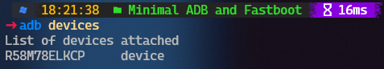
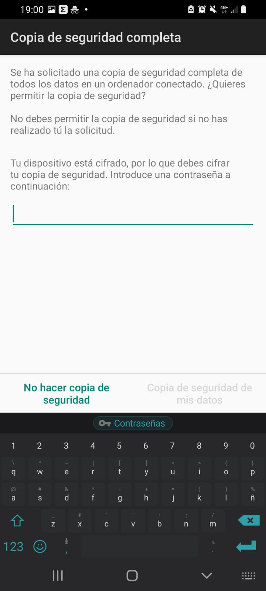
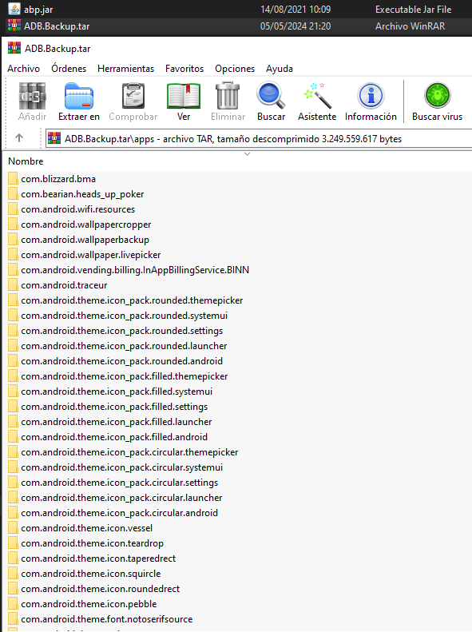

# Extracción Dispositivo Móvil

Para llevar a cabo la extracción, hemos optado por utilizar la herramienta **Android Debug Bridge (ADB)**. El dispositivo seleccionado para este proceso es mi smartphone personal, un **Samsung Galaxy A70**.

## Extracción de los datos

En primer lugar debemos habilitar las opciones de desarrollador, para lo cual accederemos a los Ajustes del teléfono, y seleccionaremos la opción "*Acerca del dispositivo*". Allí tocaremos repetidamente (aproximadamente 7 veces seguidas) sobre "*Número de compilación*". Después de hacer esto, habremos desbloqueado las opciones de desarrollador, por lo tanto entraremos, y activaremos la depuración por USB.

Luego conectaremos por USB el dispositivo USB a nuestro portátil, y entraremos en la terminal de Windows (*CMD*). Nos moveremos hasta el directorio "*C:\Program Files (x86)\Minimal ADB and Fastboot*" y ejecutaremos el comando `adb devices`. Después de hacer esto, daremos clic en "*Permitir*" en el cuadro de diálogo "*¿Permitir depuración por USB?*", lo que nos permitirá llevar a cabo la operación de extracción de datos del dispositivo.

Como vemos en la imagen, nos muestra el dispositivo conectado al portátil, lo que nos permite pasar a comenzar con la extracción. Para llevar a cabo este paso, introduciremos el comando `adb backup -apk -shared -all -f "{Ruta}"`, y confirmaremos la operación en el dispostivo móvil. Esto se hará pidiendonos una contraseña, que se utilizará para cifrar la copia de seguridad.

## Desempaquetado de la copia de seguridad

Para poder abrir la copia de seguridad y desempaquetarla necesitaremos la herramienta **Android Backup Processor**. Lo único que necesitaremos hacer es mover el archivo **abd.jar** a la ubicación de nuestra copia de seguridad, y ejecutar en la terminal el comando `java -jar abp.jar unpack ADB_Backup.ab ADB.Backup.tar {Contraseña}`.

