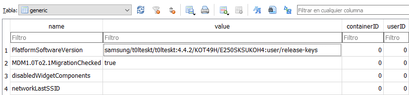
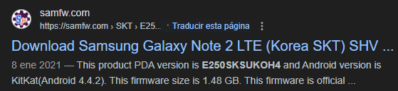
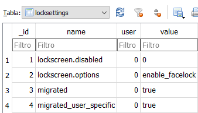

---

- **Localización:** SHV-E250S_Physical_20170718\\20170718_USERDATA\\system
- **Base de Datos:** dmappmgr.db
- **Tabla:** ApplicationControl

| **__id** |                    **pkgname**                     | **lastLaunchTime (Epoch Time)** | **lastLaunchTime (GMT+9)** |
| :------: | :------------------------------------------------: | :-----------------------------: | :------------------------: |
|  **1**   |    com.sec.android.cloudagent.dropboxoobe:0    |          1499829461056          |  Mie Jul 12 2017 12:17:41  |
|  **2**   |         com.sec.android.app.launcher:0         |          1500276641203          |  Lun Jul 17 2017 16:30:41  |
|  **3**   |        com.google.android.setupwizard:0        |          1499829482365          |  Lun Jul 17 2017 16:30:41  |
|  **4**   |         com.google.android.gsf.login:0         |          1499829448680          |  Mie Jul 12 2017 12:17:28  |
|  **5**   |       com.sec.android.preloadinstaller:0       |          1499829424016          |  Mie Jul 12 2017 12:17:04  |
|  **6**   |              com.osp.app.signin:0              |          1499829457054          |  Mie Jul 12 2017 12:17:37  |
|  **7**   |      com.sec.android.app.SecSetupWizard:0      |          1499829479651          |  Mie Jul 12 2017 12:17:59  |
|  **8**   |             com.android.settings:0             |          1500271333958          |  Lun Jul 17 2017 15:02:13  |
|  **9**   |        com.android.ahnmobilesecurity:0         |          1499829466219          |  Mie Jul 12 2017 12:17:46  |
|  **18**  |               com.iloen.melon:0                |          1500198774858          |  Dom Jul 16 2017 18:52:54  |
|  **22**  |            com.google.android.gms:0            |          1499848255345          |  Mie Jul 12 2017 17:30:55  |
|  **24**  |             com.android.vending:0              |          1499946761624          |  Mar Jul 13 2017 20:52:41  |
|  **28**  |          com.google.android.youtube:0          |          1500271459015          |  Lun Jul 17 2017 15:04:19  |
|  **33**  |   com.google.android.googlequicksearchbox:0    |          1499843312572          |  Mie Jul 12 2017 16:08:32  |
|  **40**  |             com.android.contacts:0             |          1500116254628          |  Sab Jul 15 2017 19:57:34  |
|  **54**  |             com.android.systemui:0             |          1500272384928          |  Lun Jul 17 2017 15:19:44  |
|  **64**  |        com.sec.android.app.snotebook:0         |          1499838216531          |  Mie Jul 12 2017 14:43:36  |
|  **65**  |               com.vlingo.midas:0               |          1500272383108          |  Lun Jul 17 2017 15:19:43  |
|  **66**  |           com.smartthings.android:0            |          1500276650790          |  Lun Jul 17 2017 16:30:50  |
|  **70**  | com.google.android.apps.access.wifi.consumer:0 |          1500194327628          |  Dom Jul 16 2017 17:38:47  |
|  **71**  |              com.android.chrome:0              |          1500190684475          |  Dom Jul 16 2017 16:38:04  |
|  **75**  |               com.nest.android:0               |          1499850198369          |  Mie Jul 12 2017 18:03:18  |
|  **78**  |          com.sec.android.fwupgrade:0           |          1499881236200          |  Jue Jul 12 2017 02:40:36  |
|  **86**  |              com.amazon.dee.app:0              |          1499931300006          |  Jue Jul 12 2017 02:40:36  |
|  **88**  |           com.vsray.remote.control:0           |          1499935319148          |  Jue Jul 13 2017 17:41:59  |
|  **91**  |                org.xbmc.kore:0                 |          1500271492206          |  Lun Jul 17 2017 15:04:52  |
|  **95**  |           com.tgrape.android.radar:0           |          1500272391516          |  Lun Jul 17 2017 15:19:51  |

---

- **Localización:** SHV-E250S_Physical_20170718\\20170718_USERDATA\\system
- **Base de Datos:** enterprise.db
- **Tabla:** generic

|            **name**             |                               **value**                               |
| :-----------------------------: | :-------------------------------------------------------------------: |
|   **PlatformSoftwareVersion**   | samsung/t0lteskt/t0lteskt:4.4.2/KOT49H/E250SKSUKOH4:user/release-keys |
| **MDM1.0To2.1MigrationChecked** |                                 true                                  |

De aquí podemos extraer la versión del firmware del teléfono y la versión de Android:

---

- **Localización:** SHV-E250S_Physical_20170718\\20170718_USERDATA\\system
- **Base de Datos:** locksettings.db
- **Tabla:** locksettings

| **__id** |        **name**        | **user** |    **value**    |
| :------: | :--------------------: | :------: | :-------------: |
|  **1**   |  lockscreen.disabled   |    0     |        0        |
|  **2**   |   lockscreen.options   |    0     | enable_facelock |
|  **3**   |        migrated        |    0     |      true       |
|  **4**   | migrated_user_specific |    0     |      true       |

---

- **Localización:** SHV-E250S_Physical_20170718\\20170718_EFS\\bluetooth
- **Nombre:** bt_addr
- **Contenido:** 50:F5:20:A5:7D:CC

---

- **Localización:** SHV-E250S_Physical_20170718\\20170718_EFS\\FactoryApp
- **Nombre:** hw_ver
- **Contenido:** E25.09

---

- **Localización:** SHV-E250S_Physical_20170718\\20170718_EFS\\FactoryApp
- **Nombre:** serial_no
- **Contenido:** R33D300GR4,20130301010835,1597903
