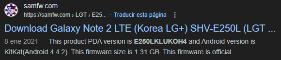

---

- **Localización:** SHV-E250L_Physical_20170717\\20170717_USERDATA\\system
- **Base de Datos:** dmappmgr.db
- **Tabla:** ApplicationControl

| **__id** |                    **pkgname**                     | **lastLaunchTime (Epoch Time)** | **lastLaunchTime (GMT+9)** |
| :------: | :------------------------------------------------: | :-----------------------------: | :------------------------: |
|  **1**   |             com.android.vending:0              |          1499931548175          |  Jue Jul 13 2017 16:39:08  |
|  **2**   |                com.wssyncmldm:0                |          1499837592454          |  Mie Jul 12 2017 14:33:12  |
|  **3**   |    com.sec.android.cloudagent.dropboxoobe:0    |          1499837429525          |  Mie Jul 12 2017 14:30:29  |
|  **4**   |         com.sec.android.app.launcher:0         |          1500271590519          |  Lun Jul 17 2017 15:06:30  |
|  **5**   |        com.google.android.setupwizard:0        |          1499837436559          |  Mie Jul 12 2017 14:30:36  |
|  **6**   |         com.google.android.gsf.login:0         |          1499849304591          |  Mie Jul 12 2017 17:48:24  |
|  **7**   |              com.kingouser.com:0               |          1500111847472          |  Sab Jul 15 2017 18:44:07  |
|  **8**   |       com.sec.android.preloadinstaller:0       |          1499836995273          |  Mie Jul 12 2017 14:23:15  |
|  **9**   |              com.osp.app.signin:0              |          1499837410697          |  Mie Jul 12 2017 14:30:10  |
|  **10**  |          com.sec.android.fotaclient:0          |          1499837489207          |  Mie Jul 12 2017 14:31:29  |
|  **11**  |      com.sec.android.app.SecSetupWizard:0      |          1499837435316          |  Mie Jul 12 2017 14:30:35  |
|  **12**  |             com.android.settings:0             |          1500271255646          |  Lun Jul 17 2017 15:00:55  |
|  **13**  |        com.android.ahnmobilesecurity:0         |          1499837433157          |  Mie Jul 12 2017 14:30:33  |
|  **25**  |            com.google.android.gms:0            |          1500271316079          |  Lun Jul 17 2017 15:01:56  |
|  **26**  |           com.google.android.talk:0            |          1500271408466          |  Lun Jul 17 2017 15:03:28  |
|  **27**  |               com.android.mms:0                |          1500270559294          |  Lun Jul 17 2017 14:49:19  |
|  **38**  |   com.google.android.googlequicksearchbox:0    |          1500271701675          |  Lun Jul 17 2017 15:08:21  |
|  **44**  |             com.android.contacts:0             |          1499927997887          |  Jue Jul 13 2017 15:39:57  |
|  **57**  |            com.google.android.gm:0             |          1499932048358          |  Jue Jul 13 2017 16:47:28  |
|  **58**  |             com.android.systemui:0             |          1500270809079          |  Lun Jul 17 2017 14:53:29  |
|  **72**  |          com.kingoapp.superbattery:0           |          1500271651029          |  Lun Jul 17 2017 15:07:31  |
|  **74**  |         com.android.packageinstaller:0         |          1499869244206          |  Mie Jul 12 2017 23:20:44  |
|  **75**  | com.google.android.apps.access.wifi.consumer:0 |          1499933188784          |  Jue Jul 13 2017 17:06:28  |
|  **76**  |         com.sec.android.app.myfiles:0          |          1499869238426          |  Mie Jul 12 2017 23:20:38  |
|  **77**  |              com.android.chrome:0              |          1500271652599          |  Lun Jul 17 2017 15:07:32  |
|  **82**  |               com.nest.android:0               |          1499869220038          |  Mie Jul 12 2017 23:20:20  |
|  **83**  |              com.amazon.dee.app:0              |          1500271397120          |  Lun Jul 17 2017 15:03:17  |
|  **85**  |             com.xiaomi.hm.health:0             |          1500270794476          |  Lun Jul 17 2017 14:53:14  |
|  **86**  |          com.sec.android.fwupgrade:0           |          1499931153732          |  Jue Jul 13 2017 16:32:33  |

---

- **Localización:** SHV-E250L_Physical_20170717\\20170717_USERDATA\\system
- **Base de Datos:** enterprise.db
- **Tabla:** generic

|            **name**             |                               **value**                               |
| :-----------------------------: | :-------------------------------------------------------------------: |
|   **PlatformSoftwareVersion**   | samsung/t0ltelgt/t0ltelgt:4.4.2/KOT49H/E250LKLUKOH4:user/release-keys |
| **MDM1.0To2.1MigrationChecked** |                                 true                                  |

De aquí podemos extraer la versión del firmware del teléfono y la versión de Android:

---

- **Localización:** SHV-E250L_Physical_20170717\\20170717_USERDATA\\system
- **Base de Datos:** locksettings.db
- **Tabla:** locksettings

| **__id** |        **name**        | **user** |    **value**    |
| :------: | :--------------------: | :------: | :-------------: |
|  **1**   |  lockscreen.disabled   |    0     |        0        |
|  **2**   |   lockscreen.options   |    0     | enable_facelock |
|  **3**   |        migrated        |    0     |      true       |
|  **4**   | migrated_user_specific |    0     |      true       |

---

- **Localización:** SHV-E250L_Physical_20170717\\20170717_EFS\\bluetooth
- **Nombre:** bt_addr
- **Contenido:** 1C:AF:05:9E:19:74

---

- **Localización:** SHV-E250L_Physical_20170717\\20170717_EFS\\FactoryApp
- **Nombre:** hw_ver
- **Contenido:** E25.07

---

- **Localización:** SHV-E250L_Physical_20170717\\20170717_EFS\\FactoryApp
- **Nombre:** serial_no
- **Contenido:** R33DB09VR9,20131113,7J211329