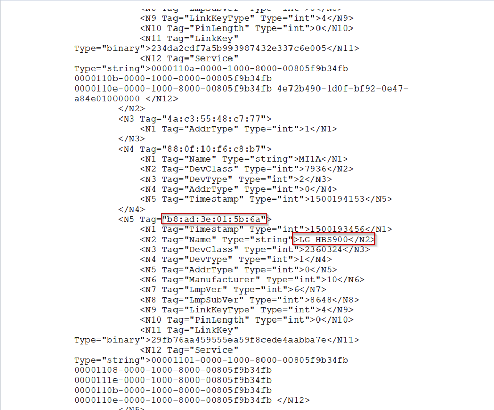
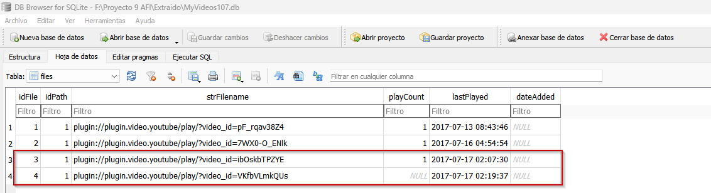

# Índice de hallazgos

## bt_config.xml

| ID | Contenido | Tamaño lógico | Ruta | Modification Time | Access Time | Creation Time | Hash SHA-256 |
|----|-----------|---------------|------|-------------------|-------------|---------------|--------------|
| 1 |  | 4000 bytes | SHV-E250S_Physycal_20170718\USERDATA\misc\bluedroid\bt_config.xml | 17/07/2017 15:19:00 UTC+9 | - | 17/07/2017 15:19:00 UTC+9 | 3F6997F2F39E6F635E2C6F83C97032828968147B6422E095BF0DF6B63F4A06FA |

## MyVideos107.db

| ID | Contenido | Tamaño lógico | Ruta | Modification Time | Access Time | Creation Time | Hash SHA-256 |
|----|-----------|---------------|------|-------------------|-------------|---------------|--------------|
| 2 |  | 376832 bytes | /home/osmc/.kodi/userdata/Database/MyVideos107.db | 17/07/2017 15:19:37 UTC+9 | 17/07/2017 15:19:37 UTC+9 | 17/07/2013 17:30:40 UTC+9 | C9D82770546819B1020077C2064797FBB9E9C16FF7DFFBA60C03888713666DED|

## Timezone

| ID | Contenido | Tamaño lógico | Ruta | Modification Time | Access Time | Creation Time | Hash SHA-256 |
|----|-----------|---------------|------|-------------------|-------------|---------------|--------------|
| 3 | - | 17 bytes | /etc/timezone | 01/01/1979 08:00:08 UTC+9 | 01/1979 08:00:08 UTC+9 | 01/1979 08:00:08 UTC+9 | 97A96DEF5389F70F749D69D5F58872871561F3155381B303845589BAFCD48A0F |

## history first page.png

| ID | Contenido | Tamaño lógico | Ruta | Modification Time | Access Time | Creation Time | Hash SHA-256 |
|----|-----------|---------------|------|-------------------|-------------|---------------|--------------|
| 4 |  | 105000 bytes | Alexa\Alexa\history first page.png | - | - | - | EE6D009300947F24DAFED6029C193D019F833159C4D107EA45C6AF54C40832D7 |

## history second page.png

| ID | Contenido | Tamaño lógico | Ruta | Modification Time | Access Time | Creation Time | Hash SHA-256 |
|----|-----------|---------------|------|-------------------|-------------|---------------|--------------|
| 5 |  | 115000 bytes | Alexa\Alexa\history second page.png | - | - | - | DB61C918114EE0BBE816B414868822AEBACF82F789B1CCC9EE195CF05B2371F7 |

## 2017-07-17_17h03_29.png

| ID | Contenido | Tamaño lógico | Ruta | Modification Time | Access Time | Creation Time | Hash SHA-256 |
|----|-----------|---------------|------|-------------------|-------------|---------------|--------------|
| 6 | [2017-07-17_17h03_29](../img/2017-07-17_17h03_29.png) | 41800 bytes | Alexa\Alexa\Alexa screenshot\Music video and Books\Music video and books\2017-07-17_17h03_29.png | - | - | - | 38361288E7ED4CE1D20C6DE33F6C396F6E33E86DE02C016424EFA260A06B2ED0 |