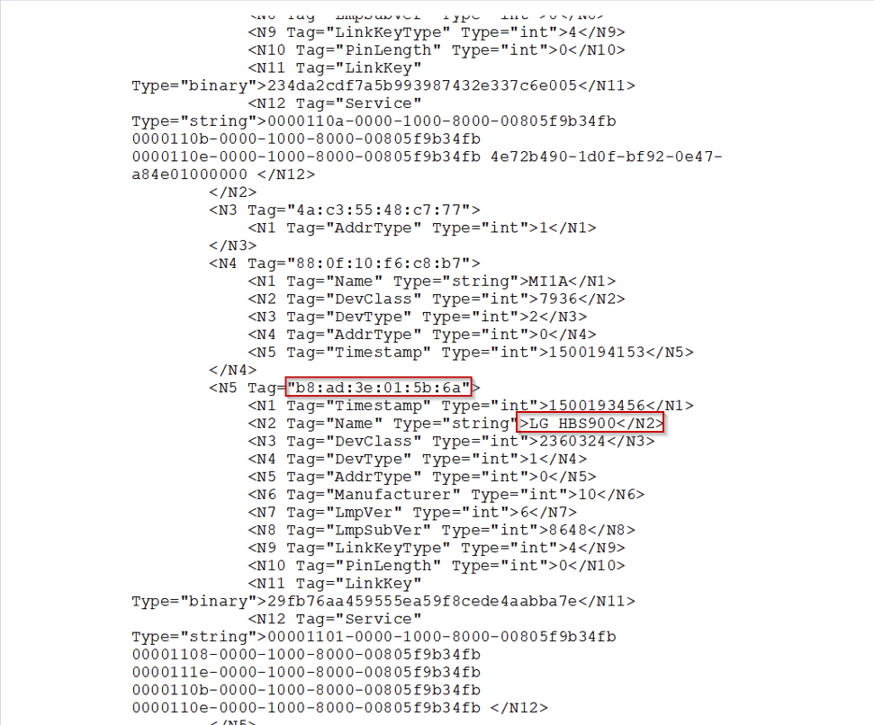
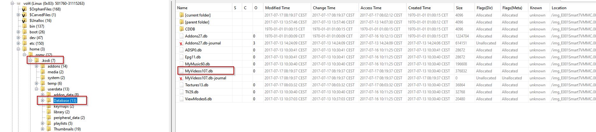

# Investigación Sergio

Se ha investigado los dispositivos móviles para encontrar algún hallazgo que indique que estuvieron la fecha del asesinato a la hora indicada pero no se ha encontrado nada. Sin embargo, se ha encontrado que, el móvil del marido de la victima se conectó a los auriculares dandonos la MAC del dispositivo.

Después de no encontrar nada más interesante, se ha investigado la Smart Tv a la que conectó el marido de la victima los cascos. Se han encontrado los dispositivos bluetooth conectado a la Smart Tv de los cuales ninguno coincide con los cascos bluetooth.

No se ha encontrado un programa llamado Kodi que sirve entre otras cosas para escuchar música o ver videos. El marido de la victima indicó a la policia que se encontraba en el momento del asesinato viendo una película.

Se ha encontrado un plugin de youtube instalado en Kodi y se ha extraido MyVideos107.db para su análisis.

Se ha analizado la base de datos extraida y se ha encontrado que el día del asesinato se vieron dos videos de Youtube a las 02:07:30 y a las 02:19:37.

Este horario no coincide con los horarios del asesinato, por lo tanto se ha investigado la zona horaria de la Smart Tv. Se han analizado los directorios del dispositivo encontrando que la zona horaria es la de America/Nueva York.

Teniendo en cuenta la zona horaria, las horas de los videos no son los indicados por la base de datos. La zona horaria de America/New York se encontraba en Verano por lo tanto es GMT-4 y en corea es GMT+9. 

La hora en la que se visualizaron los videos sería para el primer video a las 15:07:30 y el segundo a las 15:19:37.

La hora del primer video coincide un minuto después de que la victima iniciara con Alexa la aplicación Pandora que sirve para escuchar música según el historial de Alexa. Siendo está a las 15:06PM.

Esto coincide con las grabaciones recibidas de Alexa llamadas 9.wav y 10.wav con una voz de mujer, del mismo día con un segundo de diferencia entre ellas en la que se indica a Alexa que inicie Pandora.

Pandora es como podemos ver en los servicios de Alexa, una aplicación de música.

Se han investigado los videos y como podemos ver, el primero solo dura cuatro minutos siendo visto a las 15:07:30.

El segundo video se vio a las 15:19:37 teniendo una diferencia de más de 6 minutos entre el primero y el segundo, teniendo en cuenta que el primero sin pausa terminó a los cuatro minutos exactos.

Este segundo video ya no existe en youtube y no podemos ver la duración del mismo.

Mirando de nuevo el historial de Alexa, vemos que alguien le indicó el mismo día del asesinato un minuto después de iniciar el video que apagase la televisión.

Esto coincide con una voz masculina que se escucha en los audios grabados por Alexa llamados,3.wav y 4.wav.

No se ha encontrado ningún tipo de actividad que demuestre que ocurrió entre esa hora y la hora del aviso a la policia.

El audio grabado por Alexa llamado 13.wav contiene tres voces, una femenina y dos masculinas diferentes.