# A05 - Intento de Asesinato

## Índice

1. [Descripción](#descripción)
2. [Cuestiones a resolver](#cuestiones-a-resolver)
3. [Línea temporal](#línea-temporal)

## Descripción

Esta actividad sitúa a los estudiantes en el corazón de una investigación forense digital, en la que deben desentrañar un complot contra un político utilizando una imagen de disco duro incautada. Los estudiantes aplicarán técnicas forenses para explorar pistas ocultas, descubrir la identidad y los planes del sospechoso, y rastrear su actividad digital. A través de un análisis detallado, deberán conectar los puntos entre varios elementos del caso, desde los intereses en línea del sospechoso hasta sus posibles ubicaciones y preparativos.

## Cuestiones a Resolver

1. ¿Cuál es el nombre de usuario del equipo?

El usuario es Pacopepe, y podemos encontrarlo a través de varios métodos. El primer método que podemos usar para hallar el usuario es a través de la herramienta *AccessData FTK Imager*, de modo que comenzaremos haciendo clic en 'Add Evidence Item', donde elegiremos la imagen que se nos proporciona.

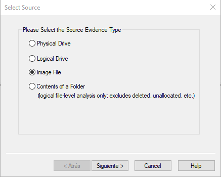

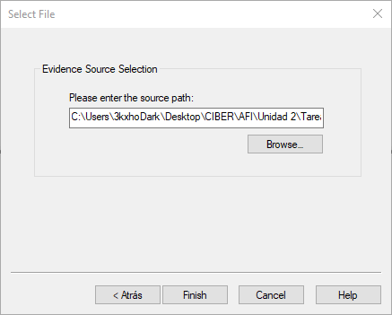

Una vez que se cargue la imagen, accederemos a la segunda partición, que es la más grande, luego entraremos en la carpeta *root* y finalmente desplegaremos la carpeta *Users*, donde podremos ver la carpeta del usuario ***Pacopepe***, que es el que buscamos.

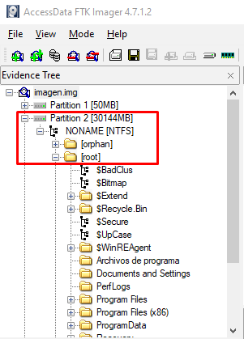

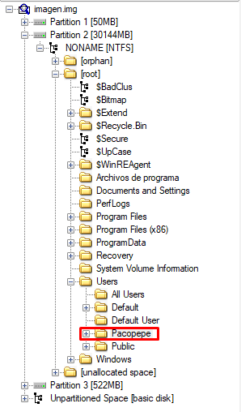

El segundo método que hemos utilizado para encontrar el usuario es usando la aplicación *Windows Registry Recovery* y *AccessData FTK Imager*. De la misma forma que en la manera anterior, seguimos todos los pasos hasta llegar a la carpeta *root*, luego nos dirigiremos a *Windows*, *System32* y *config*, donde buscaremos el fichero 'SAM', 'SAM.LOG1' Y 'SAM.LOG2', con la finalidad de exportarlos. 

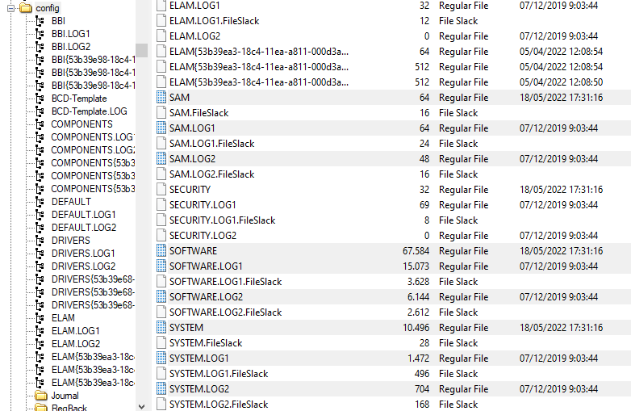

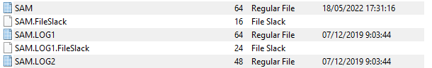

Una vez exportado, abrimos el software *WRR* (Windows Registry Recovery), y abrimos el fichero anteriormente mencionado (*SAM*). Una vez allí, elegimos la opción '*Raw Data*', y luego navegaremos por las carpetas '*ROOT\SAM\Domains\Account\Users\Names*', donde hallaremos el usuario ***Pacopepe***, que es el que buscamos.

2. ¿Qué personaje público es el posible objeto del atentado?

En la sección '*Data Artifacts*', hacemos clic sobre '*Web History*', y allí observamos como el sospechoso busca información sobre dos políticos, que son *Alberto Núñez Feijóo*, presidente del Partido Popular y *Alfonso Rueda Valenzuela*, ex-presidente de la Xunta de Galicia.

Sin embargo, cuando profundizamos más en el análisis descubrimos que el sospechoso planea atentar en la Moncloa, por lo que las posibilidades se reducen a *Feijóo*, además después de ver noticias sobre el susodicho político, comienza a buscar armas en internet.

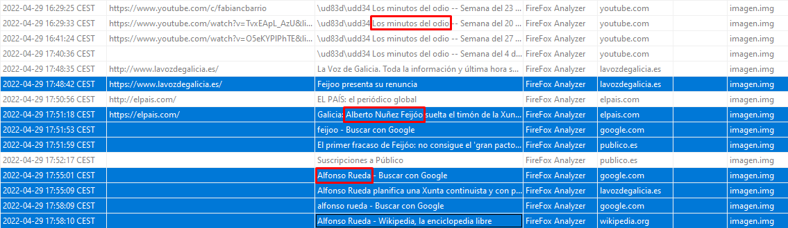

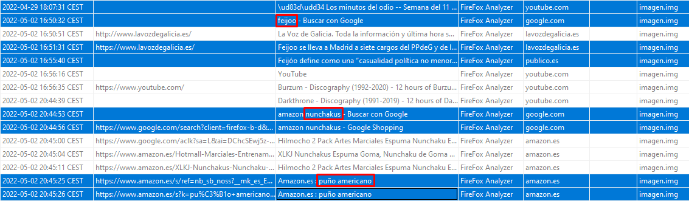

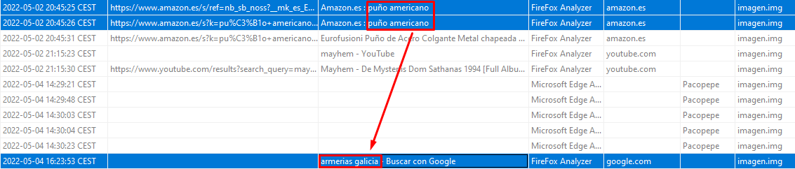

Como vemos en esta última imagen, dos días después de buscar puños americanos en internet, se interesa en explorar armerías gallegas. 

3. ¿En qué lugar estaba el sospechoso planeando llevar a cabo el atentado?

Cuando accedemos a '*Data Artifacts*', y a '*Web History*', observamos que el sospechoso ha estado mirando y analizando el *Palacio de la Moncloa*, en Madrid, lo que coincide con un posible intento de atentado.

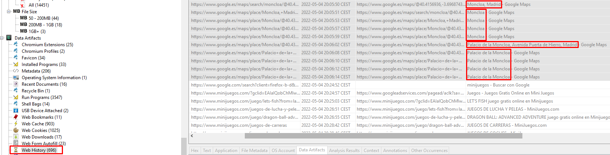

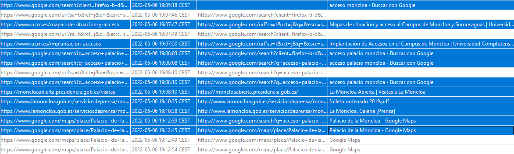

También podemos mirar los *documentos recientes* (Recent Documents), y hacer clic en la opción '*View Item in Directory*' sobre el documento *Indicaciones acceso MPR.pdf.Ink*. Cuando hagamos esto navegaremos hasta la carpeta *Data Sources\imagen.img_1 Host\imagen.img\vol3\Users\Pacopepe\Downloads*, para encontrar el archivo pdf *Indicaciones acceso MPR.pdf*.

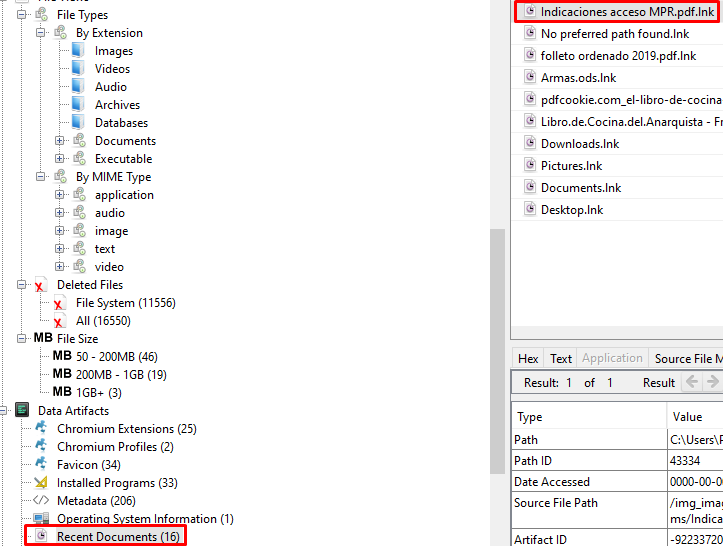

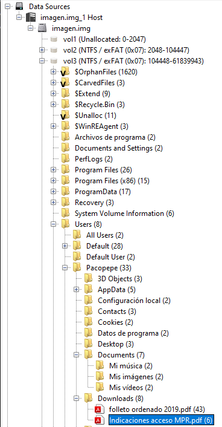

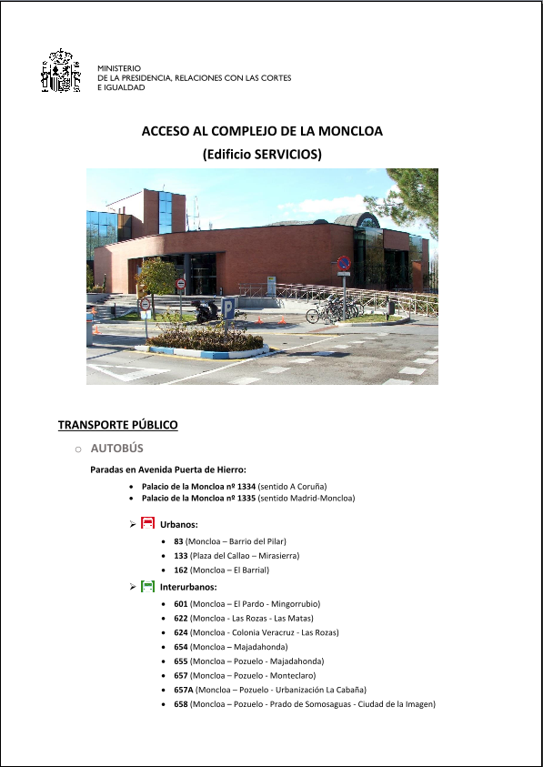

También podemos ver el archivo *folleto ordenado 2019.pdf*, que detalla los alrededores, edificios y algo de contexto sobre el Palacio de la Moncloa.

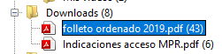

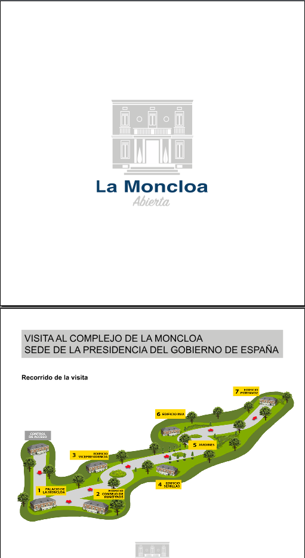

4. ¿Cuáles serían los posibles alojamientos del sospechoso?

Para hallar los posibles alojamientos debemos dirigirnos a 'Data Artifacts', y a '*Web History*'. Una vez allí, simplemente anotaremos los alojamientos buscados por el sospechoso, que son el ***Hotel Riu Plaza España***, el ***Hostal Condestable*** y el ***Hostal Alaska***.

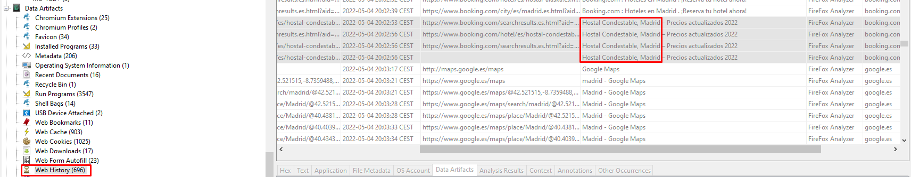

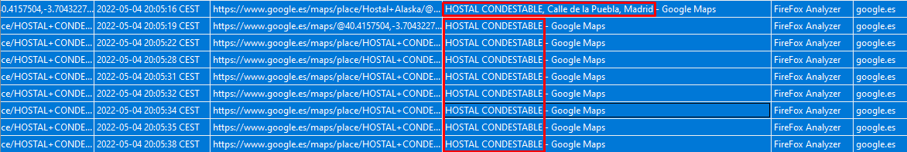

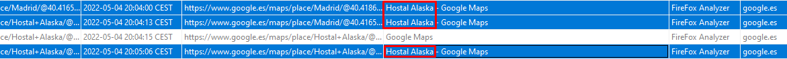

5. El sospechoso estuvo viendo un programa en YouTube que le ha motivado para llevar a cabo el atentado. ¿Cuál es dicho programa?

Una vez más, valiéndonos del historial, vemos que el programa en YouTube que el sospechoso ha estado viendo de forma continuada, antes de proceder a planear el atentado es '*Los Minutos del Odio*', del YouTuber *Fabián C.Barrio*. Además, después de terminar de ver dichos programas, comienza a ver las noticias de política y fútbol, para luego escuchar música, lo que reduce las posibilidades al programa antes mencionado.

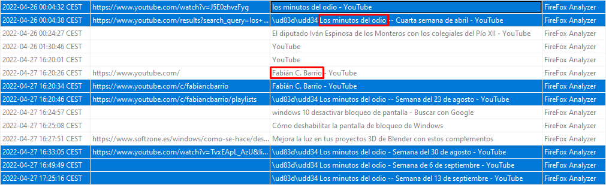

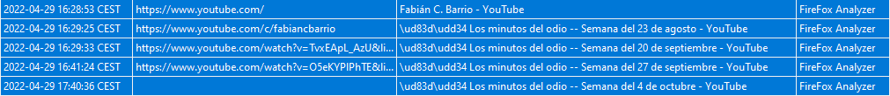

6. Además, el sospechoso ha estado leyendo un libro que le puede ayudar en el atentado. ¿Cuál es dicho libro?

El libro que estaba leyendo es ***El Libro de Cocina del Anarquista***, el cual podemos encontrar gracias al software *Autopsy*. Para ello debemos acceder a 'Data Artifacts' y a 'Recent Documents', donde podemos ver que, efectivamente el sospechoso estaba mirando el libro en cuestión.

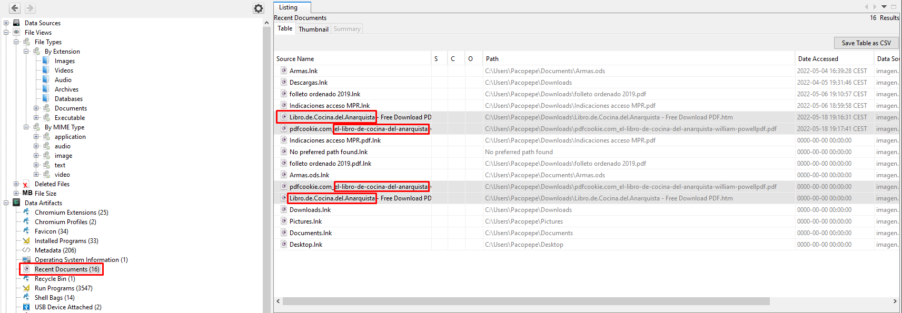

7. El sospechoso ha estado buscando armas en varias páginas de armerías de Galicia. Sin embargo, sólo ha anotado los precios del material de dos de las armerías que ha visitado. ¿Cuáles son dichas armerías?

Mirando el historial hemos podido averiguar la lista de armerías que el sospechoso tuvo en cuenta, que son:

- Armería Barreiro
- Armería Santos Cao
- Armería Estradense
- Armería Jardín
- Armería Romaní
- Military Arsenal
- Armería Belami
- Armería Deportes
- Deportes Toribio
- Armería Miragaya

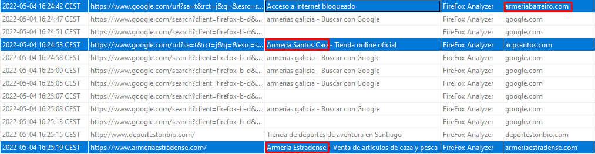

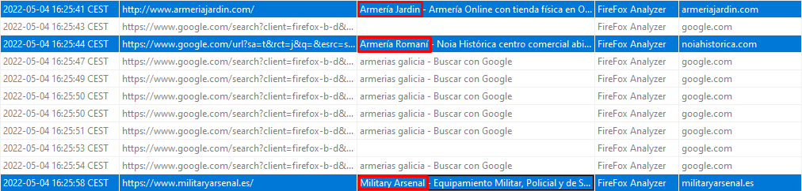

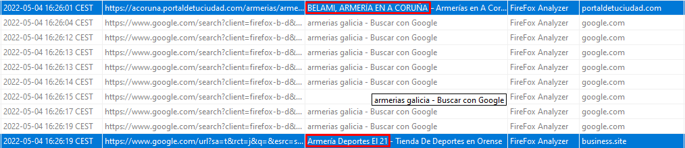

Pero sólo anota precios de dos de ellas, y para ello debemos volver a navegar por las carpetas de la imagen hasta llegar a '*Documents*', donde veremos el archivo *Armas.ods*. Haremoc clic sobre él, y elegiremos la opción '*View Item in New Window*'. Viendo el archivo, vemos que las armerías elegidas son ***Santos Cao*** y ***Jardín***.

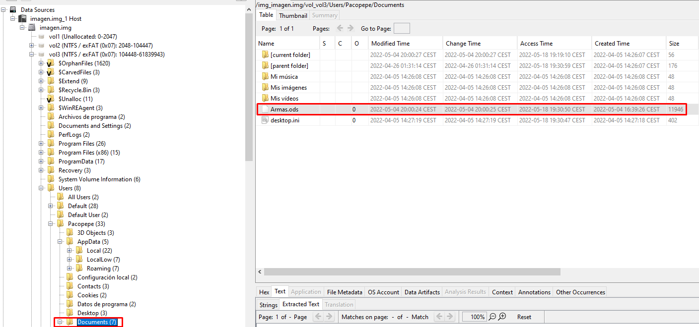

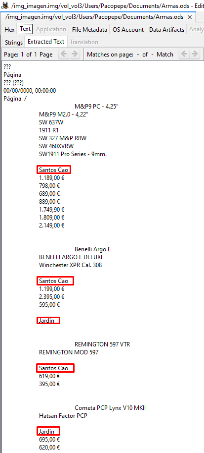

8. ¿Existe alguna imagen cuyos metadatos EXIF nos puedan ayudar en el caso?

[...]

 

## Línea temporal

[...]
