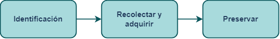
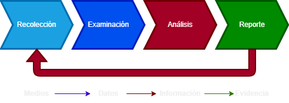
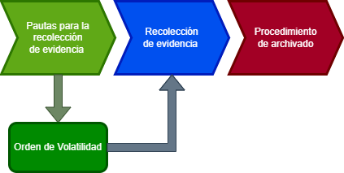
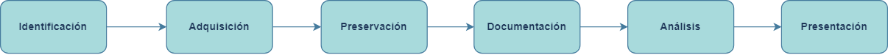

# Análisis Forense

# **Proyecto 1 - Nuestra Metodología**
## Grupo 3

Raúl Ladrón de Guevara García
Juan Manuel Cumbrera López
Sergio Guerrero Merlo
Christian Romero Oliva

---

# **Introducción**

- Necesidad de seguir normas y estándares forenses.
- Investigación de normativas.
- Creación de una metodología específica.

---

# **Investigación de Normas y Estándares Forenses**

Normativas investigadas

- Norma UNE 71505/2013 (Sistemas de gestión de evidencias electrónicas)
- Norma UNE 71506/2013 (Análisis forense de las evidencias electrónicas)
- ISO 27037
- Metodología RFC 3227
- Metodología NIST

---

# **Por qué usar una norma o estándar forense**

- Establecer un marco de referencia.

- Garantizar un nivel de integridad y fiabilidad

- Mejorar la calidad y consistencia

- Aumentar la credibilidad

- Facilitar la colaboración y comunicación

---

## **Norma UNE 71506/2013 (Análisis forense de las evidencias electrónicas)**

El objetivo de esta norma es definir el proceso de análisis forense dentro del ciclo de gestión de las evidencias (Norma UNE 71506/2013 anteriormente descrita).
 

---

## **Fases de la norma UNE 71506/2013**

**1. Preservación:** En esta fase se pretende mantener en todo momento la validez y confiabilidad de las evidencias.

**2. Adquisición:** En esta fase se realiza un clonado a bajo nivel de los datos originales, siguiendo un procedimiento documentado para asegurar que el proceso de adquisición es reproducible y repetible, calculando el código hash de cada evidencia.

**3. Documentación:** En esta fase se documentará el procedimiento completo de una forma detallada y concisa que siga una linea temporal correcta (Fecha, hora, ubicación, etc..).

**4. Análisis:** En esta fase se llevarán a cabo una serie de procesos y tareas que intentarán dar respuesta a preguntas relacionadas con el evento que se está investigando.

**5. Presentación:** En esta fase se escribirá un informe pericial con toda la información obtenida a lo largo del proceso de análisis. 

---

## **Norma ISO 27027 (Recopilación de evidencias)**

 Esta norma se basa en la fases de identificación, adquisición y preservación de evidencias digitales. Esta norma está dirigida a los dispositivos actuales estando más acorde con la técnica actual.

 

---

## **Fases de la norma ISO 27037**

**1. Identificación:** Es la primera de las fases de esta norma y trata de buscar, reconocer y documentar posibles evidencias digitales.

**2. Recolectar o adquirir:** Es la segunda de las fases e indica que la evidencia identificada debe ser recogida o adquirida para su procesamiento. Indica que deben hacerse copias de una imagen del disco, copia de los contenidos de la memoria y los contenidos de un correo eléctronico. Las copias deben hacerse mediante un proceso conocido, defendible y bien documentado.

**3. Preservar:** Esta tercera fase define preservar como el proceso de mantener y salvaguardar la integridad y/o el estado original de la potencial evidencia digital, esto requiere estrictos controles de acceso para proteger los artículos de la modificación accidental o deliberada como de tener los controles de entorno apropiados.

---

## **Metodología NIST**

  
- Se desarrolló principalmente para ser usada por agencias federales.

- Adopta un enfoque holístico 

- Aporta un plan para adquirir los datos adecuadamente basándose en volatilidad, valor probable y cantidad de esfuerzo requerido

- Pretende transformar los dispositivos en evidencia

---

## **Fases de la norma NIST**

---

## **Metodología RFC 3227**

La metodología RFC 3227 es una guía para administradores y profesionales de seguridad que establece pautas para la recopilación y preservación de evidencia relacionada con eventos de seguridad informática, tales como intrusiones. Ofrece mejores prácticas para determinar la volatilidad de los datos, priorizar evidencia y cómo almacenar y documentar los datos.

---

## **Fases de la metodología RFC 3227**

**1. Introducción:** La introducción destaca la importancia de recopilar evidencia en incidentes de seguridad, de una forma estructurada, metódica y organizada.

**2. Pautas de Recopilación de Evidencia:** Esta fase establecen pautas para la recolección, incluyendo priorizar la captura precisa de datos, minimizar cambios, eliminar vías de alteración y proceder desde lo más volátil.

**3. Procedimiento de Recolección:** Etapa que destaca la importancia de la transparencia en los métodos utilizados. Los principios clave incluyen identificar la evidencia, priorizar la relevancia, seguir un orden de volatilidad, minimizar cambios externos, documentar y considerar la generación de checksums y firmas criptográficas sin alterar las pruebas.

---

**4. Procedimiento de Archivado:** Para almacenar la evidencia de manera adecuada, se requiere un registro detallado de la cadena de custodia que incluye quién, cuándo y dónde descubrió, manejó o examinó la evidencia, así como quién tuvo custodia, la duración y el almacenamiento. La evidencia se almacena en medios comunes y se restringe el acceso, documentándolo para evitar accesos no autorizados.

**5. Herramientas:** Este apartado recomienda una lista de herramientas preparadas para la recolección de evidencia y análisis forense.

---

---

## **Nuestra metodología**

Este es el esquema que hemos creado para nuestra metodología basada en las normas explicadas en esta presentación.
 

---

## **1. Identificación de evidencia (ISO 27037)**

En esta fase identificaremos los elementos que puedan contener evidencia digital. En esta fase trataremos de reconocer y documentar todas las potenciales evidencias como pueden ser:
 

- **Dispositivos físicos:** Ordenadores, teléfonos, tablets, servidores, pendrives, etc...

- **Redes y conexiones a Internet:** Registros de tráfico, registros de servidores, etc..

- **Software:** Correos electrónicos, mensajes instantáneos, documentos. etc...

- **Datos en la nube:** Servicios en la nube como Google drive, Dropbox, etc...

---

## **2. Adquisición (UNE 71506, RFC 3227, NIST)**

En esta fase planificaremos la adquisición. Posiblemente encontremos distintas fuentes por lo que es importante establecer prioridades en el orden de la recogida basandonos en los siguientes criterior.

- *Su valor probable*: La fuente de datos que más evidencias, o evidencias de mayor calidad podrían contener.
- *Cantidad de esfuerzo requerido*: Priorizando antes las fuentes de datos que menos esfuerzo requieran frente a las que más.
Se realizará un clonado a bajo nivel, se harán fotos y se etiquetarán el cableado y los dispositivos. 

---

- *Volatilidad*: Las fuentes de datos que antes puedan deteriorarse o perderse. Teniendo en cuenta este orden concreto:
	1. Registros, caché.
	2. Tablas de enrutamientos, caché ARP, tabla de procesos, estadísticas del núcleo y memoria.
	3. Sistemas de archivos temporales.
	4. Disco duro.
    5. Datos de registro remoto (logs del sistema) y monitorización del sistema relevante en cuestión.
	6. Configuración física y topología de la red.
	7. Documentos y archivos.

---

## **3. Preservación (UNE 71506)**

En esta fase el objetivo es mantener la integridad de las evidencias, para ello se deben aplicar una serie de medidas como:
 
- Evitar exposición a campos magnéticos y otras interferencias.
- Almacenar la evidencia, precintarla y sellarla en los soportes adecuados.
- Utilizar el material adecuado como indumentaria de protección para evitar daños por descargas electroestáticas entre otros.

---

## **4. Documentación (UNE 71506)**

En esta fase documentaremos el procedimiento completo de forma detallada y concisa siguiendo una línea temporal.

Los procesos llevados a cabo son:

- Tácticas de adquisición
- Tipos de hardware o software
- Configuraciones
- Herramientas utilizadas

---

Además de los procedimientos, detallaremos en un regitro todas las personas que han tenido acceso a la evidencia. Este registro debe componerse de:

- Nombre de la persona que manejó la evidencia
- Fecha
- Hora
- Propósito de cada manipulación

---

## **5. Análisis (UNE 71506)**

En esta fase se llevarán a cabo una serie de procesos y tareas que intentarán dar respuesta a preguntas relacionadas con el evento que se está investigando.

Esto incluye:

- Revisar la hora de la BIOS del dispositivos.
- Recuperar ficheros borrados.
- Analizar los metadatos.
- Analizar los registros de red.
- Estudiar las particiones y sistemas de ficheros.
- Analizar el sistema operativo.

---

## **6. Presentación (UNE 71506)**

En esta fase se escribirá un informe pericial con toda la información obtenida a lo largo del proceso de análisis. Este informe debe escribirse en un lenguaje entendible para un público no técnico y tener una estructura uniforme.

El informe debe incluir la documentación de la cadena de custodia y al finalizar el informe será remitido al organismo solicitante.

---

## **Conclusión**

Después de una exhaustiva investigación de normas y estándares, y desarrollar nuestra metodología de análisis forsense, nos hemos dado cuenta de la importancía de seguir una serie de procedimientos y las medidas a tomar para asegurar la integridad, autenticidad y validez de las evidencias digitales para el ámbito legal. Al haber comparado una serie de normas nos hemos dado cuenta cuales deberían ser las mejores prácticas que debemos llevar a cabo en nuestra metodología.

Por ello las normas en las que nos hemos basado para crear esta metodología son las que hemos explicado en esta presentación.

---

# **¡Muchas gracias por su atención!**

## IES Rafael Alberti - Ciberseguridad en las TI

## 2023-2024
