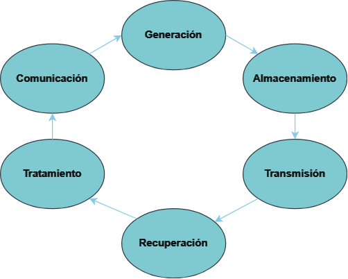

# Análisis Forense

# **Proyecto 1 - Nuestra Metodología**
## Grupo 3

Raúl Ladrón de Guevara García
Juan Manuel Cumbrera López
Sergio Guerrero Merlo
Christian Romero Oliva

---

# **Introducción**

- Necesidad de seguir normas y estándares forenses.
- Investigación de normativas.
- Creación de una metodología específica.

---

# **Investigación de Normas y Estándares Forenses**

Normativas investigadas

- Norma UNE 71505/2013 (Sistemas de gestión de evidencias electrónicas)
- Norma UNE 71506/2013 (Análisis forense de las evidencias electrónicas)
- ISO 27037
- Metodología RFC 3227
- Metodología NIST

---

# **Por qué usar una norma o estándar forense**

- Establecer un marco de referencia.

- Garantizar un nivel de integridad y fiabilidad

- Mejorar la calidad y consistencia

- Aumentar la credibilidad

- Facilitar la colaboración y comunicación

---

## Norma UNE 71505/2013 (Sistemas de gestión de evidencias electrónicas)

Esta norma se centra garantizar los principios de la información de las evidencias electrónicas o digitales estableciendo un ciclo de vida de las mismas.

---

## Principios

**Confidencialidad:** Se refiere a la protección de la información para que solo las personas autorizadas puedan acceder a ella.

**Autenticación e integridad:** Garantiza que la evidencia es auténtica, es decir, que proviene de la fuente que se afirma y que no ha sido modificada de ninguna manera.

**Disponibilidad y completitud:** Asegura que la información esté disponible cuando sea necesaria y que esté completa, es decir, que incluya todos los datos.

**Calidad y gestión:** Se refiere a la necesidad de mantener estándares de calidad en la recopilación, almacenamiento y uso de la información. También implica una gestión de los datos, lo que incluye su actualización y eliminación en el momento adecuado.

---

## Ciclo de vida de las evidencias:

**Generación:** En este primer paso es donde se crean los datos. 

**Almacenamiento:** Una vez generados los datos, se almacenan en algún tipo de medio de almacenamiento. 

**Transmisión:** Los datos a menudo necesitan ser enviados de un lugar a otro. 

**Recuperación:** Extraer datos de los medios de almacenamiento y exportarlos para su análisis.

**Tratamiento:** Los datos extraídos se procesan para obtener información útil.

**Comunicación:** Los resultados del análisis de la evidencias se comunican a las partes pertinentes.

---

## Norma UNE 71506/2013 (Análisis forense de las evidencias electrónicas)

El objetivo de esta norma es definir el proceso de análisis forense dentro del ciclo de gestión de las evidencias (Norma UNE 71506/2013 anteriormente descrita).
 

---

## Fases de la norma UNE 71506/2013:

**1. Preservación:** En esta fase se pretende mantener en todo momento la validez y confiabilidad de las evidencias.

**2. Adquisición:** En esta fase se realiza un clonado a bajo nivel de los datos originales, siguiendo un procedimiento documentado para asegurar que el proceso de adquisición es reproducible y repetible, calculando el código hash de cada evidencia.

**3. Documentación:** En esta fase se documentará el procedimiento completo de una forma detallada y concisa que siga una linea temporal correcta (Fecha, hora, ubicación, etc..).

**4. Análisis:** En esta fase se llevarán a cabo una serie de procesos y tareas que intentarán dar respuesta a preguntas relacionadas con el evento que se está investigando.

**5. Presentación:** En esta fase se escribirá un informe pericial con toda la información obtenida a lo largo del proceso de análisis. 

---

---

# **¡Muchas gracias por su atención!**

## IES Rafael Alberti - Ciberseguridad en las TI

## 2023-2024
